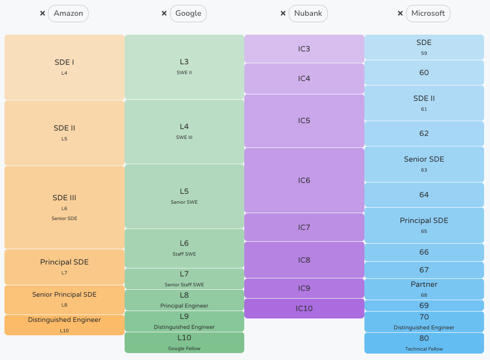
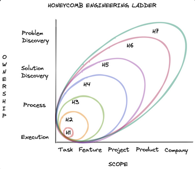

# Table of contents
{: .no_toc .text-delta }

1. TOC
{:toc}

# Data Science Career Ladder
{: .no_toc }

A Career Ladder (CL) provides structure to people on what is expected from them inside a company to support individual growth and performance management, which is how a company evaluates and rewards their employees, including salary bands.

This section will present a generic Data Science Career ladder for people crafting one for their companies and for individuals to understand how to use it and its nuances.

<figure>
	
		<figcaption></figcaption>
</figure>

# How to use a career ladder

Especially for young professionals, a CL can become a game. They turn it into a list of "all the things I need to do to level up"—a harmful take. Knowledge workers mostly start their careers after college, where they do tests and assignments, and they have someone who can tell how they grade from 0 to 10. For many of them, it will be the first time they will find something that's only a directional and fuzzier grade system.

The focus is the personal growth as a professional in a particular field. On one side, it is essential to learn how the company you are in sees your career. At the same time, if someone changes a company's career ladder, it shouldn't disrupt anyone's notion about their skills and value as a professional. Have an internal definition you own, update, care, and can use regardless of management or company changes.

Most of the time, Career ladders are handy if you use them properly. A healthy way to see it:

- Use it as a starting point to define with your [manager the expectations](https://datascienceleadership.com/docs/people-management/manager-report-expectations-doc) about your work for the short-term;

- Guide career conversations with your manager, projecting an intended evolution for the mid-term and getting tips from the ladder on how what you do slopes with seniority;

- Project a long-term career goal, a possible terminal level;

- Identify if the expectations your manager and other leaders have about your work are reasonable, to challenge them if you don't feel set for success;

- Understand what to expect and demand from people of different seniorities;

- To consult it as a manager, knowing all the managers have the same starting point for their expectations on every level;

- To contrast with the hiring process results and set the seniority for an offer as a [Hiring Manager](https://datascienceleadership.com/docs/people-management/hiring-manager-role);

- Use it for discussions during calibration (performance evaluation) so managers share the exact dimensions and terms.

It is worth listing the many things a Career Ladder is not:

- The CL isn't a career walkthrough that will guide people step-by-step to get promoted;

- The CL cannot be an exhaustive list of every situation the team members could be in and express all the nuances related to Data Science and Machine Learning in a company.

- The CL is not to pinpoint and correct dysfunctionalities or justify them;

- The CL won't provide precise cuts or hard rules about skills and behaviors from every level;

- The CL can't describe all the possible exceptions;

- The CL will never overwrite reality;

- The CL won't be as precise for more senior levels as it is for more junior ones;

- The CL will not resolve the ambiguity that is inherently from higher positions;

- The CL does not fit anyone perfectly but shouldn't miss anyone completely.

Even with so many pitfalls, it is still part of the job of managers and leaders to look into our career and provide a structure on what greatness means in Data Science and how one can increasingly deliver value in a company using it.

# Naming the levels

There is no standard in the industry regarding titles for seniority, and different companies can see the same title with other responsibilities.

Nonetheless, there is a commonplace around the Senior title. There is a career to get to the Senior level, starting with an internship. And there is a career after the Senior level, which implies technical leadership. This region has been classified as "Staff+" [^fn5] and leads to a fancy name, like Principal, Distinguished, Fellow, etc. You won't see titles associated with pre-Senior in a pos-Senior part of any ladder and vice versa, but you can see the titles inside these two moments shuffled.

<figure>
	
		<figcaption>A comparison between the different levels for Software Engineering. Pay range and scope correlates.  Don't even try to design an "ultimate ladder", or think there is a company with a perfect ladder waiting for you so you can finally grow as a professional. Ladders have common patterns, but also represent companies' stage and culture. Source: <a href="levels.fyi">levels.fyi</a></figcaption>
</figure>

For management, it is more mature. It will likely only use "manager", "director", and "VP", and additional levels preceded by "senior" to create a transition between them.

A cool thing about the technical career is that it became a parallel track to management. Becoming a manager is not a must-do for those who want to progress in their career.

Here's a possible Y-shaped career track for Data Science. I will only use "Data Scientist" in most parts, but one can replace it with "Machine Learning Engineer".

flowchart TD

classDef classDefault fill:#286748,color:#FFF,stroke-width:2px,stroke:#286748;
classDef classFork fill:#8b0000,color:#FFF,stroke-width:2px,stroke:#286748;
classDef classTech fill:#ff8c00,color:#FFF,stroke-width:2px,stroke:#286748;
classDef classManager fill:#6495ed,color:#FFF,stroke-width:2px,stroke:#286748;

A[Intern] --> B[Jr Data Scientist]
B --> C[Mid-level Data Scientist]
C --> D[Senior Data Scientist]
D --> E[Staff Data Scientist]
D --> F[Data Science Manager]

F --> G[Senior Data Science Manager]
G --> H[Data Science Director]
H --> I[Data Science Senior Director]
I --> J[Vice President - VP of Data Science]

E --> L[Senior Staff Data Scientist]
L --> M[Principal Data Scientist]
M --> O[Senior Principal Data Scientist]
O --> P[Distinguished Data Scientist]

style A fill:#286748, color:#fff

%%Style
class A classDefault;
class B classDefault;
class C classDefault;
class D classDefault;
class E classTech;
class F classManager;
class G classManager;
class H classManager;
class I classManager;
class J classManager;
class L classTech;
class M classTech;
class N classTech;
class O classTech;
class P classTech;
class D classFork;

# Thinking beyond Data Science
{: .no_toc }

The good thing about Data Science is that it is a tech-analytical role that can borrow from previous fields with a longer record in the industry. Beyond the benefit of looking to Software Engineering ladders, it is also positive to align the career with those similar in the same company to reduce the burden of understanding another career. Matching the leveling name and scope in Data Science, Business Analytics, ML Engineering, and Software Engineering works well.

# Scope and mental models

The scope is the operating range of a position. People describe it in terms of time range, organization width, influence radius, etc. The scope is the easiest thing to match through the different expertise in a company, and it is instrumental since it makes managing cross-functional teams easier. A mental model is a short and practical daily description for different levels.

For those who want to design a ladder, it makes sense to follow what is in the "high-level scope" and break what comes before and after the Senior level according to the stage of your company. It usually doesn't make sense to have much structure in small companies, where the nuances between a Junior and a Mid-level, or a Staff and a Senior Staff, won't have room to express and be perceived, or if you won't have people populating the different existing levels.

<figure>
	
		<figcaption>Honeycomb engineering ladder displays it nicely regarding ownership and scope. A single image or 1-page representation is beneficial to keep groups aligned. Source: <a href="https://www.honeycomb.io/blog/engineering-levels-at-honeycomb">Engineering Levels at Honeycomb</a></figcaption>
</figure>

## High-level scope

### Tech
{: .no_toc }
#### Pre-senior
{: .no_toc }
Intensive learning. Autonomy is almost inexistence at the beginning - an intern won't be able to deliver value if someone doesn't invest a reasonable amount of time in explaining, training, and pointing a small broken task with concrete steps. Autonomy is the main thing that will slope until it gets to the Senior level. Teaching concepts is inevitable, but the focus is on teaching how to discover things by themselves and how to get help from others, collaborate, etc. The quality of their work increases visibly, and the goal is to achieve the standard the group considers acceptable.

#### Senior
{: .no_toc }
It is the most significant level in a medium-to-large company. It is a professional that has consistent autonomy, which means they know well when to get help, how to get unstuck, communicate their work to stakeholders, break projects into tasks, design systems, and deliver high-quality work. Further, they can mentor more junior employees effectively and bring them to their level.

Because of this, companies consider it a "terminal level", meaning people can stay on it as long as they want, including for their whole career. Before it, they demand many resources to deliver value, and the company mainly invests in the person. After people hit this point, they become someone who provides value and can mentor others to do the same, so the company does not need to push them to change their jobs.

Everything that comes before the Senior level is a preparation to exercise it.

#### Post-senior
{: .no_toc }
The post-senior levels mean a different job, and I cover the first step in the [From Sr to Lead](https://datascienceleadership.com/docs/people-management/from-sr-to-lead). It will mean ownership into an "increasing whole" of the systems or depth into critical systems for that business. It will start with the systems in the local team; then it might go to the interacting systems of a group of teams. The timeframe changes. They are concerned about what the team does in the systems today that will make them healthy in 1-5 years or enable company plans that are far in the future.

They start getting involved in problems that are not just about technology, but a team can't solve it without someone with high-tech expertise, like how to evolve a solution when it involves changing many parts that can't simply stop working: the microservices, data structures, labeling, models, policies, operations, etc.

Notice that there are companies that inflate titles to attract people. The first level after the Senior might still represent the traditional Senior level, and they become a "pre-staffe" level. It is not bad to have this preparation level, some people benefit from a "title nudge" to start acting like a technical leader.

### Management
{: .no_toc }

In management, the anchor level is the "Data Science Manager", as it is for any other career, like "Engineering Manager". It is a terminal level manager because they can succeed in leading projects of a typical size and complexity, and they can grow ICs to become Seniors.

<figure>
	
		<figcaption>A Career Ladder for management needs to reflect the shifts of attention in People, Project, and Product/Strategy.</figcaption>
</figure>

A form to represent the career progression is to think that talent management will consume much time in the beginning via the individual coaching of ICs. Additionally, it is the differentiator of their track in a Y-shaped career, so we expect a larger investment in the beginning. Still, it will become less time-consuming as the manager starts to manage other leaders that will cascade their influence.

They will later master Project Management, and increasingly focus in Vision, Product, and Strategy since these are more effective ways to influence larger groups.

#### Pre-manager
{: .no_toc }

Some companies will have one or two levels before the "Manager" title already implied in management, like "Associate Manager". They will usually people manage pre-senior ICs and start managing projects of lower complexity, involving only their team and even a single expertise.

#### Manager level
{: .no_toc }

The bulk of the projects in a company are led or supervised by them, just as they manage the careers of most people in the company. They are consistent and know where their team is going in the next 12-18 months. They likely lead a team with cross-functional professionals, owning a critical work stream.

#### Post manager
{: .no_toc }
They typically lead an organization that won't have projects running in it (but in its sub-teams), looking to the bigger picture of how those different teams will work together and how their org will support the company's aspirations.

They won't lead projects anymore but work on the system their org represents. They are nudging people, setting goals, and creating the conditions to make their teams more autonomous and improve by themselves. They have to look into a more extensive time horizon, up to five years.

## Mental models

For the sake of having an example, here are mental models for a generic IC ladder. This post is about Data Science and Machine Learning Engineering, but one of its points is that all tech careers are similar from a certain distance, so the mental models should be pretty generic.

### Intern
{: .no_toc }

Work on simple and low-risk tasks. Spend most of the time learning the pre-defined skills to enable the delivery. Typically, programming, git, ML modeling stages, internal tools, and data manipulation. Close supervision.

### Junior
{: .no_toc }

Very similar to the intern but a full-time employee. Companies expect them to know the basics from a couple of base skills, like programming.

### Mid-level
{: .no_toc }

A person you can count on their deliveries to achieve the essential objectives of the team. They execute with independence, relying upon supervision on how to solve it.

### Senior
{: .no_toc }

Limited supervision. Senior members lead their work given a problem. Highly reliable. Their work standards are the standards associated with that company. Completely autonomous in their interactions with peers and direct leaders to solve their issues and unblock projects.

### Staff
{: .no_toc }

Minimal supervision from their manager. A role model for Seniors. They work frequently with people of different expertise. They can make good decisions under trade-offs and expose them to other people. They own the quality of the systems in their influence radius. Spot problems they can break and make proposals via strategies.

### Senior Staff
{: .no_toc }

Deals with uncertainty regularly, which means they pursue it and leaders allocate them to complex problems involving conflicting interests from different teams or issues that other aspects interplay with tech, like cultural and organizational. Constant interaction with company leadership.

### Principal
{: .no_toc }

They set long-term objectives for the company and guide the teams to make them happen. Their approaches and cases are potentially influential in the community and industry.

# Dimensions

The dimension is where we discuss Data Science / MLE-specific subjects. Nonetheless, the dimensions can still be generic and align very well with other tech careers, which is a good practice.

From the many dimensions people use, I see them in four groups:

Communication, Leadership, Influence, Teamwork, Scope, Culture, Strategic;

Autonomy, Trust, Ownership, Direction, Accountability;

Technical knowledge, Expertise, Skills;

Delivery, Results, Impact;

Let's see how they compare using their representation from a Large Language Model.

<figure>
	
		<figcaption>The ladders' usual dimensions clustered using embeddings from a LLM. We use the green groups as dimensions, since the purple group is well covered in the mental model. The orange group is controversial, but some guidance in complementary material is beneficial.</figcaption>
</figure>

We can cover everything needed to say using only Impact and Teamwork. The Scope group is usually well covered in the Mental Model. The Technical Expertise is acceptable as a dimension but very tricky. It is hard to pinpoint technologies and concepts one should know by that level, and it is hard to imagine someone not progressing in a career when they have fantastic impact and teamwork but don't master a particular sub-area. People will argue that it is hard to imagine someone will have such an impact in a technical area if they don't have the required technical expertise, so it doesn't need to be explicit. At the same time, it is a technical career, and the lack of detailed expectations around technical expertise will likely make people skew to soft skills, compromising the company's talent mix.

## Impact
### Junior
{: .no_toc }

They work primarily on small tasks, which are easily verifiable. They support the execution of more significant initiatives via the work of their manager and more senior colleagues, who can break down what is needed to complete and create clear guidelines. Their tasks have a straightforward definition of done, like making or excluding a particular feature from a dataset. They must get involved with tasks that support their learning, like coding in Python, using Git, manipulating and preparing data, and developing some stages of ML models. The support needed to accomplish similar tasks should decrease. They should learn how to get help in their company environment. Their tasks mostly require interactions with their manager or more senior colleagues from the same expertise.

### Mid-level
{: .no_toc }

They execute with increasing quality self-contained small and medium initiatives and parts of more significant initiatives that are key to the team's objectives. In contrast, a more senior team member is accountable for their success. Examples include creating the input dataset for a model, designing a simple experiment, deploying a typical ML model following a guide, setting up simple services, configuring model monitoring, or doing non-ambiguous data analysis that leads to a clear recommended decision for the team.

### Senior
{: .no_toc }

The team expects them to frame a business problem as a Machine Learning task or a system issue as an ML engineering task. They have creative freedom to define the approach for the problem given to them, like the quantity to be estimated, the experiment to perform, the data sources, the target variable, the system design, etc. They understand well the models and systems their team owns, and they can fix and modify their components. They likely own medium-importance systems of their team.

### Staff
{: .no_toc }

They are technical references, and their work sets high standards for the team. They own the state of the ML systems in the organization under them, which means they constantly monitor them and design and work on fundamental changes. Their work impacts the team in the following 12-18 months. They are critical for the proper framing of the problem and guarantee that the design of the solution will tackle it. They spot systematic errors in their team's systems, like harmful feedback loops in the decision-making, degrading data quality for future solutions, and not scalable process.

### Principal
{: .no_toc }

They spot company-wide technological issues or work on critical systems for the company's business. They lead other technical people in listing the shortcomings, defining an ideal state, and designing strategies to evolve essential and complex systems that need to keep working while refactoring or evolving.

## Teamwork

### Junior
{: .no_toc }

They need guidance from more senior people and mostly communicate with people from the same background and their manager. They can expose their questions to others and request help.

### Mid-level
{: .no_toc }
They develop their autonomy by identifying unclear definitions and proactively asking for clarification. They start presenting their work to people with the same expertise. They start understanding how the environment impacts their productivity: clear expectations, tooling, etc., and they can demand it from their manager.

### Senior
{: .no_toc }

Meaningful interactions with people from other expertise to connect their work, like business people who will design the policy their model will serve as an input, for example. It is expected that they never get stuck unnoticed, and they can take issues to technical leaders in a way that makes the most of their support. They start to mentor more junior team members consistently, looking to give them the same autonomy they have.

### Staff
{: .no_toc }
They can communicate trade-offs and justify decisions. They influence their team's roadmap. They mentor more junior members of the group. They can connect their team strategy to other teams and have a great notion of the company goals and how their team plays or could play a role in it.

### Principal
{: .no_toc }

They are used to lead people from multiple expertise since they deal with systems that interact with various domains. They interact and present to executives, and they are highly influential in the organization's roadmap and plans for the future years. They distribute technical challenges and sponsor other emerging technical leaders.

# Archetypes & Environments

The term archetype has been used in tech careers to describe the different patterns in which people can exercise a role. They are more relevant in large companies, where there is enough work to justify someone leading less generically. However, I also see environments and roles offering the same challenges for individuals, managers, and the evaluation process since they considerably impact the work of Data Science professionals.

Multiplying ladder definitions for every archetype and environment is unimaginable, but offering general examples of how they can deliver value in your company is helpful. Archetypes usually play a more prominent role in one's career in its leadership stage.

## Archetypes
{: .no_toc }
Recognizing it is way more important as a personal, professional discovery for self-development. However, this style must fit the person in the team, and their manager recognizes it. For, if you are a "Code Machine" [^fn2], an existing archetype in Meta for engineering, and your manager doesn't consider that's the best way to contribute to that team at that moment, it will likely lead to frustration.

See the section "The archetypes" in the [From Sr to Lead](https://datascienceleadership.com/docs/people-management/from-sr-to-lead#the-archetypes) article for Data Science examples based on Larson's book [^fn5].

## Environments
{: .no_toc }
Beyond archetypes, the environment influences how a professional with a specific expertise needs to be effective, which means it should also control the expectations and the performance evaluation. It is common for a manager to measure performance using their team needs and stage to tell what is impactful and how a good job looks. Still, a company needs to be able to evaluate and grow professionals who work in very different situations.

The most salient cases are:

- Product Team x Platform team;
- Mature Product x Green Product;
- Mature Data Science applications x Green Data Science applications;

A Product Team (or, more generally, a Stream-aligned team[^fn1]) works on applications. A platform team is a team working on making the creation of applications more manageable and with higher quality. A mature product (or stream-aligned team) is a team whose value proposition is in the "after-market-fit stage". They have learned how to deliver value via their activity, while the Green Product team is still finding their way to it. A Mature Data Science applications scenario is when a team has a track record of applying Data Science to their domain. Notice how a team can have a Mature Product but a Green culture of using Data Science, which makes it a different situation.

It is a critical thing for managers and team leaders to understand.

<figure>
	
		<figcaption>Different stages will offer different pressing needs to teams, so we can expect their members to act differently to succeed.</figcaption>
</figure>

When teams are in different moments, they have different needs, affecting the kind of activity someone does. Evaluating it and acknowledging it in the ladder can be helpful since people can resist making what the team needs to be guided by general guidance coming from the ladder. For example, a ladder might comment that a Senior Machine Learning Engineer owns the deployment of ML models. However, in a very young team, they might be enabling experimentation, or in a very mature team, they might be refactoring to allow the team to fix the technical debt and iterate faster in the future. If a kind of work becomes more important only because of a bias towards it or a career ladder statement, an excellent allocation of time and energy will become less likely.

If any environment is vital for your company, showing how the mental models specialize in it

# Matricial Organizations
{: .no_toc }

According to the Grove's law [^fn4], matricial organizations are inevitable at scale, so the chances are your organization is matricial, meaning it has groups related to the business (e.g., fraud unit) and others related to expertise (e.g., data science, engineering). In the Spotify's [^fn3] organizational design, you have Squads and Chapters.

It can insert nuances into the career. For example, a manager can find themselves in three very different situations:

- Leading Data Science in multiple teams/contexts: someone who oversees Data Science for a particular business purpose, like Fraud. As Fraud gets larger and larger, one might have the role of leading the expertise through the different Fraud teams (e.g., Identity Fraud, Account Take Over, etc.);
- Leading multiple expertise in a single team/context: you might be an expert, but leading a cross-functional team (e.g., leading the performance marketing team);
- Leading a team that has a Data Science and ML Engineering scope mainly: typically, a platform team (e.g., an MLOps team);

Another nuance is how people allocated in business teams contribute to the expertise group, e.g., teaching and mentoring people from other teams. It is hard to avoid addressing this dual role, so it can be a new dimension in a career ladder.

# Refreshing the ladder
{: .no_toc }

It will happen, and it is natural. Suppose it doesn't make sense for a startup to use a Google-like career ladder, and organizations show different needs at different scales. In that case, updating and providing more supporting material is unavoidable. However, keep it easy to understand from a high level. In my current company, we end up serving at different layers of specificity and description. The mental model is the first layer, a single page describing all the levels generically. In a way, it even matches other careers. Then, it doesn't matter how much we offer to people or the nuances we want to describe (archetypes, skill dimensions). We will always have a single page that hardly changes.

Here's how we organize it to make it extensible and decrease the changes in its core.

- Layer 1: Mental Models;
- Layer 2: Dimensions;
- Layer 3: Archetypes and Environments;
- Layer 4: Career Stories (interviews with team members describing their growth);
- Layer 5: Additional material.

The additional materials serve to cover topics in depth and coach the team. For example, if leadership spots that "Ownership" became an issue for that Expertise, instead of changing the ladder to increase the description when it talks about it, generate extra material to influence the team's understanding of how to improve it.

# Benchmarks

It is relatively common for companies to expose their ladders because of the relation it has with the company's culture, so it works in favor of employer branding. A few references:

- [DropBox](https://dropbox.github.io/dbx-career-framework/)
- [Spotify](https://engineering.atspotify.com/2016/02/spotify-technology-career-steps/)
- [CircleCI](https://docs.google.com/spreadsheets/d/131XZCEb8LoXqy79WWrhCX4sBnGhCM1nAIz4feFZJsEo/edit#gid=0)

# References

[^fn1]: Skelton, M., & Pais, M. (2019). Team topologies: organizing business and technology teams for fast flow. : It Revolution.
[^fn2]: George Orosz, [Inside Facebook's engineering culture](https://newsletter.pragmaticengineer.com/p/facebook), The Pragmatic Engineer.
[^fn3]: Atlassian, [Discover the Spotify model](https://www.atlassian.com/agile/agile-at-scale/spotify).
[^fn4]: Grove, A. S. (2015). High output management. Vintage.
[^fn5]: Larson, W., & Reilly, T. (2021). Staff engineer: leadership beyond the management track. : Will Larson.
