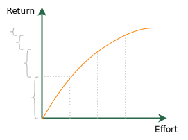
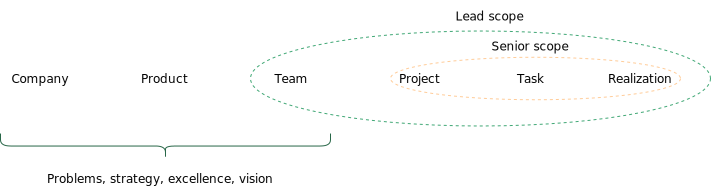

# Table of contents
{: .no_toc .text-delta }

1. TOC
{:toc}

# From Senior to Lead Data Scientist and ML Engineer
{: .no_toc }

In most careers, there is a phase change between an individual contributor (a person whose most of the value they deliver comes directly from their work), and a technical leader (someone who increasingly provides value indirectly).

The typical "Y" career in tech companies bifurcates when it enters the leadership stage into management and a technical track. While management is covered to a great extent, the technical leadership needs more attention. As in management, the common core permits Data Science folks to get knowledge from engineering [^fn1]. Still, I want to transpose it to our context and add to it.

Titles vary. "Lead" will represent the first step after the Senior level with leadership expectations.

I feel this is one of the most essential steps in the tech career (just as the first move to management), and I believe making it consciously has a lot of benefits. The first is that it won't come naturally for some people, while they can become better and better in the Senior scope and get frustrated at some point. The second is that promotion can happen organically, but many times as a "reward to a great Senior", which will tragically trap that person in the Lead role if they do not learn to identify their new role's levers.

This article is directed to Senior, Leads Data Scientists and Machine Learning Engineers and their managers.

<figure>
	
		<figcaption></figcaption>
</figure>

# Evaluating the current state

Given a structured career, people will be either ramping up to meet the expectations, learning to excel in them (getting a higher evaluation in a performance review), or growing to the following scope (becoming an excellent candidate to be promoted). 

The transition from Sr. to Lead is tricky because learning to excel is not necessarily connected to growing to the following scope.

The first step is to identify where we are. People usually want to grow as fast as possible in their careers, mainly because compensation slopes. However, we need to be honest in this evaluation. Alternatively, the transition means the start of a new job, and some people won't want it. A Senior level is a possible "terminal level" for most companies, and staying there is a valid option.

## Signals to focus on the work as a senior
{: .no_toc }
The transition cannot happen too early. The many gaps will spread the person too thin when coping with them and make the whole process take longer.

### If we magically replace all seniors with people with similar skills to that individual, how would the company be?
{: .no_toc }
People have different skills, but this exercise can reveal critical gaps. We don't want to focus on the gaps as a way to hold people by their weaknesses but identify skills or behaviors that are limiting their strengths to realize their potential.

How would be the code quality and sustainability of the ML systems? How would information flow from analysis to decision-making? It shouldn't go to a level it would endanger the company.

If someone does not communicate well, we don't want to turn them into the best communicators if it does not engage them, but we guarantee it won't get in the way of them.

### A lack of confidence from the individual and their manager regarding rotation
{: .no_toc }
If someone fears going to a new team, or the manager prefers to not suggest it to "protect" the person, something is going on. It can reveal that there are dimensions that if this person is exposed to, they will likely fail: "This person is great, but if they don't have someone to help them on X, they will have a hard time". Work on "X" to provide minimum autonomy. The level of confidence in a Lead should enable us to imagine that person in any team, not because they are prepared for everything, or they won't struggle, but because they understand their role too well to not succeed in the mid-term under any condition.

### Lack of consistency
{: .no_toc }
If the outcome of the work varies a lot or a regression to old issues happens frequently, it can mean the Senior behaviors are not yet internalized. Missing it once in a while is expected. Here we talk about systematically repeating old mistakes.

Getting tricked by the same kind of bias in the data, sloppy when building datasets or deploying models. The regression will create distrust even if the person can get it right once.

## Signals it is time to change the nature of the work
{: .no_toc }
A person might be changing the nature of their work without guidance, and if they could identify it was the right time for that, it is evidently a signal to keep the process. We focus here on early indications. None of these signals is about doing the Lead job. 

### Diminishing returns
{: .no_toc }
There will always be room for improvement, but the law of diminishing returns will hit. We are not talking about specialization but improving given the Senior scope. Getting better and better as a Senior. Which means operating with a certain radius of Influence, problem size, etc.

Suppose the core job of a Senior Data Scientist in a team is building sentiment analysis models. In that case, we will see them improving from one version to the other: the code, reproducibility, communication, technical approach, etc. But after a couple of times, it will take more and more energy to improve just a little bit on this level.

It does not mean it is time to change teams. There will undoubtedly have different jobs associated with the same problem: data quality, how that solution interacts with the product and other models, systematic mistakes, changing the paradigm on how the team solves that problem, etc. Issues that will take that person out of the diminishing returns curve and place them in another.

However, suppose we think about the Senior level as a possible terminal scope for people that do not want to change their job to become a Lead. In that case, it will likely imply changing the subject they work with without changing the responsibilities. 

<figure>
	
		<figcaption>Every equaly sized step on effort provides diminishing increments in the return.</figcaption>
</figure>

### Harder and harder to get feedback about the core job
{: .no_toc }
Corrective feedback will become rare. Most of the feedback will focus on "nice to have" instead of the core of the work. If the core work is to design and deploy ML systems, peers and managers stop seeing opportunities to improve. 

### Role model for other seniors
{: .no_toc }
The manager starts to feel they would like all the other Senior to behave or have specific traits from that individual. Their peers will constantly look to their work as a standard, and leadership will start exposing and enforcing it. Their best characteristics will get attention from Lead+ in the team. 

### Point of contact to other specialties
{: .no_toc }
When people from other specialties (engineering, product, business, etc.) start to trust a particular individual, the other leaders will get less and less involved in their interactions. 

# The phase change

Suppose we want movement. A car brings us some movement, and a faster car gives us more movement during the same period. However, regardless of how fast a car can get, it will never fly like an airplane, which provides another kind of movement.

When we move from a Senior level to a Leadership role, we want to change the kind of movement we provide. It is true it does not mean anything from the Senior scope will be part of a Lead's responsibilities, but the core is a different job.

## The importance of the opportunity 
{: .no_toc }
For the first step into a leadership opportunity, the opportunity is most of the time there. If no one is filling that role completely using the same set of skills the individual has, there will be room for it. Having more junior professionals around make it easier. However, one can expand the radius of Influence to other specialties. A Data Science professional can support, Influence, and work with more junior members from analytics, engineering, etc. We will describe the many tools one can use. 

## The importance of the manager
{: .no_toc }
If you are reading it as a Senior Data Scientist and feel it has been helpful, that's just a fraction of what your manager can do for you in this process! Imagine getting all the content here personalized for your skill set, personal situation, company moment, and team context? Amazing, right? That's the first reason the manager is vital in the transition.

The second is that promotions usually need a promotion case. And something planned, worked throughout a year, with care and work about the individual development, will certainly create a more convincing story (which is easier to sell) for the promotion to happen. Craft the story together. 

## Change the nature of the work instead of adding more responsibilities
{: .no_toc }
Promotion means a new job, and the first step after the career bifurcates is a crucial change for many reasons. The first is that it seldom happens naturally. As an intern, it is natural to learn the main concepts, get used to tasks, and have more autonomy. This process will get you converted as a full-time employee at some point. The exact process continues until the person becomes a Senior professional: someone with autonomy to solve significant problems, and autonomy means they can get whatever help they need to get things done.

But this process won't get the Senior professional to a Lead position.

The person and the manager must focus on a #change# instead of an #addition#. It means slowly growing other people to participate in the work that person is doing and finding room for them to exercise the next scope. Care is needed for this move. That's why so many people opt to overwork.

- What is this person doing without much room to improve that would be an excellent opportunity to develop someone else?
- How can we trade off a little bit of execution for strategic work and keep or increase the team's impact?

The eight working hours should be seen as a non-negotiable budget. Doing something means not doing everything else.

## The next gap
{: .no_toc }
It is not trivial to state in every context what the next step means, and it is helpful to have the skill to identify it yourself.

As we get more scope, we need to connect things that are farther away.

A typical step for a first leadership role in a company is to start answering what to build and why. It means operating at the team's problem level.

Identify what is provided to that individual to work on top, then which gap that output belongs. Focus on starting working on that gap to improve the outcome of that stage. 

<figure>
	
		<figcaption></figcaption>
</figure>

# The lever concept

Leverage is simply the outcome generated by a certain kind of work [^fn3]. Given the same time invested, the higher the result, the higher the leverage of that activity. Since the Lead can keep doing what junior, mid, and senior folks can, it is important to ask if the actions they chose to do are highly leveraged. We will list some professionals in a Lead role use as possible ways to stretch the Senior one.

It does not mean a Lead will only get involved in this kind of activity, but their time management becomes more critical, and they need to be aware of the leverage involved in everything they have to do or are available to choose to do.

Prioritize according the type of the task [^fn4]. Do the best work possible during high-leverage activities. Do good work for neutral activities and for overhead (things one must do, but with very low leverage), just get them done, and actively do a bad job.

# Generating value via other people

Where is the key leverage for technical leadership: contributing to other people doing better to impact the overall result. Even though it comes with a certain level of specialization and deep work from the individual, as problems get more ambitious, they are likely to touch so many points and different areas that it is impossible to solve alone. The simple activity of understanding the problem will imply interaction with multiple people and will require leadership.

How does one scale oneself?

## Build tools and assets for the team
{: .no_toc }
Enabling other people to do more, better, and faster will increase one's impact. Data Science requires a lot of repetitive tasks. Curiously, we have a bad reputation for writing code we run only for a particular case via notebooks.

If the team is used to running certain kinds of analyses often, consider abstraction to create libraries or frameworks to support them. Always have a specific use case in mind. It is easier to sell tooling if one builds it aiming at a very important use case pressing the team, even if the ultimate goal is to solve a myriad of cases.

A series of skills will be required here to be effective. Transforming anything that's floating on Jupyter Notebook into libraries won't contribute that much to the team without paying attention to the bottlenecks and the users' pains. One will depend on people's adoption.

In Data Science, data is the main asset, and that's a commonly overlooked way to impact multiple people: providing new data, improving the quality, fixing its issues, etc. 

## Sharing knowledge
{: .no_toc }
Most people in a company share their knowledge. The way they do it, the intentions, and the consequences can be very different.

Expose it to the right audience. Speak in terms of their interest. Make it easy to understand, reproduce, and reapply. Having a couple of people in the company copying the way a particular individual do things is clear evidence of influence and impact via other people. Especially without authority: if people organically choose to do things that way, it is because it is an improvement from their previous state. If it is possible to have a measure of what and how much it changed for them, then it is a huge win.

In Data Science, so many things fit here:

- Sharing on how to use an open-source library the team does not know to solve a company problem;
- Explaining a new approach for a certain kind of problem;
- Exposing a new way to do a specific stage of modeling;
- New ways to validate a certain kind of model to visualize its results;

Remember that #how# is very important. Sharing a blog link is low effort and low leverage. Learning something new, applying to a problem in the company, understanding it deeply, exposing it to one's peers in the company context, making code available, etc., can drive way more impact.

Solving a problem usually takes a long time. A write-up about it will take way shorter and potentially impact the solution of multiple problems in the company. Evidently, thinking about the general problem the individual has solved and how much care, it deserves when sharing is part of the work.

Think about how scientists work. How researchers can summarize a project that took years in a poster or a 15 minutes talk. Things that take individuals long hours to decipher and get insight into can be easily reused by others and generate the same benefits with lower costs. That's scale. 

## Push improvements to as many people as possible
{: .no_toc }
It can be appealing to improve or fix things locally only. The work of pushing it to others can be disengaging. However, it can have high leverage. Whenever one does a hack to improve or fix something, that's a good opportunity to impact others. Especially If it is a standard tool.

## Invest x hours and provide y hours of high-quality work to others, given y > x
{: .no_toc }
Another way to multiply an individual is by having interactions with individuals that generate an effect longer than the time spent together.

Pairing with someone will get something done during that time and hopefully teach something to the other person. However, pairing or designing together, discussing, breaking epics, stories, or clarifying tasks can have a more significant effect on an individual if we focus on how much better work that interaction will provide to the other person.

Imagine an ill-specified task that takes a week if done right but can get as long as it can if the person doing it doesn't know exactly how to do it or can't see the needed decisions to make during it. Getting together to clarify it for 20 minutes can support that person to have a great week of work. 

### Trap: getting overwhelmed by all the help requests
{: .no_toc }

Time management becomes more important in a leadership role. As the Lead becomes a reference for the team, getting all sorts of requests will be common. Since it is part of the expectations to deliver value via other people, it is easy to get overloaded.

To avoid it, create a series of questions to help decide if the Lead should get involved and how.

Here's a suggestion:

To decide for Yes or No. "No" means providing directions regarding the best person or team to help with it (not ignoring them!). 

1. Am I exceptionally skilled in solving that issue? (Why you? Does it make a difference having you involved?)
2. Does it involve a concept that if I teach this person, they will reuse it frequently? (Are your contribution to their education or simply getting something out of their way?)
3. Is there a team whose objective is to provide what people request from me? (Is there a standard workflow to solve it?)
4. How long will the solution to this problem guide this person's work? (Is it high leverage?)

To decide how it is needed, clarify that individual's role in the related project. Are they supporting it? Are they part of the developers? Are they on the same team? Is it a one-off thing or continuous?

It might sound bureaucratic, but a Lead cannot survive by defaulting on providing the maximum help one can on every request. 

## Own the end-to-end
{: .no_toc }
Whenever a single person becomes able to see the end-to-end, it will mean they will get involved with the work of more people, which allows them to help, support, and influence them. Everything from the previous tools will now apply to a more diverse group, expanding the radius of Influence. It might be the only way to justify leadership if there aren't other Data Science folks around.

How could someone influence people with other skills? A Data Scientist or Machine Learning Engineer rarely knows so much more about business, engineering, product, and design than professionals from these areas. However, the interface between Machine Learning and everything that needs to happen to have a business impact can open up this possibility. It is not trivial to fit it, so even though one might not be a better software engineer than their team peers, they better understand the trade-offs involved in software in a Machine Learning context. 

# Communication & Leadership

Items in this section relate to what Camille Fournier [^fn2] calls the "one weird trick all good tech leads know": the ability to step out of the code and look to the team's needs to balance their contributions. What is more valuable, one hour of coding or using that hour to clarify the requirements of a new model? That's what someone needs to be able to answer as a Lead. 

## Up and Down
{: .no_toc }
There are always expectations from more junior and senior people, but in the Lead role, they become a core part of the work. One must understand well what both of them would expect from a Lead to start positioning as this person. People usually have chances to interact with more junior professionals, which should create evidence. Interacting with more senior people and owning parts of the work they used to do can build the trust that a person can play the next scope role. 

## The lead role in the room
{: .no_toc }
There is this motto: as people get to leadership positions, they need to get closer to the business. It is correct, but in my perspective, it can be misleading. 

In a room with people with different skills, a technical leader should represent their expertise on the decisions the team needs to make.

Representing it is not enforcing the highest standard. It knows the high standard, identifies the involved trade-off, makes the consequences clear to the team, and helps them navigate the trade-off to choose where to operate. So a lead that can only tell the team, "we shouldn't do this because that's not the best way", is not really supporting the navigation of a complex situation. Exposing trade-offs well will create trust when one needs to expose a non-negotiable aspect to the team, and they will see it as a no-go. 

When the lead is in such a room, a diverse set of views is needed for decision-making. It means the views should interact. Suppose the person's mind hasn't changed on anything while other leaders have exposed the perspective of their specialty, including the business perspective. In that case, they probably are not embracing the situation's complexity.

Thus, getting closer to the business means dialogue with it, not getting to a particular side to create unison. Being able to do it will generate trust from their manager to replace them and represent Data Science in more and more situations. 

Notice that if a decision turns out to be bad from a data perspective, it will be the Lead Data Scientist, Machine Learning Engineer, and Manager's fault if they did not expose that risk or if they didn't weigh it well when presenting to the team.  

## Make it easier for people to follow the example
{: .no_toc }
To reinforce the message from the previous section: make the cost to follow one's good practices low. Appealingly expose the work, and write good documentation for pieces that can influence a large group of people.

Communication now won't be a matter of only informing people something happened, but educating, influencing, and changing their minds. 

## Lead technical decisions
{: .no_toc }
We can break it into three steps: first, identifying the underlying decisions in a project, task, etc.; second, deciding which one is relevant; third, guiding a group to make the best decision given the context.

Supporting the team on these steps is valuable, but we need to keep leverage in mind: why are you leading that discussion? How your expertise interacts with it?

When developing a project with ML, the freedom to define model characteristics is very large. Influencing the team to focus on what is important will help them deliver value earlier.

## Own the state of ML systems and/or analytical solutions
{: .no_toc }
Usually, when we look at the state of the solutions in a team we are working on, we are not happy with everything. A Lead should look to that as an opportunity and feel that now the result of the whole team represents their own work, and they need to support, Influence, and work together to get to a point they feel proud of the entire team's work.

It means both from Data Science peers and adjacent areas.

This shift in ownership will naturally engage the person to work towards delivering value via others, as they can't take the state of work from the whole team by themselves to another level.

A Data Scientist should feel proud of everything related to analytics: monitoring, policies, experiments, modeling, datasets, documentation, etc. When it gets to Machine Learning Engineering, it is to own all models, data, and their interactions, extend them to software and data engineering, and anything that integrates ML as a whole system.

## Change the time frame they are concerned with
{: .no_toc }
Developing a solution, especially in Data Science, has consequences for the future. Our acts generate censorship in data and bias for future solutions. The need for continuous experiments to get good data. Data accumulates, changes, and gets appended by

Looking a year ahead will inevitably expose a Lead to think about it and scalability.

How will our solutions be pressured as the company gets more customers, launch more products, have more instances to score, want to throw more experiments, needs to evaluate more actions to change customers' behaviors, make data from other products available, etc.

# People support

Though someone in the technical track won't manage people, they can't avoid projects being executed by multiple individuals and will have to interact a lot.

## Well positioned to take specific situations to managers around
{: .no_toc }
By owning the state of ML and Analytics in a team, a Lead will certainly have to be concerned about people. This will allow them to partner with managers to frequently discuss situations and be part of the solution. 

## Team up with managers to develop their reports
{: .no_toc }
A proxy for a promotion is when someone can consistently coach other people to their own level because it usually means they master it, and if they master it, it is time for a stretch.

Working with managers to bring other people to their own level will be very helpful for them to indicate a time to stretch or a promotion. As a Lead, one should be great at making junior members become seniors. So exercising it as a Senior will build the way to become a Lead. 

# The archetypes

One of the coolest parts of the Larson's book [^fn1] is the the four archetypes for Staff Engineers. They can be easily adjusted for Data Scientists and Machine Learning Engineers. I hope to explore more in terms of Archetypes for Data Science in the future. Here I will just skim and provide examples from Data Science. 

It is important to understand how they operate and where they are valuable to identify what one wants and where in the company they fit.

Furthermore, every company will have its technical leader archetypes, but they will commonly start with the Tech Lead. Observe your own company and talk to other leaders to understand what exists and what is about to generate enough demand to justify its existence. 

## The Tech Lead
{: .no_toc }
The common archetype to those getting promoted to senior. The guide and role model. They will guide less senior people in solving problems they are used to.

In Data Science, they will usually step out from the execution of the usual-steps-from-every-ml-model and guide others on learning how to do them well, and jump into special topics from the models in their teams: validation schema, issues in the data, bias, needed experiments to gather better data, etc.

## The Solver
{: .no_toc }
Jump from one big issue to the other. Those challenges are spotted by leadership and offer high risk to the business. They might also be great at taking things from scratch. We know that the first versions of models are more challenging, especially in a new product or business where the company has never applied Machine Learning. 

## The Architect
{: .no_toc }
ML Systems and Data Science will have some critical areas. Things that will be part of most of the solutions and can scale the impact: feature store, model deployment, monitoring, etc., in terms of infrastructure and experiments, unit selection, recommendation systems, etc., in terms of analytics.

Having a great understanding of these parts and combining them with how the company's systems work to provide a direction to where it should go, set standards, and recommend the right approach, is considered. 

## The Right Hand
{: .no_toc }
Borrowing authority from other leaders and solving organizational issues. It involves a mix of technical knowledge with business and organizational problems.

A Lead Machine Learning Engineer might be the best person to lead an effort on data governance, model governance, setting work agreements between data internal consumers, etc. 

# Anti-patterns
## Mediator Mimic
{: .no_toc }
I like the concept of serious playing. Playing the role of a technical leader can get a person unstuck from simply not doing it as it is a different job they won't ramp up magically to.

However, mimicking is different. It is trying to behave in the next scope without the content to perform it. They might take the word in a meeting to guide the team but cannot provide valuable guidance. They can facilitate meetings or be a technical advisor without pushing the group to a better place. They can do work reviews, but anyone grows with it. They can prepare a roadmap that does not connect well with the team objectives.

I've been in the place of suggesting to someone they should participate more in a certain kinds of meetings before realizing they could not do it effectively without going through other stages.

[graph: understanding of the problem, skill to get info from people by asking the right questions, understanding of the team strategy -> Take the role of a guide during a meeting -> ]

As a Senior professional, try to clarify the chain involved in it and be honest with you: why can't you provide a valuable code review? What makes it possible to unlock these possibilities in your context?

## Trying to compensate for the lower impact while ramp-up by using the old leverages
{: .no_toc }
It is a situation that can happen for people stretching to the next level or just being promoted to it. It is common with new managers: one gets to a new position, but the natural difficulty in delivering value on it due to the ramp-up gives the person options to provide value using their previous role or doing it in a higher proportion than expected.

It is super tricky because a couple people around might be happy with the value that individual is delivering, without noticing they are working as the "premium Senior": a faster and more experienced Senior. It will probably slow down the growth in the long-term, and it can even be harmful to the team in a way they just realize too late: no attention to important decisions, technical debt accumulating unnoticed, more junior members of the team not developing as much as they can, etc. 

When the time comes for a performance calibration, if the person doing it is a Senior looking to become a Lead, they will be compared to other people who are successfully changing the nature of their work, or if they are a Lead in their first cycle, they will be compared to other Leads positioned themselves as such in their teams. It will be clear they are missing something, which can result in not getting promoted or delivering less value than other Leads. 

## "I won't work on it. It is not a lead job."
{: .no_toc }
We commented a lot on changing the nature of the work to adapt to a Lead role. However, it is too simplistic to think we could define a couple of questions to determine whether people should get involved. Further, the real world is messy and full of unplanned work or disproportioned tasks compared to the seniority and specialties in a team. 

Still, in most companies and for most roles, people will expect you to do what is best for the company and that you are the best person to accomplish, even if it is out of your scope or job description. When it happens for that big visible thing a team leader is pushing or, it is usually rewarding. If it is about invisible work - something no one notices, but it is important, making it visible and discussing if it is indeed the best for the company and the person doing it instead of simply dropping it.

## Snacking
{: .no_toc }
It is related to the audacity, importance, and size of what one is getting involved in. It is another piece of advice coming from Larson [^fn1]. 

Indeed, supporting other people is important, but if the person invests most of their time in it, it won't grab people's attention. It gets to the leverage concept again, and focusing on that big hairy problem from a team to be the lead argument for the promotion is usually better than many small things. 

## Getting obsessed with it
{: .no_toc }
Greatness takes time and patience. And to be a role model, we will need to get closer to greatness in one or more dimensions. No hurry, building solid bases. Enjoying the time as a Senior Data Scientist or Machine Learning Engineer. It will be the best time to learn some skills, and gaps will become increasingly costly to cover as the career progresses. Forgetting about the others. Not getting frustrated if a peer gets to it before them. Instead, talk to them to get to know their story and learn from it. 

# References

[^fn1]: Larson, W., & Reilly, T. (2021). Staff engineer: leadership beyond the management track. : Will Larson.
[^fn2]: Fournier, C. (2017). The manager's path: a guide for tech leaders navigating growth and change. : O'Reilly Media, Inc.
[^fn3]: Grove, A. S. (2015). High output management. : Vintage.
[^fn4]: Shreyas Doshi's on time management tricks, [Twitter thread](https://twitter.com/shreyas/status/1492345184171945984)
