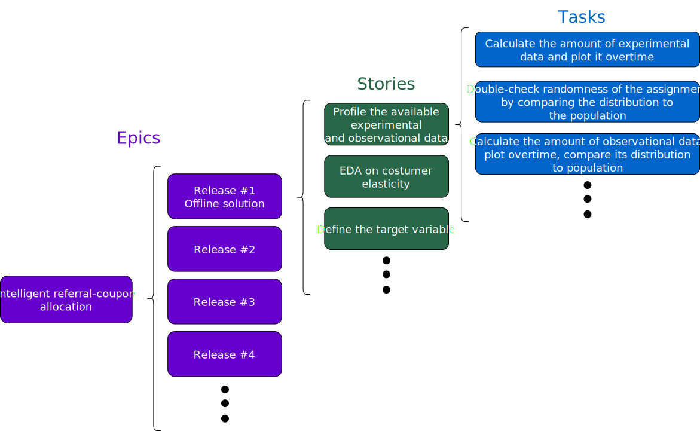

# Breaking stories

During the Story mapping, the steps to make every release happen are not at an execution level. They must be broken into objectives, the definition of done, etc. The developers intended to work on that story-level step should turn them into tasks. Technical leaders can review or do this work for more junior team members.

E.g., "Exploratory Data Analysis". It can be too high level even for the story mapping. In that case, the project leader should ask the team if there is any particular trait in the data we want to explore. If we stick with "EDA", the developer and an advisor can take a look together and break it into the relevant tasks for the release: checking for nulls, availability overtime, drift, etc.

<figure>
	
</figure>

To put in perspective: our end-to-end project is an Epic composed of other Epics that are the releases, which are composed of stories the team map together, and tasks defined by developers that need to be executed to conclude the stories. The team can use whatever terminology. The importance lies in the hierarchy and level of representation.
