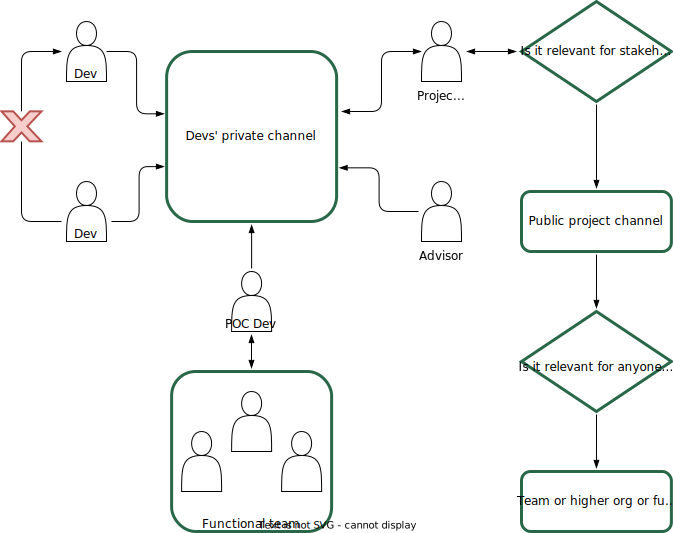

# Table of contents
{: .no_toc .text-delta }

1. TOC
{:toc}

# Communication

The RFC and the Story Mapping create a lot of alignment at the kick-off and implementation start. Nonetheless, developers and stakeholders will lose that shared understanding slowly, either by improper deviation from the original plan or non-communicated changes. We want the information to flow among developers, from developers to stakeholders, and from project leaders to the organization.

Data Science projects are very dependent on data and full of assumptions. Further, the results can vary in performance, and it is needed. Even in a downstream phase, it is common to discover aspects of the problem or the solution that impact the plan.

It is natural that communication do not flow as naturally for inter-roles as it does intra-roles.

Here are some tools for it.

## Synchronous

It is possible to have an asynchronous version of the following rituals, which is up to the team. I believe the most important thing is the issues we want to solve on them than a particular format.

### Stand-ups

Stand-ups, daily syncs, or weekly syncs. Whatever the team decides to call it should contain only developers, and the conversation can get to a low level when discussing blocks and decisions. It should be interesting to everyone in the room when someone exposes a result or a detail of an issue.

Nonetheless, these interactions will be short, and it is good to deviate to the most useful thing to do synchronously: keeping that shared understanding. You might be discussing the tasks for that week, but as a project leader, ask the following steps to make sure the graphical representation still has it.

Recap the release objective continuously. Describe the following releases. Go through the entire timeline until the completion of that release. During these moments, people will raise their hands and say their understanding was different, and the team will realize dependencies they could not spot earlier.

- Since we'll finish the integration of a new data provider, we will start working on the model service with all the data from the sources we are considering, right?
- In fact, we realized that there's a group of features that are not available online
- Ok! Can you map this new dependency and adjust the timeline?

These moments will also create a lot of action items for project leaders. The Glue work [^fn2] needed to keep a project on track. E.g., misunderstandings between the developers and other teams - "They told us we can't have this data!"

**Reality check**

In a reality check, the developer team adjusts their task completion estimates in a weekly ritual. This will change the whole project's completion. Then vote for the question: how confident are we about this new estimate? When we use a graphical tool to represent the timeline, we simply place a scale and ask people to place their pointer on their vote:

<figure>
	
		<figcaption></figcaption>
</figure>

If you don't have everyone in 4, ask why, ask devs to change the timeline accordingly or clarify requirements, and vote again. The whole team should feel confident.

At the end, you will get a fresh estimate of the project's completion. You can communicate it to stakeholders.

### Design reviews

Design Review are technical meetings for the developers to get feedback on the solution design. Most teams probably do it in a "project meeting" scope. However, the name "Design" is powerful since we want to focus if it is the right approach and if it solves the problem, not if it is the perfect solution. Though it is a Data Science project, it does not need to be exclusive for the Data Science folks from the developers.

Opening it to the whole team is recommended. Invite the stakeholders and make the agenda clear. The technical decision trade-offs should be exposed to be as inclusive as possible. That's a great moment for a more detailed explanation of the risks identified and possible solutions.

Developers should own this ritual for their benefit. They define the content and the frequency. Projects leaders can encourage them to have it if they notice the team gets stuck and would benefit from it as a tool. A good strategy is to show the result of the story mapping and planned releases in a design review and do one after every release for decision-making.

### Direct interactions with stakeholders and sponsors

If the project leader or other people regularly meet with stakeholders and sponsors, they will inevitably request updates and make suggestions. Try to route it to the existing rituals and channels: "It is indeed a risk, I will take it to the devs, and if it is relevant, we can decide in a Design Review after checking the data". Avoid a feeling of important discussions or decisions being made far from the development team.

However, in terms of updating, it is fine to expose the project in detail during these conversations. It is not an information silo if facts or decisions are not generated in the interaction.

### One-on-ones with developers, feedback, and retrospectives

## Asynchronous

The two main goals are not to let information silos happen among developers and make relevant information flow from the developers to whoever can be interested in it.

<figure>
	
		<figcaption>The most important part of async communication is to avoid information silos among the developers</figcaption>
</figure>

### Developers' private channel

Regardless of the tool, the whole developer team should have a safe space to communicate *everything* about the project. This is the place they do not need to ask themselves, "should I send it? is this audience interested in it?" because the answer is always #yes#. To work, it depends on a rule: Developers should #never# send direct messages to each other. They should always send in the devs' channel and tag the person you want to hear from.

It should be private and contain only developers and, at most technical advisors. This should be the most cohesive group. There shouldn't be any silo of information.

Bugs, surprising results (especially the negatives!), partial results, task completion, ideas, blocks, concerns, etc., will find a place here and won't generate noise for stakeholders. All the issues are exposed here, and the team can decide deliberately if and when they want to escalate to solve it. Most problems will be technical, and you are already in the best group to solve them.

The beauty of working in a Cross-functional team with such a channel is that you expose information and other roles will have the expertise to define if it affects their work or not. As a Data Scientist, I might be unable to spot if a particular thing I've identified impacts engineering work. Still, as we have a single communication flow for developers, I must share it with all of them.

Another important person is the Point of Contact (POC) developer. As commented before, it can happen an engineer, designer, or any other role who's not core in the project will only perform hands-on in later stages. This person should keep informing whatever functional organization they report to avoid conflict with their other projects.

A daily activity should be seen on this channel because every message means something interesting happened regarding the project. If this channel is full of silence, investigate the reasons.

### The public channel

A place to announce releases, timeline updates, design changes, and invite the team for presentations, rollouts, etc. Here's where stakeholder management happens in the asynchronous form.

It is important not only during development but after deployment. Most Data Science projects are living solutions, and they will interact with other people in the company, and it is important for people to have a place they can go to get help from the developer team about it.

### Team's and higher organizations' channels

A project is usually part of a larger team or the reason for the existence of a team, which is part of a larger organization. There will be communication channels of these higher organizations, and that's a place to expose the project. You probably want to send information that impacts that organization's objective here. The higher the level of the organization (until company-wide), the more you need to talk in terms of general interests and let other details as optional material.
