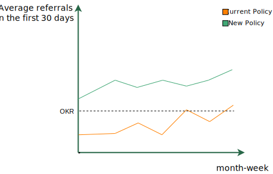
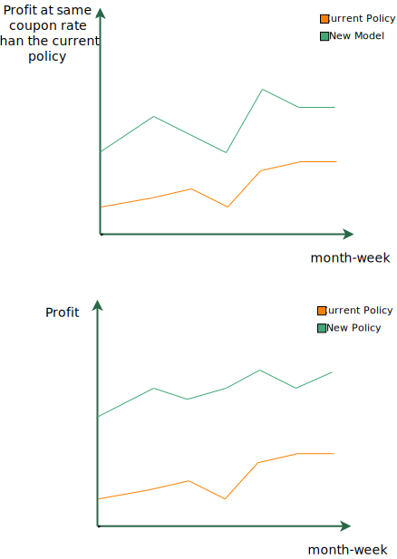

# Table of contents
{: .no_toc .text-delta }

1. TOC
{:toc}

# Metrics

Metrics are used as a guide to know how well we are doing. We can make a nice usage of the different types.

## Model metrics

The usual for Data Scientists and Machine Learning Engineers. They tell how well the model is solving its learning task.

It is essential to define a benchmark for it. It is impossible to tell if a specific model metric is good or bad without considering how other solutions do on it. We will classically use the previous version as a benchmark for new model versions. For the first versions, we can use whatever is the current solution and a very simple model. When using a single rule as the benchmark, a common solution to replace, remember it offers a particular operational point. At the same time, models can be seen as engines that provide a curve of possibilities.

For a binary classification predictive task, we can imagine a Precision-Recall curve we can place the benchmark (simplest model possible, previous version), and the current solution as a single point, a factual. The New model curve will tell us how much we could expect of impact in precision, recall, or both. We will commonly fix one of them and say how much we could improve on the other. E.g., considering the same recall we have today, the new model could increase the precision by 30%.

<figure>
	
		<figcaption>A Precision-recall curve is common for predictive classification tasks. We can place the current solution performance to offer a perspective.</figcaption>
</figure>

In our uplift example, we can illustrate it with a Cumulative elasticity curve [^fn3]. We show the benchmark, new model, and the current policy performance using experimental data.

<figure>
	
		<figcaption>.</figcaption>
</figure>

It is still unclear if we can make profitable decisions with the model. Still, the better the engine that solves the most or one of the most critical components of the whole problem, the more likely the final solution will be better.

## Mid-business metrics

The mid-business metrics are related to the possible impacts of the model on the business. At the same time, it validates the model for the intended usage. They are a way to know if the model is solving a business problem or not or if it enables us to build a policy that does it. They are great sanity checks on the usefulness of the model.

The AUC of a model can tell us how well it is ordering our customers concerning the target. But how does it impact decision-making? What we call here a mid-business metric is one step closer to answering this question.

In the referral problem, suppose we have random data to analyze from the 20k offerings we did. We can consider these 20k to represent the population we want to apply for the coupon-referral program, simulate who we'd choose, and compare it to our benchmarks.

<figure>
	
		<figcaption>We can get closer to business and offer plots and metrics easier to absorb for a cross-functionl team</figcaption>
</figure>

We are only manipulating the same data we had to build the model to display in a way it is more insightful for business. It should be easy for Data Scientists and Machine Learning Engineers to get these numbers.

We know many other components can be part of the solution, like differentiating the value of a referral based on whom did it. We are naively solving the full problem to provide a perspective on how powerful the model is as an engine for decision-making. If the assumptions for this naive solution are not too strong, e.g., considering all referrals have the same value, it could suggest a first policy on how to use it.

When simulating how it would have been using the simple solution during offline evaluation (backtesting), if possible, say, "we would have decreased the cost of the program by 40% and brought the same amount of referrals, which means savings of X USD in three months". Even if the idea is not to reduce the cost, it will give a perspective on the number of resources the team is dealing with.

## Business metrics

Of course, every time we can get to profit as a metric, we should, but teams hardly monitor profit day-to-day. There are important metrics that correlate with profit for every team. They represent the team's levers for revenue and costs. We could put it simply as "the numbers that business people from this team care, talk about, and set goals with". One should adjust for the context. It can be like the average referral for active users in their first 30 days. Usually, there are OKRs (Objective Key Results) related to them.

These metrics can get the attention of the project: "we can increase average referral in the first 30 days by 20%".

<figure>
	
		<figcaption>Produce plots and aggregate numbers relating the model performance to metrics the whole team care.</figcaption>
</figure>

For more appealing a mid-business metric can be, the business metric makes the developer team speak in the sponsor's interest. If it is cheap to jump from model metrics to business metrics, that's preferable. Skip the mid-business ones.

<!-- 
 -->
<!-- <figure> -->
<!-- 	<a href="../../images/project/business-metrics.svg" name="Business metric"> -->
<!-- 		 -->
<!-- 	</a> -->
<!-- 		<figcaption></figcaption> -->
<!-- </figure> -->
<!-- 
 -->

As a final word for decision making, we need to get to an expected profit.

Try to have it as soon as possible in the project. A common pitfall is getting it too late and fall in the Sunk cost bias. The team discovers the project does not impact the business much, but they keep developing it because they have already invested too much. As we are working on this cross-functional team and with releases, estimating it before the final release is crucial, especially if the uncertainty is high regarding the profitability of the project.

One can make a lot of assumptions and see how profit goes even without a defined policy.

<figure>
	
		<figcaption></figcaption>
</figure>

When proposing the policy using the model, you want to change the conversation to the delta profit it will bring in a time range, e.g., the next six to twelve months. It is also usual to propose a few policy options - showing the curve with all the possibilities during decision-making is usually bad. It is better to reduce to 2-3 options that represent the range of possibilities well.

Behavior overtime and displaying it step-by-step, first by changing the engine (using the model to select the same number of people we provide a coupon) and then optimizing the policy, will generate trust on the major components of the solution.

<figure>
	
		<figcaption></figcaption>
</figure>

## Offline & online evaluation metrics

We can call model training and evaluation an offline stage, while a model in production represents the online stage. The team will certainly generate offline metrics before it can offer online ones. How soon a team needs to get online metrics will depend on the offline-online gap on their application. If the training data was generated in an identical scenario to what we will see in production, there is no need for it. However, it is not true for many reasons: different data logging or serving capabilities, previous business policies might have biased the training data, and dataset shift will challenge the generalization power of the model.

In big companies with many different products that interact, it is very hard to predict all side effects, giving further reason for experimentation via A/B testing.

Since it is common to have differences between offline and online data, doing releases involving deployment is highly recommended, as indicated previously. Take a lot of care when communicating offline metrics regarding the expectations they might generate. If a policy is profitable by a little margin in an offline metric, the chances are it is unprofitable online.

## Monitoring

Naturally, the metrics we care about the most during development should be part of what we will monitor. Keep the end-to-end mentality for monitoring and have the same group look at features, decisions, and outcomes.
