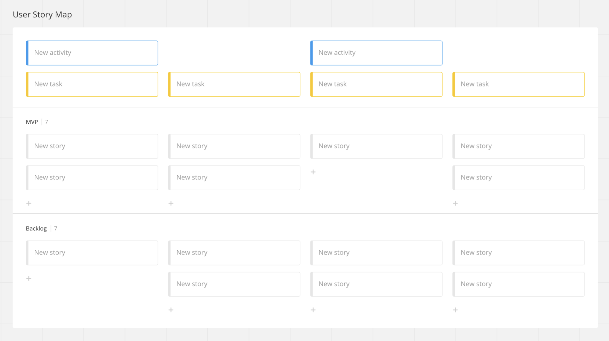

# The logistics

Adjust your expectations, it will be at least a little bit messy, frustrating, and confusing. However, that's a great signal, as we are exposing our minds and generating the shared understanding. No need to be a Process Czar [^fn], focus on the outcome: mapping the end-to-end and defining releases around uncertainties or delivering business value earlier.

## Pre-meeting meeting

Explain the activity in advance. Realistically, not everyone will take the time to read material you send. A short description for the invitation.

> What is story mapping?
>
> Well, we're going to describe everything we need to have a decision in production supported by a Machine Learning model.
>
> Here how it goes:
> - Do a very high-level description of the whole process on a grandparents' level
> - Break it into stages more related to the implementation
> - List all the stories we need to achieve every stage
> - Finally, a very exciting part, we will slice it into releases using some questions like:
> "What if we want to have it in prod in a month?", "What if we want to minimize the uncertainty first?","What we could deliver first to learn the most?"
>
> To finish it, if we have time, we will build a timeline using the stories we have listed and highlight their the dependencies and who will get involved in each for the first release.

Define the schedule. An example:

- 5m: waiting people to join.
- 10m: explaining the session and why we are doing it.
- 15-30m: mapping the backbone
- 30-45m: mapping the full story
- 10-20m: listing uncertainties
- 15-30m: defining the first release(s) and its stories

Set the session with the developers, stakeholders, advisors, and internal users. Try to not overlap expertise. With exception of the developers, invite the minimum number of people that likely possess enough knowledge to describe the end-to-end.

It is frustrating to assume a very high-level in some parts of the solution because the right person is not in the room. For advisors and other roles that can have a smaller role in the project, reinforce their invite personally and explain why they are going to be important. E.g., "we need you in the meeting as an engineer who understands the services involved in the acquisition process of our customers to list how the solution will integrate with it".

In general, if you can clarify with every person what we expect from them, that's great. Tell the tech leads we will need their expertise on a certain subject to describe the steps related to it. Clarify to the stakeholder we want most of their participation and agreement in the backbone level, and they shouldn't let us progress without their trust on the direction.

## Meeting

The more diffuse the steps to build the end-to-end are on different team members minds, the longer it will take. I believe 1h30 is the very minimum, and it is great to do with calm in a 2h30 session. It is ok to need follow-ups, but it is very bad if the team does not get any of the items from the schedule done.

If there was a lot of discussions, clarifications, disagreements, and the team could only create a backbone in 1h30, that's ok.

As the facilitator, you will be constantly making questions. As you are likely an expert yourself, you will be answering some of them. But it would be weird you are the one who answers most of the questions. Ask people directly if they are the most likely to know the answer.

Using a collaborative tools facilitates a lot. I've been using [Miro](miro.com/). It has a template for Story Mapping that facilitates a lot.

<figure>
	
		<figcaption>Miro makes it easy to add steps to the backbone and create additional lanes for every release while enabling multiple people editing it at the same time.</figcaption>
</figure>

During the backbone, it is ok to assume the role of the person writing every step. However, since the beginning, it is important to let people create Post-its with subjects they think are relevant for the project and put it in the board without interrupting the session. So they do not forget it and it flows more naturally.

During the full-mapping, it is possible to provide 5-10 min to let people list by themselves the stories needed and use another 10 to review and fill the gaps. The same goes for the uncertainties: provide a time for everyone to place it, and follow-up with questions to uncover other.

## Post meeting

Do a little bit of cleaning, integrate the result to the work management tool the team uses, and communicate the conclusions and next steps to the team.

- Stories breaking: tell developers and tech leads to describe them better and break them into tasks. They can do async or schedule these sessions by themselves;
- Schedule the timeline definition (if there was not enough time during the Story Mapping);
- Schedule the project syncs (if the team like it);

## Timeline meeting

Get all the stories needed for the first release, and ask developers to define which ones they would like to work on, place them in time, and link their dependencies. Provide a couple of minutes for them to do it organically.

After a first round, review together and challenge the dependencies. Find bottlenecks

If there are following releases without dependencies from the first, map them too. Try to find with the team room to have people not starving, which can include them working in a following release while the team is finishing another.

Do the reality check until everyone is comfortable with the initial plan. Start working on it.

## Following Story Mapping meetings

Since in the following story mapping meetings the team will map following releases, it might not require the original crew focused on defining the backbone. The alignment with them should come from strategic discussions during the presenting of the revious releases results. 

## References
