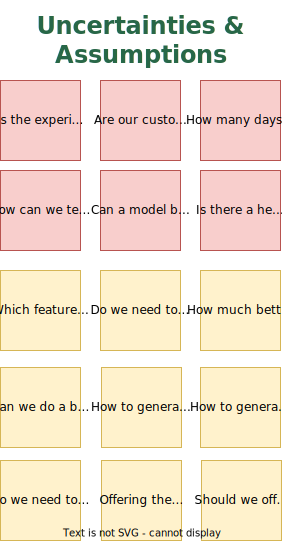
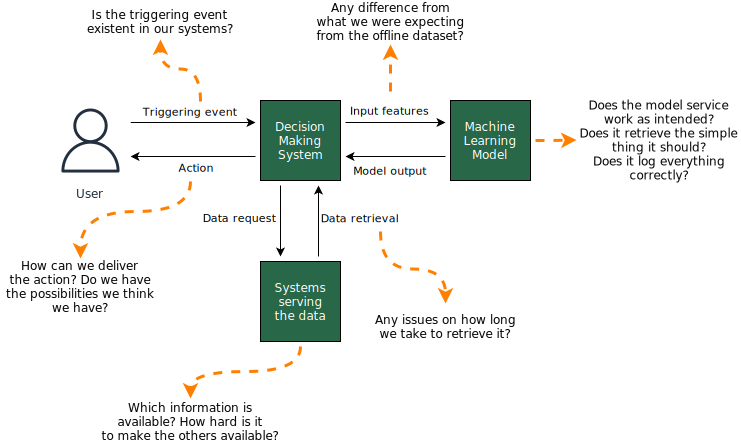
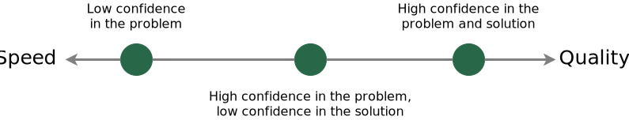

# Table of contents
{: .no_toc .text-delta }

1. TOC
{:toc}

# Defining releases

It is the most crucial stage to achieve a continuous delivery style. That's what will make the team flow. As a project leader, this is the most exciting part and an excellent opportunity for technical references to identify what is essential and relevant.

## Listing uncertainties

After mapping the backbone and the full solution, get back to the notes describing open questions, uncertainties, and risks, and think about other hidden assumptions for the project's success as a team. Which aspects is the team uncertain about?

Think of assumptions that, if true, will:
- Make the justification for the project false (e.g., we want to explore elasticity, but there is no elasticity);
- Generate a challenge the team or the company has never solved before (e.g., if recent data is the most important for the model performance, the team will have to deploy the model in real-time, they never did it);
- Reduce the value of the project considerably (e.g., the volume of customers we can nudge is not that high for some reason)

Sort or classify them in a way to make it clear which are the most important to answer as soon as possible. In the example, we show them in red.

<figure>
	
</figure>

Notice it depends significantly on the team composition, company stage, available data, product maturity, etc. That's why a Data Science project is exciting: it is not an auto ML task!

If the discovery phase was not diligent, insert product assumptions from the section [De-risking the choice of building a Machine Learning model](https://lgmoneda.github.io//data-science-management/docs/project-management/why-building) here.

## Slicing the full story

Now we take as input the complete solution, the group of uncertainties, and the intended business outcome. We will use two principles to slice our project into releases: Knowledge & Business value.

Releases intended to primarily deliver knowledge will de-risk the project. Define what the most important open questions are and what is the minimum the team can build to answer them. Prioritize the ones that offer a higher risk for the project. They will put the team in a place to make more informed decisions, so their definition is strategic.

Releases intended to deliver business value solve the problem incrementally. Most of the times, we don't need to have the entire thing to start generating value for the company. Delivering value earlier has many benefits:

- Takes pressure out of the developers;
- It will provide knowledge anyway since a real solution will likely teach us something for the simpelr it can be;
- It will eventually become the full project! Sometimes the team is happy with what was seen as a partial result since it captures most of the value they were intending.

The team does not need to create all the releases until what is considered the project completion. Since some of them are based on delivering Knowledge, we expect their result to change our understanding of the project, which can change directions. The minimum to map in the first session is the first release.

Questions to engage the team on defining releases:
- If we want to deliver business value in a month [suggest a quarter or third of an estimate of the full solution], how could we reduce the project's scope to make it happen?
- From all the open questions, which ones can compromise the project? To prove those assumptions, what minimum do we need to build?
- What are the most challenging steps in the project we are not confident we can build? What is the minimum we can do to feel optimistic about it?

## Common patterns for releases in Data Science

  You will generally want to make releases as short as possible and cover as much of the end-to-end as possible. Going end-to-end in the first release is a great suggestion. That's a perfect first release in cases where the discovery part was performed well, and the team has reasonable confidence about the problem.

### The end-to-end solution with dummy components

A typical pattern for a machine learning model is that it's a piece of software ingesting data, outputting a score, and providing it to another part of the software to make decisions. These systems' connections might not be trivial, especially when gathering the needed input data. When there is uncertainty regarding it, an excellent first release is to make a dummy model triggered by the event we want to support. It receives actual data and outputs a dummy score consumed by the decision-making software, which is not really using it now.

On the data fetching, it is getting it from the actual sources. And the team should prioritize discovering sources, not providing all the possible features. It validates and profiles the data interfaces. For example, you have user registration features, which are pretty much static. Can we serve them? You have user behavior features, like their purchases in the last hour, clicks, searches, etc. Can we serve them? Integrating a fraction from every source is enough to validate. Different feature groups might offer different costs to be integrated, and it is excellent to model knowing it.

<figure>
	
</figure>

In our example, the scope of the first release, in this case, could be: triggering our model when the customer login in (considering that's the event we decide to score), fetching the relevant feature groups, returning the score, registering a possible decision regarding the coupon, and not making the decision to show the coupon, would help us to validate if we can make the relevant data to flow from inputs to decision.

This is nice to unblock engineering to start working on the project even before we have a final model definition: which features, model type, parameters, etc.

During this process, the team might discover data sources that are not readily available, how long it takes to make the entire flow happen, etc. With this information, the team can decide on the following releases and adapt the project accordingly.

### The simplest offline solution

To prove we know how to evaluate our solution and that we can solve the problem with the available data. Going from data to model, policy, simulation, and evaluation in a way that provides model metrics and a business metric (ideally, the one we care about) is a good idea.

This is way better than iterating in a model metric. Saying, "we can build a model with an AUC of 0.64", does not provide much insight into deciding on the project follow-up.

In our coupon example, we want to show that the model would allocate coupons so that the total number of referrals will be higher, given the exact costs of coupons we currently give. Notice it is probably not the optimal decision we could make based on the model. Still, it gives us a simple scenario in which using a simpler version of the solution is already profitable.

That's useful to convince stakeholders we have a good compass to guide the model development. We will have at least a straightforward policy as a benchmark, an uplift number that generates a discussion on how much better the model needs to be or if we already have enough to deploy it.

### The simples online solution

As we might experience a gap between the data we collected and can use to train our model and the data the model will score online, a great release would be deploying a straightforward model and policy to production and monitoring it. It will acknowledge the gap, and it can change the project direction completely. The team might find the data available to train is not that useful to solve the problem and engage in designing an experiment to generate the right data.

The difference between offline and online performance can help to adjust expectations when presenting offline metrics to the team.

Perfectly, engineering validation would have been done with the end-to-end solution with dummy components. Still, we will have the opportunity to spot other bugs, mistakes, or hidden assumptions by monitoring a live solution.

### Bringing business value early but with a poor tech solution

Delivering value earlier is another appealing option, especially for the first version of a solution leveraging Machine Learning. It takes a lot of pressure from the team and provides excellent insights for the following releases or versions.

What is the simplest way to deliver the business outcome?

For our problem, we could imagine using only information from the registration flow and we deciding on the coupon in batches, instead of in real-time. We could score our customer base manually, meaning a developer triggers the score, so we don't need to deploy it. Apply the policy on the scores to decide to which customer to offer the coupon, and find an existent way to provide it to the customers, like their e-mail, though the perfect plan was a screen in the app.

This simplest solution is a horror show. Tech leaders should think about what is negotiable and what is not. Consider if the time benefit makes sense when compared to the technical debt. The trade-off is that getting far from the intended scenario can make delivery faster but bias the data for the following steps, e.g., offering a coupon by e-mail has a different effect than offering in-app.

There will be solutions that are not perfect in terms of tech, like simplifying the model, and still don't hurt the mid and long-term. These are usually the ones the team wants to pick to deliver value earlier, learn from it, and keep developing a more complex solution after making stakeholders happy.

## Defining the first release for our example

When we finished the full mapping and the uncertainties mapping, we have the following information:

We identiied the following reasons that would make the project not make sense:

- Not enough experimental data;
- Lack of elasticity on doing referrals when getting a coupon;
- A bad target definition;
- Inability to compare the model to the current solution;
- If the model does not improve the current solution;
- Lack of heterogeneous effect.

What can we deliver to gather evidence to answer these questions? Define the scope of it. It is the text in the under the release identified in the left.

We now look to all the stories in the full thing and we can select which steps are needed to achieve the description. We will copy and paste some. It needs to be a subset of the complete thing, but we might also need to build steps that were not explicit or not part of the perfect solution. In the image, we should in red what we have excluded, in blue what remained and in green what we have added (sometimes as a simplification of an excluded story).

<figure>
	
</figure>

In our example, we see the Discovery didn't answered these questions, which might not be the case in every project. The first release can mark the transition between upstream and downstream, or be the first downstream step.

At this moment, defining the first release is probably enough and the team can start working on it.

### The following releases

Every release is going to generate Business value and/or Knowledge. The team will decide on the following based on it. It might happen to have a few releases without dependencies, which enable the team to map more than one in a session and build them in parallel.

### Prioritizing business value

The releases we defined in the example are not an example to follow regardless of the context. Again, this definition is very influenced by the context.

One example is the result of the second release.

> Is the reduction a deal breaker for the batch?

This is a decision to be made in the light of the results. We can imagine a few scenarios:

- Yes, and we build the batch solution as the last release of that version of the model;
- Yes, but decide to deploy the batch solution to bring value as we build the real-time solution. A good option if the time to develop the real-time solution is long or unknown
- No, and follow-up with a release to deploy it in batch.

There is no right or wrong, it all goes for the involved costs and benefits. Delivering something that captures 60% of the original value and jumping to another larger opportunity might be better. Or even waiting for a better moment to improve it.
## Supporting concepts

### Speed Vs. Quality trade-off

The project leader should help developers to see the Speed vs. Quality trade-off [^fn5] [^fn6] involved in the releases. The same stage of model development might appear on different releases. For example, Exploratory Data Analysis. In early releases, you probably want to spot big data issues and do it quickly. Making the team understand the particular interest of that EDA is very important. Confidence determines speed vs. quality.

In general, first releases will have low investments in particular stages.

<figure>
	
		<figcaption>The releases will provide confidence in the problem and then in the solution. <a href="https://untools.co/confidence-determines-speed-vs-quality">Source</a>.</figcaption>
</figure>

A good rule of thumb is: is there a chance that this task will be irrelevant if something else doesn't work as intended? If yes, make it quickly just to enable the following tasks to answer these assumptions that can compromise or make us more confident about the initiative.

### Stepping stones

A cool concept from "Stepping Stones not Milestones" [^fn4] is that real projects happen in the cone of strategy. The cone of strategy can be seen as all the possible paths that take the team to achieve the goal, which is not singular but is part of a space of potential end goals that achieve the intended business outcome.

<figure>
	
		<figcaption>Our understanding of the problem and the solution space should evolve after every release, which open up for decision making on the following ones. <a href="https://medium.com/@jamesacowling/stepping-stones-not-milestones-e6be0073563f">Source</a>.</figcaption>
</figure>

That's why we can't map all the releases perfectly in the first conversation. If we define releases that will provide us knowledge regarding what we are building, it is expected that when we have results from it, we will use them to make decisions. Those results can be seen as this tortuous path in the cone. See also how there are potential goals at the cone's end and before it.

## References

[^fn4]: Cowling, J., [Stepping Stones not Milestones](https://medium.com/@jamesacowling/stepping-stones-not-milestones-e6be0073563f). Accessed 29 October 2022.
[^fn5]: Amran, A., Tools for better thinking. [Confidence determines speed vs. quality](https://untools.co/confidence-determines-speed-vs-quality). Accessed 29 October 2022.
[^fn6]: Chu, B., [Product Management Mental Models for Everyone](https://blackboxofpm.com/product-management-mental-models-for-everyone-31e7828cb50b). Accessed 29 October 2022.
