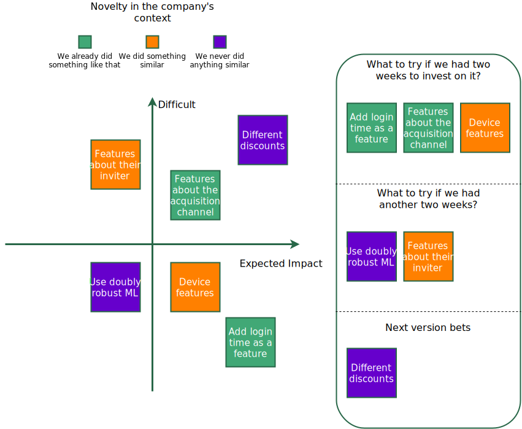

# Research & Optimization

I will use "Research and optimization" meaning exploring ideas to make a solution better. In Data Science, since we have Machine Learning models that solve one or more tasks with a given performance, one can invest time to improve the performance on the given task.

Technical people get particularly excited about this stage since they can learn and try new techniques, like different pre-processing, model types, model architecture, hyper-parameter optimization approaches, feature selection techniques, feature engineering, etc.

This is a trap that I believe is way more pronounced in the Data Science field than software engineering in general: endless optimization and exploration on top of a solution.

For the referral-coupon problem, there are many approaches to de-bias observational data, ways to combine with experimental, model types, etc. It is easy to enter a loop of trying all the libraries and spending weeks or months.

## Time-box optimization

If we know that the better a model metric, the better the business outcome, you can spend time optimizing it by looking at a model metric. That's the case when the first version of a model is successful or after a successful release to production.

Even then, set a time budget for the team. E.g., we can work for three weeks on all possible. It is nice to let the team explore what they think is more promising; a session together can help with it. The session can follow a brainstorming, categorization, and prioritization form. Standard categorizations for the ideas quantify the impact, effort, and novelty.

So you might end up with something like this:

<figure>
	
</figure>

Be faithful to the budget. At the end of it, document everything and add to the scope of the project only what makes sense given the

## Focus on lowering uncertainty before optimizing

Avoid premature optimization. If it is not yet clear the relationship between a better model and the business outcome, invest more in validating the connection between predictions and business outcomes, and just a little on how to make that prediction better.

A first version that solves the problem with a few features and a simple approach is a fantastic achievement.

In our problem, we first uncover the suitable validation schema using the simples solution. Then give the team a week or two to explore a few approaches, like a doubly robust estimator versus a model fitted only with experimental data.

As the team gets more experienced in solving that problem with ML, the time budget will change and allocate to innovate and optimize the ML component.
