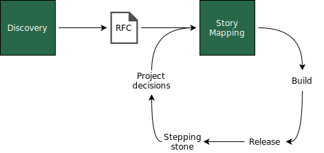

# Story Mapping

With a potential team in place and agreement on the problem's relevance, we can start the Story Mapping. A team can use Story Mapping during discovery, but now it will reach the limits of shared understanding to build it together.

Though Story Mapping is central to this process, that's a version of it that works well for my purposes. Here's a [video](https://www.youtube.com/watch?v=a--xbF_WGyM) and an [info graphic](http://www.jpattonassociates.com/wp-content/uploads/2015/03/story_mapping.pdf) by Jeff Patton summarizing it on its original proposition.

Let's look at the final representation we will have at the end of a project. I will describe how it evolves. I'm using a custom diagram here, but software like Miro offers a template.

<figure>
	
		<!-- <figcaption>Putting together the many common terms for these two stages</figcaption> -->
</figure>

It is read from left to right, with a temporal interpretation. The top two rows are the backbone. The first row is a high-level perfect user journey on how what we are building will work. The following row breaks it into stages that start to make sense for developers. The first block of stories defines the first release. The subsequent blocks are the next releases.

Abstracting, we can expect the following movement.

<figure>
	
		<!-- <figcaption>Putting together the many common terms for these two stages</figcaption> -->
</figure>

I will present the details of the process and discuss the logistics more precisely in a later section focusing on the role of the facilitator.

## The "User" of the "User Story Mapping"
I've been omitting the "User" from "User Story Mapping". Data Science Projects involve different users, just as software in general. You might solve a single pain from an internal user or team, use a tool to systematically address pain from multiple internal users, or solve an external user task.

An example for the first case: a team needs to decide if they offer a subscription discount and how much they should offer. They are the customers of a solution that uses Machine Learning to accomplish it. Many times, some of them will also be developers since you want to deliver the end-to-end solution, and it will hardly get to decision-making without work from the team benefiting. They are essential in the Story Mapping process.

## Tooling

Many tools can support Story Mapping, timeline, and work management. The tooling is not really important. Use whatever fits the team better and aligns with the company. A suggestion is to not use more than one if they are not integrated. For example, Miro can display Jira cards. So the team does not need to update information in two different tools. It is important to use at least one work management tool to keep track of all the epics, stories, tasks, their status, and who is developing them.
