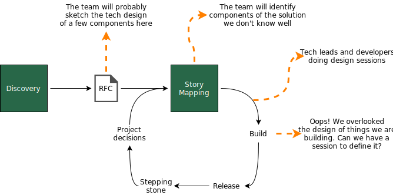

# Technical Design

Story mapping does not offer the best audience for technical design. Developers and technical leaders should set these sessions to work together in a smaller group, usually a subset of the developers with expertise on that part, and technical advisors, if needed. Do not take it as "overplanning". This is development. Now we want to be precise and specific, derive stories that were unclear in the story mapping, etc.

In our project, the developer and tech lead should get together to look at the user flow to determine when we will trigger the model and which services will be involved in fetching the data, scoring, displaying the coupon, etc.

This sessions will likely be spread in the whole process. The important part is to keep all the developers in the same page about it, and use the communication channels to adapt releases, stories, timelines, etc. It does not mean back and forth, but it shows how the increasing understanding of the problem and the solution space will require technical design efforts to happen continuously. 

<figure>
	
		<!-- <figcaption>Putting together the many common terms for these two stages</figcaption> -->
</figure>

