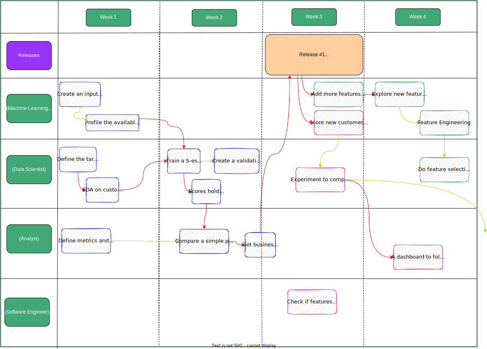
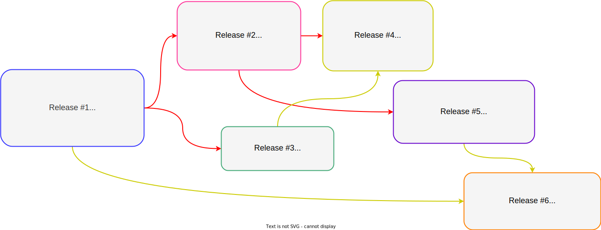
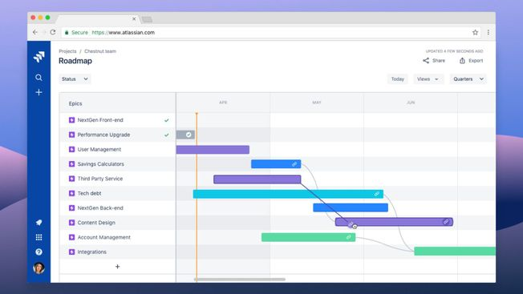

# Timeline

Another crucial moment. It can happen at the end of the Story mapping after we have at least one release mapped or in a different session with the developers. If it happens at the end, a bit of conversation on the scope of every story might happen if developers didn't break it yet. Otherwise, they could start with better defiend stories.

The team should map the dependencies between tasks. I like to see the timeline using a representation that shows developers' work and their relationship. Usually, Gantt charts are by tasks. Many work management tools can build a view similar to this one.

<figure>
	
		<figcaption></figcaption>
</figure>

Let the developers decide who will execute which story and how long it will take. Roles usually have some overlap and individuals have different skills and motivations even in the same role. Keep the division of work organic, just intervene if you see bottlenecks and to help the team optimize to deliver faster.

After doing it, do a reality check. Details on it in a following section.

In a practical sense, give 5-15 minutes to the developers to drag the tasks to their lane and connect the dependencies. Then start working on top of it: challenge time for execution, dependenies, allocation, etc.

The image shows a first release mapped and a few stories from following ones (represented by different colors for the stories). Here, one release depended completely on the other - we can't experiment if we don't have evidence the model works in the offline evaluation. In our example, we have some product open questions in forms of untested assumtions that could compromise the project. However, it is also possible to have two releases under construction at the same time. See how it is possible to start working on tasks from the third release (in green) without a dependency on the second. That's why it is good to map story dependencies inside a release, but also between releases.

<figure>
	
		<figcaption>This is a snapshot from the end of the project. We will talk how it evolves to get here in the Strategic decisions section.</figcaption>
</figure>

I've found it helpful to represent dependencies as weak and strong. Weak ones do not prevent the next task from starting, only to be concluded. Strong dependencies block the next task entirely as they offer all of the main inputs to do it. E.g., in the previous timeline, we cannot check for populational elasticity without defining the target.

A classical weak dependency happens when we can meaningfully work on the next task using a partial result or ignoring it. For example, one can train a model with a subset of the features and use those scores to build the following steps, like designing the policy. The team can progress in that direction if we guarantee the interfaces between the tasks. As we usually solve things programmatically, changing the input and running a calculation pipeline is easy.

Notice the dependencies and time for execution are relative to the team and the company. It is impossivel to provide suggestions on it. The timeline displayed here is very illustrative. The following image displays it entirely. This view is impossible to build in the first day. It is extremely dependend on the result from every release and team decisions.

<figure>
	
		<figcaption></figcaption>
</figure>

In general, using a Gantt chart by task with arrows for dependencies make it less messy (<a href="https://community.atlassian.com/t5/Jira-articles/Introducing-dependency-amp-progress-for-roadmaps-in-Jira/ba-p/1166975">Jira example</a>), but the mess the timeline exposes is interesting. Because it is displaying information that was fragmented in a couple of individuals. Imagine having to build it without this awareness. The team should always push for simplification, but never shy away on exposing the existing complexity, uncertainty, and dependencies.

<!-- 
 -->
<!-- <figure> -->
<!-- 	<a href="../../images/project/jira-dependency.jpeg" name="Cone of Strategy"> -->
<!-- 		 -->
<!-- 	</a> -->
<!-- 		<figcaption><a href="https://community.atlassian.com/t5/Jira-articles/Introducing-dependency-amp-progress-for-roadmaps-in-Jira/ba-p/1166975">Source</a></figcaption> -->
<!-- </figure> -->
<!-- 
 -->
