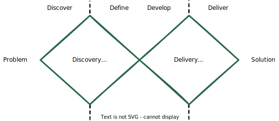

# Table of contents
{: .no_toc .text-delta }

1. TOC
{:toc}

# Why are we building it?

This text will consider that the team is working on the right problem. The process of answering the questions on "why" and "what" to build can be seen as part of Product Management. There will be constant sanity checks on them during project management. Still, I will consider the starting point as "we know the problem we are trying to solve is relevant and how it connects to the desired business outcome". Nonetheless, since a common anti-pattern is to build a Machine Learning model a team does not need, let's briefly comment on it.

## De-risking the choice of building a Machine Learning model

Machine Learning models make projects more complicated. You probably want to avoid building an ML model as much as possible and leverage other things we consider as Data Science, like simple rules based on a few variables. Make sure of the following things before building it.

### The problem is relevant, and the size justifies investing in ML
Moving the associated metric will drive a large business outcome. And there are no other opportunities that the importance is higher. Is the budget the company can invest in the discount coupons large? How many customers could we bring to the company if we optimally allocate coupons? Will these numbers be noticed by people following the company's Growth? Is it the best growth opportunity available?

If it is not part of the company strategy to spend a large amount of money on this incentive, the absolute benefits of optimizing its allocation will be low.

### The internal or external customers want it and will get value from it
There should be some data supporting it, either from User Experience Research or internal interviews. Automating something for customers that they don't see as a pain won't be helpful. Supporting a decision an internal customer does not see as critical won't generate value.

Is the team deciding how to allocate the coupons concerned with how excellently they do it? Do they perceive how well some people respond and how others do not respond at all and wish they had a crystal ball to identify them? Are they unhappy with the current solution?

### The project is technically feasible
No need to know all the details to answer it. But if the project requires real-time data and the company does not have an infrastructure that offers it, one should ask if it makes sense to make it part of the project scope or consider the project unfeasible at that stage.

The same thing to other critical parts of the project that don't need details to enable thinking about it: can we offer discounts? Do we have an in-app notification system?

#### Do we have the correct data to build it?

A particular technical feasibility criterion for Data Science projects is data.

Are we logging at least part of what we consider we can use as input data? Do we have experimental data to train and validate the model if we are willing to change people's behavior and make a causal inference?

A model to predict the uplift in referral behavior from offering a discount will likely experimental data to provide positivity. Otherwise, we will work on top of biased data from previous ways of offering discounts, or we'd not even have any data on customer behavior when getting deals.

### The delta benefit of having an ML model and the delta effort make sense
As simple rules can potentially solve part of the problem, the real value of a more complex ML model is the delta benefit. Challenge if it makes sense. Usually, if the problem is large, it will make sense to build an ML model since moving a metric by 10%-20% will mean a large amount of money to justify the people and time invested.

## Building the end-to-end

It depends on the project leader's seniority and the project's ambition. Still, in general, it is great if the leader can set the definition of done as delivering the intended business outcome. It means a Machine Learning model is only finished when making decisions in production. Or the main users of the tool are applying it successfully. The developer team should feel eager for this moment and work as they are accountable for it, avoiding the "my part is done!". That's the time to reframe the project from a "new engine" to a "new decision/product based on a new engine". For example, instead of the "Coupon-referral uplift model", the team will build the "Intelligent coupon-referral program". If you are not senior enough as a Data Science leader for it, demand someone to play this role. Large initiatives can have multiple leaders, and it is better to be the leader of a clear component of a larger project than consider that component a whole and suffer to integrate it.

## The transition between upstream and downstream

There are multiple models to describe the two general stages of projects. Let's use the Double diamond design model to illustrate all the concepts people usually use for project stages.

<figure>
	
		<figcaption>Putting together the many common terms for these two stages</figcaption>
</figure>

Here I describe how to manage what happens in the second diamond.

A Request for Comments (RFC) document can be used in the transition to display all the relevant information from the discovery phase. It is a document to circulate and spread the understanding of the team involved in the discovery to stakeholders and internally recruit the team. Focus a lot on the problem statement, on why we need to solve that problem. Skim the solution space, show the tested assumptions to choose that particular opportunity, etc. In our coupon-referral situation, we want to expose the answers to the questions in the previous sections about de-risking.
