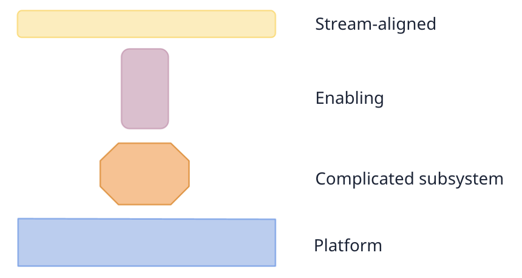
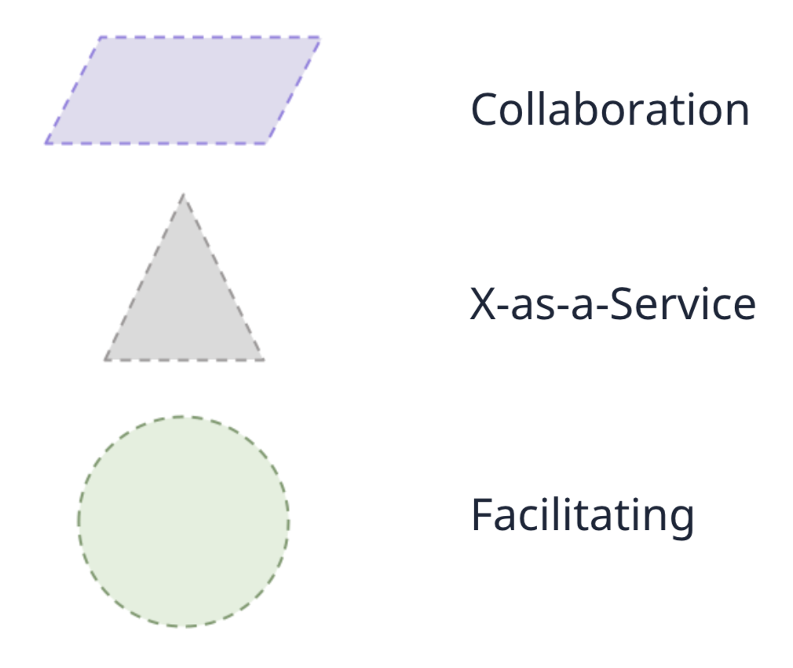
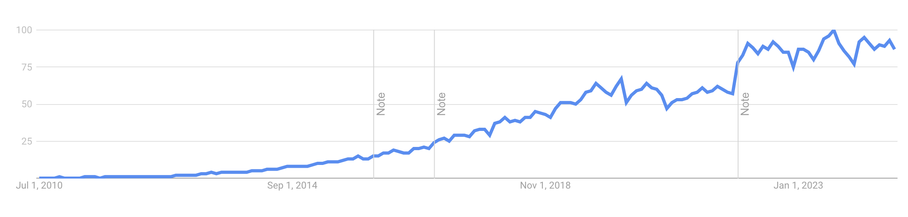
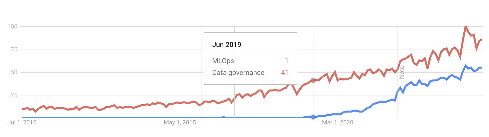

# Table of contents
{: .no_toc .text-delta }

1. TOC
{:toc}

# Introduction

This workshop and the following two explore concepts from the book "Team topologies: organizing business and technology teams for fast flow", by Skelton & Pais [^fn1]. It was one of my favorite technical readings.

Team topologies are relevant for deciding what to work on and eliciting technical leadership opportunities. Staff Data Scientists and Staff Machine Learning Engineers represent and own the state of tech in their teams, which means they act as an interface for interactions with other teams. We expect them to help evolve their systems, which stretches them as professionals.

This first workshop will examine the issues and challenges motivating the Team topologies framework. I will provide a few exercises to support seeing these challenges in your case.

# Team Topologies

The Team Topologies framework focuses on how to set a dynamic and transparent organizational structure and team interactions.

It defines teams as the fundamental building blocks of organizations, and individuals inside them should be aware and act as a team instead of a group of people. Four team types define the expected behavior of a team and modes of team interactions that further support this predictability when working together.

<figure>
	
		<figcaption>We can characterize most teams using four team types, which I will expose in the following article. The types clarify how to behave as a team and, consequently, to individuals who are part of it. The team type and what others expect from it affect technical decisions.
<a href="https://github.com/TeamTopologies/Team-Shape-Templates">Source.</a></figcaption>
</figure>

Two concepts that motivate and shape the framework: cognition load and Conway's law [^fn3], which are related to complexity, team size, and the reflections of the organization structure on the system architecture.

<figure>
	
		<figcaption>There are three modes of interaction for teams. As interactions are inevitable when building complex systems in a team of teams, the types set the expected behaviors to ease the exchanges.
<a href="https://teamtopologies.com/infographic/getting-started-with-team-topologies-infographic">Source.</a></figcaption>
</figure>

The authors highlight how these structures are dynamic - the organization structure and team type and interactions will constantly evolve. An organization needs to be a "sensing organization": always perceiving how some things are degrading or emerging. As a Staff+ level in a technical career (Data Scientist, Machine Learning Engineering, Software Engineer, Product, Business Analytics, Design, etc) and part of the decision-makers, one needs to be able to identify the technical signals that demand evolution and be part of the ones driving the changes. We will build up this skill in the following sections.

# The constraints our limited cognition imposes on us

As humans with a certain cognition power, we have found that we have limits for social group work. We are unable to deal with larger groups.

This result comes from Dunbar's number [^fn4]: fifteen is the group size limit for members to trust each other deeply. From those, only five can be known closely.

Trust is an essential component of a high-performance team — a result echoed by many [^fn5] [^fn6], though the most popular study about it, from Google [^fn7], lacks publishing.

Consequently, to be effective and innovate as a team, it is necessary, but not sufficient, to keep teams small, up to 15 people, but typically around 5-8.

## The type of relationship expands the team size limits
{:.no_toc}

One can only build so many businesses with 15 people. What we call a "team" here is the everyday group we work together in. Companies use different names to describe the higher levels of an organization, like "business unit", which is composed of many teams.

Going beyond Dunbar's number, Skelton and Pais bring other limits for certain types of interactions and suggest team sizes:

- Around five people: Limit of people we can hold close personal relationship and working memory.

- Around fifteen people: Limit of people with whom we can experience deep trust

Around fifty people are the limit of people with whom we can have mutual trust.

- Around 150 people: Limit of people whose capabilities and skills]] we can remember.

The everyday team (e.g., Spotify's Squad [^fn8]) consists of 5-8 people. I will keep referring to this as a team.
A group of teams working under the same broad domain (e.g., alliance, Tribe, etc.), around 50, up to 150.
A Profit & Losses center (e.g., a Business Unit, Division, etc), from 150 to 500.

## The team size and responsibilities define the team's cognitive load
{:.no_toc}

Beyond the team size, the role, goals, and domains a team owns will define its cognitive load. A team can deal with a limited load. Though we can hold the team size constant, the other elements are dynamic and can change out of the team's control, generating a scope increase. For example, if a company expands internationally, the team starts to deal with serving two countries, which can come with extra requirements due to local legislation, different time zones, new internal customers, etc.

An excessive cognitive load decreases the team's motivation. Breaking by Pink (2011) [^fn10] three pillars for intrinsic motivation: Autonomy (compromised by the team having to deal with multiple requests and unable to decide by themselves what to do next), Mastery ("jack of all trades, master of none", the team does a lot of things, nothing particularly good), and Purpose (too many domains, they don't feel owners or main agents of nothing in particular).

# The Conway's law and its implications

_Conway's law: System design reflects the communication structure of the group who builds it._

There is a homomorphism between the design team and the system design. In many cases, if one group designs every subsystem, it becomes 1:1.

<figure>
	
		<figcaption>There are three modes of interaction for teams. As interactions are inevitable when building complex systems in a team of teams, the types set the expected behaviors to ease the exchanges.
<a href="https://teamtopologies.com/infographic/getting-started-with-team-topologies-infographic">Source.</a></figcaption>
</figure>

The example Conway uses in his article [^fn3] is about the Fortran and COBOL compilers. Eight people for both projects. They split five for Fortran and three for Cobol. The first ends up as a five-phase compiler, the second as a three-phase one.

It means that when designing teams, we are designing systems. If cognition is an essential element for team design,  it is for system design.

# Inverse Conway maneuver

> Design the organization you want, the architecture will follow (kicking and screaming)  
> \- Evan Bottcher

Coinned by James Lewis and others from Thoughtworks [^fn9]. Enforced by Forsgren (2018) [^fn6].

It is using the Conway's law at your benefit and designing a organization structure that makes the software architecture you want *more likely*.

Skelton and Pais provide an example of data professionals concentrated in a single team. This allocation creates a unique communication channel for data expertise and will likely generate a monolith database.

Using it in the favor of what you want is thinking first about the software architecture, then in the team. To have a decentralized Data Store, we need data professionals in every team and a data infra capability provided by a central team.

# Organization and team design

If the organizational structure defines the solution design space, technical expertise is required. Thus, it is needed to involve technical leaders in it (the Staff+) - and they need to be willing to participate and be prepared to contribute meaningfully. Refraining from it because it sounds like a technical person doing a "manager job" is likely to impose unpleasant constraints for future solutions.

As a manager, I expect technical leaders to see how one thing interferes with the other and how we can use it together to achieve what we want or bring it up proactively when they want to evolve our solution and need support on the organization's design.

It also means we must understand the architecture we want before designing a team. Here's where it connects with Staff+ contributions to vision, strategy, etc. Because technical leaders and managers keep tuning where they want to take their systems in different time ranges, they should have great notions about team organization when the signals point to changes or to use the Inverse Conway maneuver.

Considering the team as the basic delivery unit and our objective to provide them autonomy, mastery, and purpose, we need to find an architecture that enables it. A significant part of doing Data Science and AI is about software engineering and many proven software architecture practices that help when designing an architecture for team empowerment, like loose coupling and cross-team testing.

At the same time, there are specificities of analytical work, machine learning, and AI systems: data generation, data quality, data providers, labeling, data and model monitoring, business problem-solving, offline/online stages, retraining, computation for training and inference, etc. Technical leadership must understand these stages well, their tooling, interfaces, how people working on different parts can get the correct feedback about their work, how we can split some of these stages into different teams without creating friction, etc.

# Recapitulation
{:.no_toc}

Let's recap to ensure a clear understanding of the foundations of this care about teams.

- We have social limits on how we can interact with other people in an organization;
- We have limited cognition to deal with complexity;
- These limits push us to limit our teams to small sizes and manageable domains;
- Small teams mean splitting groups and domains;
- Splitting groups means influencing the architecture of the resulting system (software or another kind);
- The architecture of the resulting system is what we care about the most to deliver value;
- We conclude we should care **a lot** about how we organize ourselves as teams and that it is a technical subject.

# Changes aren't permanent, but change is

If we expect our architecture to continuously evolve, we should expect continuous organizational change.

> Always hopeful, yet discontent  
> He knows changes aren't permanent  
> But change is  
>   
> \- Rush, Tom Sawyer  

We don't expect to change teams, members, and organization frequently. It is costly. 

Teams need to be together for a reasonable time to generate mastery. Nonetheless, we need to keep in mind that some changes are expected due to a greater understanding of the problem the team is solving or the solution the team wants, the increase in complexity, etc.

Re-organizations have bad fame, which is justified: frequent changes performed by people who are not doing it pursuing a shared envisioned system will likely degrade a team. However, we expect more from experienced folks on these moments. Going against team changes needs to be deeper than "we are tired of changes", and point to why those changes won't produce the system the team wants to build.

If technical leaders want to evolve the architecture, they will likely need to influence the team organization. If the architecture evolves, the team organization will, too. I expect this series to support it.

# Domains and boundaries

A domain is a "particular interest, activity, or type of knowledge" [^fn11]. Here are some examples of domains, from highest to lowest level: Fraud, Credit Card Fraud, and transactional credit card fraud. Or Data, Data Governance, and Data discoverability.

We want to assign one or more domains to a team. It should enable a team to deliver with minimal external friction. For example, the team that owns the transactional credit card fraud subject should be able to provide a new rule to reduce it without handing off work to other teams, triggering processes that are completed externally, etc.

Splitting domains and software involves a trade-off. Splitting too much can compromise the user experience (UX) and generate duplicate data and solutions.

A bounded context is a unit for partitioning a larger domain that shows internal consistency. This term was coined by Evans (2004) [^fn12], a book about Domain-driven Design: an approach to design software based on models of the underlying domain, which provide a common language to developers and domain experts to talk about and support the creation of elements and functions about it.

If a team owns one or more domains, and the boundaries between the teams will determine the boundary of the systems they build, a technical leader should understand very well what their domain is about and the others it relates to.

## Usual system boundaries
{:.no_toc}

Skelton and Pais (2019) [^fn1] provide several commonly used criteria to split domains.

- **Business domain bounded context**: the most common to use. Intuitively, it divides the business into the jobs needed to satisfy customers: customer service, product catalog, shipping and logistics, payments, etc.
- **Regulatory compliance**: the different regulatory needs enable domain split to avoid imposing different processes and interactions with auditors.
- **Change cadence**: When different parts of the system need to change at a different pace, combining them will impose the slowest change rate on all of them. Follow the business need for change to split.
- **Team location**: The team needs to have a good number of overlapping working hours and the strongest communication possible. Otherwise, reviews and approvals can slow it down.
- **Risk**: depending on how acceptable it is to take risks in the form of changes with a high potential for positive or negative impact.
- **Performance isolation**: if a part of the system requires excessive attention to performance while it is negligible in other parts. E.g., processing financial transactions.
- **Technology**: commonly used (splitting front-end, back-end, etc), but mostly done wrong since it usually generates more dependencies, hand-offs, and information silos. It is helpful for particular cases, like legacy tech.
- **User personas**: when internal or external user segments start to differentiate enough that understanding and building features for them becomes complex enough to justify focusing. E.g., high-income customers.

The authors also offer a way to evaluate the domain split using two questions:
1. *Does the resulting architecture support more autonomous (less dependent) teams with reduced cognitive load (less disparate responsibilities)?*
2. *Could we, as a team, effectively consume or provide this subsystem as a service?*

If the answer is yes, one can split that sub-system and have a team owning it.

Further, we classify the domains by their complexity. Perfectly, a team should 
## Domain complexity 

# The evolution of Data Science in the industry and its sub-domains

The base fields for Data Science are old: statistics, computer science, Artificial Intelligence, Software Engineering, etc. However, the Machine Learning and data Science wave from the 2010s has thrown a couple of academics and new joiners into companies of different sizes.

<figure>
	
		<figcaption>The growing appearance of the term Data Science in Google searches. The field was built on top of statistics, ML, and engineering and continues to be fueled by advances in AI. It opened the door to many newcomers to the tech market, notably from academia.
<a href="https://trends.google.com/trends/explore?date=2010-07-17%202024-08-17&q=/m/0jt3_q3&hl=en">Source.</a></figcaption>
</figure>

We have seen companies starting with a federal model, placing all their "data experts" in a single team and going after the first couple of opportunities before splitting them into the business. When they start to iterate on the first generation of solutions, typical patterns of Data Science projects appear, and sub-subjects become relevant. The most common to become salient is Machine Learning Operations (MLOps), a set of practices, tools, and frameworks that aim to streamline and automate the development, deployment, and management of machine learning models in production.

<figure>
	
		<figcaption>While the Data Science field started to grow in 2014, the MLOps subfield started in 2019. We can also see how an existing subfield from Data, a base topic for Data Science, has also grown recently due to Data Science. These subfields represent subdomains the community has found useful to break into to deal with the field's complexity.
<a href="https://trends.google.com/trends/explore?date=2010-07-17%202024-08-17&q=/g/11h1vbjpbg,/m/0fxl7g&hl=en">Source.</a></figcaption>
</figure>

Having an MLOps team that absorbs all the complexity of deploying ML models is crucial to alleviating the cognitive load on data scientists and machine learning engineers who must think deeply about specific problems, like how to improve recommendations to increase sales.

At some point, this fictional team pushing for conversion might start offering coupons beyond recommendations. At some point, this problem can become different enough to split into another team, which is justified by a different set of metrics, types of models, language, etc.

# Workshop: Identify team boundaries

We did these workshops in a group. The group had more than one person from three different teams. We grouped people by team because we focused on the team as the base unit. I'd recommend doing it with others on the same team, but it is also possible to do it alone.

I provide a [template](https://miro.com/app/board/uXjVKms1KIM=/?share_link_id=752512685457) with examples for this and the following workshops.

**Activity 1: Flow of change**
1.  List the last 2-3 completed epics your team has worked on;
2. Identify the flow of change for them:
  1. List the teams you have interacted with to deliver it;
  2. Characterize the interactions:
    1. Consuming an internal product (no interaction with people)
    2. Collaboration (working together in a joint effort for 1-6 weeks)
    3. Handoff (requested a task to them to continue yours)
    4. Others (try to find out a pattern)

**Activity 2: Listing domains**
1.  Identify the domains your team own
2.  Classify them into simple, complicated, or complex (or rank order them)
3.  List higher-level domains your domain is a sub-part of
4.  Identify if your team splits a domain with other teams

**Activity 3: Evaluation**

Consider the flow and the domain list to evaluate the current situation and verify whether it elicits the team's plans for the future.

- Are there bottlenecks in the flow of change?
- Considering the characteristics and interfaces you and your team want to provide to your systems, do the current boundaries enable it?
- Is your team overloaded by too many domains?
  - If yes, should we have a plan to split it?
  - If not, does the future point to them becoming more complex? New use cases, new products to support, etc

# References

[^fn1]: Skelton, M., & Pais, M. (2019). Team topologies: organizing business and technology teams for fast flow. : It Revolution.
[^fn2]: Cook, R. I. (2020). Above the line, below the line. Communications of the ACM, 63(3), 43–46.
[^fn3]: Conway, M. E. (1968). How do committees invent. Datamation, 14(4), 28–31.
[^fn4]: Dunbar, R. I. (1992). Neocortex size as a constraint on group size in primates. Journal of human evolution, 22(6), 469–493.
[^fn5]: Coyle, D. (2018). The culture code: the secrets of highly successful groups. Bantam.
[^fn6]: Forsgren, N., Humble, J., & Kim, G. (2018). The science behind DevOps: accelerate building and scaling high-performing technology organizations. IT Revolution.
[^fn7]: Duhigg, C. (2016). [What Google learned from its quest to build the perfect team](https://www.nytimes.com/2016/02/28/magazine/what-google-learned-from-its-quest-to-build-the-perfect-team.html).
[^fn8]: Atlassian. [The spotify model for scaling agile](https://www.atlassian.com/agile/agile-at-scale/spotify).
[^fn9]: Lewis, J. (2016). [Microservices - using the inverse conway manoeuvre for fun and profit](https://youtu.be/ijhoQ0PKJ0A?si=r_5xXSApKDxKsK4K&t=2957).
[^fn10]: Pink, D. H. (2011). Drive: the surprising truth about what motivates us. Penguin.
[^fn11]: Cambridge dictionary, [access](https://dictionary.cambridge.org/dictionary/english/domain).
[^fn12]: Evans, E., & Evans, E. J. (2004). Domain-driven design: tackling complexity in the heart of software. : Addison-Wesley Professional.
