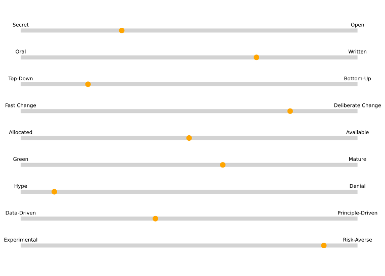

# Table of contents
{: .no_toc .text-delta }

1. TOC
{:toc}

# Introduction

In economics, we have the concept of bounded-rationality [^fn1]. It is about how our cognitive power and available information bounds our rationality. A consequence is that what some call anan irrational decision is simply the fruit of a perfectly rational person deciding without all the relevant information.

When we talk about decisions that shape the work of multiple people, teams, and time frames, it is clear that the boundaries of the ones involved should be relatively large. If one makes decisions that impact others without the proper context, they will be seen as irrational. Do you recall thinking a leader was irrational and follow up with any of these statements?

> "They don't know how the process X works"  
> "I think they don't know team Y exists, and it's their scope"  
> "Well, team Z will never adopt it"  
> "K. doesn't like this sort of solution, they won't support it"  

Reilly (2022) [^fn2] offers a tool to help Staff+ see these boundaries, acknowledge, and expand. It consists of drawing three different maps. Locator: shows where you are and puts your part in perspective to the whole; Topographical map: helps you to navigate your company and understand how it works so you can be effective; Treasury map: uncover the goals, where your team, adjacent teams, and the company wants to be. They are useful for understanding the current state, how things work, and where everyone is moving to. I will briefly present them and include my twists and experiences. For a full picture of these concepts, I recommend reading the book.

# Locator

To understand your scope, you need to understand others', too. To know others' scope, you need to zoom out—getting into details about every team's domains is impossible or too costly. Scopes can be hard to strictly define in the borders, but your border might be the core of another team, so it is very useful to know the other team's core scope since it would mean it isn't a good idea to tackle it or do it without their collaboration.

Expanding your perspective will help overcome your thinking that your team's problems are unique and deserve a custom solution, which makes people reinvent the wheel. It also provides you benchmarks about the technical bar and helps you to avoid normalizing bizarre situations - the normalization of deviance [^fn3]. For example, you might get used to accepting poor-quality data from how your team uses the prediction of an ML model, but knowing other teams have a better way to deal with it makes it clear to you it isn't a situation you should stand for. As a Staff+, you should always have a fresh pair of eyes and absolute quality bars when looking at systems. Perspective helps you with it.

Getting perspective mainly reminds you about your organization's larger goals. Suppose you are part of a team dealing with computation for ML. In that case, it might seem to you that it is all about how much data you can ingest into a model in a reasonable time, but an AI Platform, a Data Platform, or a company's business will rarely be only about that.

When zooming out to get perspective, you will also find the zoomed-out version of your team. It is usually what you would show if you had to insert it along with the other 30 teams in a 30-minute presentation. What doesn't make the cut in these situations is harder to make the others care about.

It should clear how your work impacts other teams, internal customers, and final customers. Further, you should know these things in different levels of detail for the other teams, decreasing the resolution as the teams get far from your own team business. There are business goals that are always true, like continuing to exist by being capitalized and/or profitable. Nonetheless, other significant objectives, such as international expansion, will change occasionally. These changes should impact your map, like reorganizations, new team formations, team vision reviews, etc.

To build this map, we will go from your team and expand it. The most fundamental part of your map is the starting point, which is why your work matters to the company. Start getting this right. Now, represent your team, place its goal, product, vision statement, etc. Identify the broadest organization that's still very relatable to your team. For example, if you work in an ML Platform, it will likely be the Data Platform. It is likely the largest group you have an infrequent ritual with (like an all hands) besides the whole company all hands. Expand your map to represent all the teams inside this larger org with good detail. Your team role is usually key for this group's larger goal, and whoever leads the larger group sponsors your team's existence and believes it is important.

<figure>
	
		<figcaption></figcaption>
</figure>

As a Staff+ Data Scientist or Machine Learning Engineer, people expect you to understand your organization's multiple objectives. There is a high chance of strong interdependency in this group and a need for collaboration that relies on leaders identifying and coordinating them. Beyond it, the issues the nearest teams face are likely to be very similar, so you want to have this perspective to adopt, adapt, or influence its solution in multiple places.

If it exists, we will expand this map to the next level of organization or go to the full company level. Draw the large chunks of the organization, and keep tagging them with their objective, main products, and current vital projects. Add more details that are relevant to you and your team: if you provide internal services, identify inside the big chunks the specific teams that consume it, or at least the main customers, if it is a widespread internal product. If you work in a product team, identify the teams that impact the customer journey related to your product. Identify the main goals, products, things they always are concerned about, their "flavor of the year", i.e., the new concern everyone is talking about lately, what are the most common aspects of their problems or solutions, for example, if a team usually needs real-time models, the type of data they usually use, etc.

<figure>
	
		<figcaption></figcaption>
</figure>

A trade-off exists between a deeper understanding of your domain and investing in broadening it. Depth provides you the expertise to foundational shifts in your domain, at the risk that it might not solve anyone's problem or lack impact by not being integrated into the whole. Breadth gives you perspective and lets you fit your team's work well in the overall system. Still, it can compromise your understanding and undermine your technical leadership within your team. The highest risk here is to be on the edges of the spectrum.

Reilly (2022) [^fn2] also discusses the industry perspective, which I covered in the [tech-driven career](https://datascienceleadership.com/docs/technical-leadership/tech-driven-career) article.

# Topographical

The topographical map is a positive frame of what some call "politics". It helps you navigate a company, which translates into pushing for changes. It shows you the best path to make different things happen.

My experience is that technical people are prone to calling "politics" things that are just expressions of complex systems. For example, it is more often that people won't follow through on a certain strategy from a technical leader because it doesn't contemplate aspects they care about than because "they only care about their own ideas since they want to get promoted by building new things by themselves."

The information contained in this map and the skill to use it are things I often see internalized by senior people. Further, it is one of the clearest limiting factors for growth. When facing problems of a certain complexity, ambiguity, and size, some technical leaders will get unexcited because they consider it full of "politics". That's when you realize that person doesn't enjoy operating in the following scope - and that's fine as long as they understand it. Reilly cites that "Being right about a need for change is less than half the battle", the other part comes from things like finding out who can sponsor it to get done - again, something many will call "politics".

Knowing the difficult parts of your organization and acknowledging how others have failed there will increase your chances of success. For example, who's the best person to contact if you need to collaborate with another team? How do they like to kick off this conversation? Data, problem size, a draft of how you plan to tackle so they know if they should get involved, etc.

Processes like planning and decision-making governance are more common as a company grows and play a significant role in the effectiveness of initiatives. At the same time, these are aspects of the work that people consider bureaucratic, boring, useless, and uninteresting. However, ignoring them will likely make one so ineffective they won't progress in a technical leadership role. Many people can navigate this complexity to deliver consistently and innovate. Bureaucracy does exist, and every company has plenty of bad processes or stale rules that might be causing way more harm than benefit. Still, it comes with seniority the skill to choose when to fight it, or when it is a fair step you can learn how to avoid it until your confidence on a project is high enough to go through it.

To make the map, we will identify your company culture. Reilly (2022) [fn2] provides a couple of dimensions. Evidently, it is a scale, and most organizations are not at the edge. I will add a few regarding data science that I believe are useful for the same purposes.

## Culture assessment
- **Secret or open?** How openly does information flow? In secret organizations, it is scarce, and it is hard to make decisions due to the lack of context. In open organizations, there is more information than time, and it is shared in very different stages, which makes it hard to know if something will happen or the draft of an idea.
- **Oral or written?** What medium information is transferred when things get serious or close to becoming real? What is the best way to make people consume or care about it?
- **Top-down or bottom-up?** Does most of the definition of what the team will pursue come from the top of the hierarchy or the bottom?
- **Fast change or deliberate change?** A fast-change company accepts immediate changes. Deliberate companies will demand a lot of thought and plan upfront.
**- Back channels or front doors?**: How do people in different groups communicate? Can developers talk to developers directly (front door), or is it necessary to circulate an idea with one's manager to get to another team's manager and spread it to the relevant developers?
- **Allocated or available?**: How much slack is there in the teams? Are most people fully allocated and without margin for new things or collaboration?
- **Liquid or crystallized?**: Crystalized companies have a fixed hierarchy where people grow following an order. A liquid organization enables a more dynamic growth trajectory, independent of an order or just growing when people in upper positions also grow.
- **Data Science green or mature?** How well does the average technical person understand the problems Data Science can solve?
- **AI hype or denial?** How much leadership believes in AI potential? Is it skewed toward unrealistic-optimism or traumatic-pessimism?
- **Data-driven or principle-driven**?: Are decisions only made if the team has data that covers most of it, or do teams make decisions based on principles and intuition without or with incomplete data?
- **Experimental or risk-averse/waterfall-drive?**: Does it offer tooling for frequent experimentation? Does it accept incremental solutions? Or does it require full-featured projects to go live?

<figure>
	
		<figcaption>Inspired in the illustration by Reilly (2022)</figcaption>
</figure>

## Decision-making process

Many types of decision are relevant for Data Science folks. The most basic is which problem to tackle, which evolves to which solution to pick, the experiment launch, and whether we should use the solution in production. The closer the data scientist or machine learning engineer is to the business, the higher the chance they will work with systems that make decisions at scale. For example, millions of discount offers are triggered every day. In those cases, there is usually more governance regarding it since the stakes are high, and it affects important revenue streams. Know every detail of this process!

Without knowing how decisions happen, it is hardly possible to influence them. The direct manager is the best person to have this conversation with and request access to where decisions happen, in case you can't even spot them.

Even the most autonomous places will have some governance around big business decisions. Beyond mapping it, a suggestion is to make everyone who has a word on the decision used to the project as early as possible, even during problem definition. The moment someone makes a decision shouldn't be the first time they learn about that topic.

## Points of interest

Reilly (2022) highlights some especially interesting parts of the organization to know:

- **Chasms**: artificial abrriers that make information flow poor between two teams, areas, etc. For example, between an information security team and a product team. You can also have it between software engineers and data scientists within a team.
- **Fortresses**: people or teams that act as gatekeepers of a domain and that can block projects. If you know it well, you will find who or which process can get you through them.
- **Disputed territory:** domains with unclear owners, or confusing boundaries, where this confusion can make it hard to find who's accountable for it and block initiatives.
- **Uncrossable deserts**: domains, projects, or problems that caused many failed trials. Things the team will tell you that they won't happen. Dismissing them or not is a matter of knowing if you are prepared to face it or if it is likely to waste your energy.
- **Paved roads:** Platforms try to make the right way to do things also the easiest. If the right thing is to have great observability about ML models, the process of deploying an ML model that inherits all the available observability tools will likely be the easiest. However, it is essential also to know the unpaved roads, the shortcuts, and how one can achieve what the official ways of doing things can't help with.

## The shadow organization

The "shadow org chart" [^fn4] is the concept that there is so much information beyond the formal organization chart that's useful to get things done. For example, there will be product managers who are more open to receiving ideas from other teams and are more able to convince their teams. Or teams you'd prefer to reach out to the technical leader instead of the manager, or team lead, depending on what we need from them. When working in a platform team, we knew the technical leaders from each team that we could count on testing and spreading our new features, so we focused our energy on them. Or an experienced engineer that has been in the team for very long and their team listens to them even more than the most senior technical person there.

Consider your objectives to identify which aspects of this "shadow org chart" you should discover and use to benefit your team.

## Events that change the topographical map

Reilly (2022) [^fn2] points out a couple of events that should trigger an update on your map: a team you interact with has a new leader, quarterly planning, a new platform launch, a canceled project, etc. Reorganizations mean a change in priorities or a change in how one wants to tackle a problem; it is important to identify the reasons behind them.

To discover these triggers, skim other teams' plans and find the proper information channels. Know where to find the updated org chart and check it every time it changes. Read other Staff's strategy documents. Ask your manager what a certain change means.

# Treasure map

A treasure map says what the team is pursuing. I express concepts about vision and impact in ["Impact, Risk, and their relationship with performance grades and promotions"](https://datascienceleadership.com/docs/people-management/impact-risk-perf-promo). A core concept is that impact becomes how much one can push the real world toward the idealized world of a vision. We can think of the vision of a team as the highest level possible treasure map one will have. It enables someone to zoom in on a region and start defining and exploring it. A Staff Data Scientist or Machine Learning Engineer can't be confused about where we are aiming. The person either requests clarification, or jump in to define. If one has no idea about their broader area objective, it is usually a matter of pushing a more senior leader to offer it. They won't do your job since their description will be too high level to become an epic. If there are definitions, like "we want the internal customer journey to deploy a model to take a few minutes instead of days", this should be enough for the Staff to jump in and start structuring what the team can do about it.

The good thing when the treasury map is undefined or confusing, is the opportunity to lead its definition, which is part of the Staff+ scope. So one shouldn't get stuck in frustration.

You want to share it as much as possible to check if it is a good zoom-in or translation of the vision. This means circulating it up (to more senior folks to verify alignment) and down (to more junior folks to verify if it provides enough clarity for them to define their own tasks).

This map is important to keep you rooted. Even your leaders might get influenced by the last firefighting or pressure for short-term results and lose their adherence to a vision for a while. When this happens, it is good to have a good filter to determine what really matters.

Here, the map can be a graphical translation of the team vision, strategies, epics, related metrics, etc. It is a way to summarize many documents, and updating it is easier than in a full-textual form.

Reilly (2022) highlights that as someone in the Staff+, how you report your performance will likely change. As you work on more ambiguous things, longer term, and contribute to an environment that can impact others, it is hardly the case that you can translate your impact into a single number or a list of projects. It might be a 2-year story with many projects, team changes, cultural shifts, clarification on metrics and objectives, etc. One needs to be prepared to tell this story. In the [tech-driven career article](https://datascienceleadership.com/docs/technical-leadership/tech-driven-career), I frame that the story of your success will likely become the story of success of a certain domain in your company, which will include all aspects of it.

<figure>
	
		<figcaption></figcaption>
</figure>

# Workshop #8 - Localizing yourself

The activities [template](https://miro.com/app/board/uXjVKms1KIM=/?share_link_id=752512685457).

**Activity 1**: Build your locator map.  
**Activity 2**: Build your topographical map.  
**Activity 3**: Build your treasure map.  

# References

[^fn1]: Herbert, A. S. (1957). Models of man. social and rational.
[^fn2]: Reilly, T. (2022). The staff engineer's path: a guide for individual contributors navigating growth and change. O'Reilly Media.
[^fn3]: Luu, Dan. Normalization of deviance, https://danluu.com/wat/.
[^fn4]: Fitzpatrick, B. W., & Collins-Sussman, B. (2015). Debugging teams: better productivity through collaboration. O'Reilly Media.
