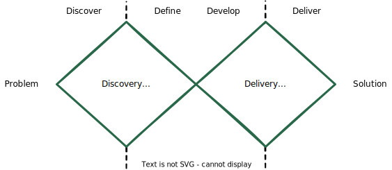
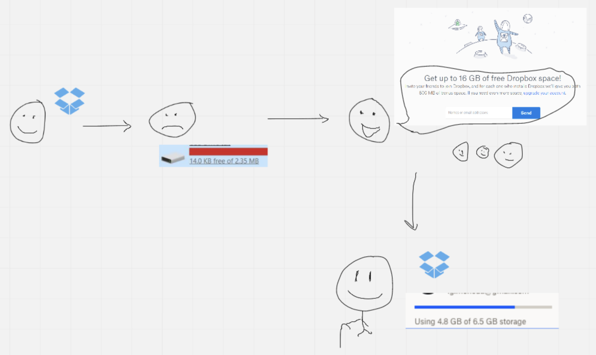
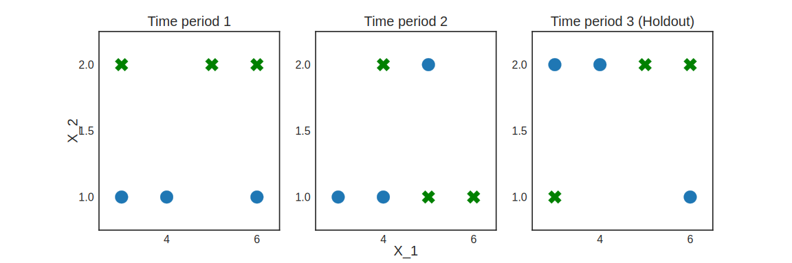
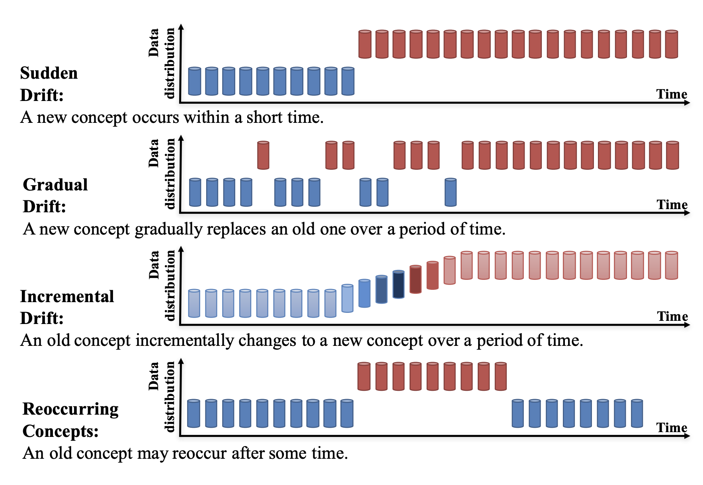
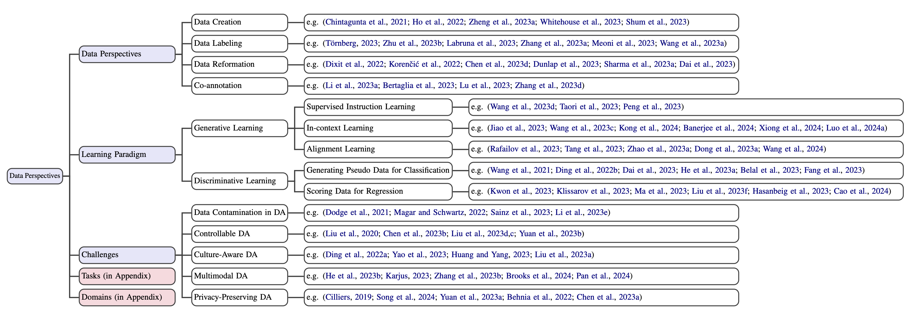
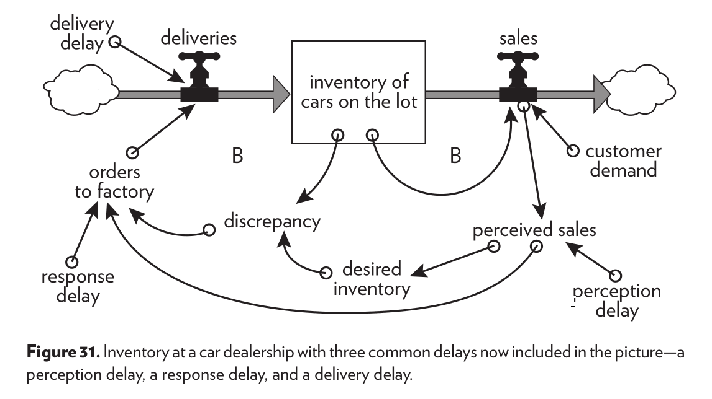

# Table of contents
{: .no_toc .text-delta }

1. TOC
{:toc}

# Introduction

In the previous sections, we discussed Staff+ tackling important and ambiguous problems. It might give you the impression that you need to create trust and get assigned to such problems to become a Staff Data Scientist. It is not always the case, and I don't consider it the main way people get there.

How you solve a problem is key and independent from the problem itself. For example, consider a scenario where two engineers face the same data discrepancy issue—one might dive straight into debugging the pipeline, while another may step back to assess whether the data collection strategy itself is flawed. This demonstrates how different approaches can yield varied insights and results. However, the amount of work and challenges involved in the problem-solving process will certainly slope with size, importance, and ambiguity.

Beyond that, managers or team leads will commonly not know how to identify and evaluate problem size when they require as much technical acumen as a Staff+. Even if the team is very close to a business domain, such as creditworthiness, a team lead might need to realize how the current team decision engine is biasing and compromising the data.

Why don't more junior people apply this problem-solving method and magically become Staff Data Scientists? There are two ways to answer this question. First, as humans, we have poor notions of everything we must understand to grasp certain concepts and effectively apply them, so when we teach about it, we assume everyone has the unwritten prerequisites that make it possible for us to achieve that. This sort of content ends up helping only those a few steps away from achieving it by themselves. It unlocks the existing potential. Second, even if you are thoughtful when applying thinking tools and problem-solving techniques, the steps demand technical expertise and experience to answer, for example, why something is a problem or what the underlying problem is. In short, there will be soft and hard skills that won't let junior folks apply this approach to problems in a way they will solve them as a Staff+ would. They can adopt it from the beginning to build muscle. However, they need to balance with the focus on hard skills, which has a better return at the beginning of a career since more senior folks will be taking care of general problem solving. At the same time, they cannot carefully review every small implementation decision from junior folks.

Though I haven't worked as a Staff Data Scientist, I had the opportunity to support a couple of them and to observe others from a within-the-same-company distance. The management career will also demand the same skill but applied to mixed or diverse domains, like talent acquisition, team engagement, product strategy, serving internal customers, etc. So, as a manager, I have been exercising muscles similar to those needed by Staff+.

There isn't a single tool or method, but many to achieve similar outcomes. I will split them using the double-diamond design model.

# The double-diamond design model

In the [Project Management section](https://datascienceleadership.com/docs/project-management/why-building#the-transition-between-upstream-and-downstream), I present this famous problem-solving model that relates discovery, development, and delivery.

Whether some processes call themselves "continuous" or "incremental", they will go through these stages somehow. Some methods also have different names for them.

<figure>
	
		<figcaption></figcaption>
</figure>

# Upstream 
## Focus on the Problem Definition

Whether people are talking about Product Management, Internal Platforms, or Software Design, it is incredible how experienced people are bold about their clarity on the problem.

Rich Hickey did an amazing internal talk at Nu in 2021 called "The problem with problems". It is a lighter and more generic version of the "Design in Practice" [^fn1] talk. Rich states that the first problem with problems is to find out the "real problem". When breaking design into stages (Describe, Diagnosis, Delimit, Direction, Design, Development, and Backtracking.), he dedicates the first three of them to solving this first problem.

In Data Science, our range of solutions varies from a simple rule over a variable to a complex system involving multiple machine-learning models, which can take months or even years to build. The first might solve a business problem very well in a verifiable way since we have access to the desired behavior as a metric. When we look at the best versus the worst case, the difference is huge, from solving the right problem with the simplest solution to solving the wrong problem with a complex solution. And, of course, we have a bias to solve things using ML models, which always come with a reasonable dose of complexity - regardless of the framework or tooling around it.

Now, summarize that Staff+ folks will look for ambiguity and importance, and you risk solving a large and hard non-problem. Because of that, we must get the problem right.

To help get to the root cause of a problem, Rich suggests the trick of *keeping asking why when in touch with the first form of the possible problem*, which is commonly a solution request. I suggest the same approach for [Product Management here](https://datascienceleadership.com/product-management/). For example:

> **Person 1:** I want a paintbrush!  
> **Person 2:** Why do you want a paintbrush?  
> **Person 1:** Because I want to paint a picture.  
> **Person 2:** Why do you want to paint a picture?  
> **Person 1:** Because I want to hang it on my wall.  
> **Person 2:** Why do you want to hang it on your wall?  
> **Person 1:** Because I want to make my room feel cozy.  
> **Person 2:** Why do you want your room to feel cozy?  
> **Person 1:** Because I've been feeling anxious.  
> **Person 2:** Why are you feeling anxious?  
> **Person 1:** Because I feel unprepared for my finals in a few weeks.

The above example is torturous, but in data science, you will find people getting requests to build a model to predict Y, for example, the churn likelihood for a certain product. Predictions by themselves are never a problem or even the final solution. An ML model will simply produce a quantity. How will it be used? Why do we want to know Y? What would we do knowing Y? Why is doing it valuable for us?

Internal customers are also used to request features and solutions. For example, can we have a tool for sampling? The problem behind it could be manipulating a dataset's mix to represent a group of interest better or simply reducing it because training or analysis has been taking a long time. If training time is the real issue, a platform member can attack it differently and look up to the actual or most crucial bottleneck, which might not be the data volume.

Another trick is to *split output and outcomes*. Here's a check: can you start implementing a version of it right away? If yes, we are talking about an output. An outcome might be higher customer satisfaction or a shorter time to set up a product. One can't sit and "implement higher customer satisfaction". Though multiple implementation choices exist, one can start building a "UI to set up the model monitoring tool" immediately. If you start the discussion from the output, the team can miss the real problem. An outcome will still demand you to find related problems and opportunities; you still need to ask why it is a problem, but different than a possible solution, it is a fruitful start.

In Rich's talk "Design in Practice" [^fn1], he suggests using description to enrich the team's understanding of the situation, context, and symptoms. Then, applying logic and analysis to explain the pictures of the reality the team gathers. Finally, the team can delimit the problem since many larger or smaller problems related to the original can emerge. You should check the talk entirely.

Graphical representations and being hard on terms work very well in this stage. Use a diagram to describe the current state. Either showing the services involved, a model's training and serving process, or including all of them. Here's an example of representation that could trigger shared understanding:

<!-- flowchart TD -->

<!-- %% Customer Journey Flow -->
<!-- subgraph Customer_Behavior [Customer Journey] -->
<!--     A[Customer Awareness: Browsing or Interaction]:::lightGreen -\-> B[Trigger: Promotional Opportunity]:::orange -->
<!--     B -\-> C[Promotional Offer Displayed to Customer]:::lightGreen -->
<!--     C -\-> D{Customer Decision: Accept or Decline Offer}:::orange -->
<!--     D -\->|Accept| E[Offer Applied to Cart]:::lightGreen -->
<!--     D -\->|Decline| F[Offer Not Used]:::orange -->
<!--     D -\->|Abandon| X[Cart Abandoned]:::orange -->
<!-- end -->

<!-- %% Post-Action Flow -->
<!-- subgraph Post_Action [Post-Action Results] -->
<!--     E -\-> G[Transaction Completed with Applied Offer]:::darkGreen -->
<!--     F -\-> H[Transaction Completed Without Offer]:::orange -->
<!--     X -\-> Y[Abandoned Cart: No Purchase Made]:::orange -->
<!--     G -\-> I[Customer Satisfaction Recorded]:::lightGreen -->
<!--     H -\-> I -->
<!--     I -\-> J[Feedback Collected: Reasons for Declining Offer]:::orange -->
<!--     Y -\-> J -->
<!-- end -->

<!-- %% Feedback Loop -->
<!-- subgraph Feedback [Feedback Loop] -->
<!--     J -\->|Identify Gaps in Customer Journey| K[Data Aggregation: Offer Engagement and Drop-Off Insights]:::darkGreen -->
<!--     K -\-> L[Pattern Recognition: Customer Behavior Insights]:::lightGreen -->
<!-- end -->

<!-- %% Custom Styles -->
<!-- classDef darkGreen fill:#286748,stroke:#286748,color:white; -->
<!-- classDef lightGreen fill:#41A876,stroke:#41A876,color:white; -->
<!-- classDef orange fill:#FF8000,stroke:#FF8000,color:white; -->

<figure>
	
		<figcaption>Graphical descriptions of the problem's current state will usually reveal misconceptions among the team members that will compromise the following steps</figcaption>
</figure>

Since we often deal with influencing phenomena, a Causal Directed Acyclic Graph (DAG) [^fn8] is another powerful representation that expresses our knowledge and assumptions about the problem and ensures a common understanding. It is excellent to make explicit "what will impact what", which can usually uncover some unintended and unexpected effects on our interventions.

graph TD
    style A stroke:#286748,stroke-width:2px;
    style B stroke:#286748,stroke-width:2px;
    style C stroke:#286748,stroke-width:2px;
    style D stroke:#286748,stroke-width:2px;
    style E stroke:#286748,stroke-width:2px;
    style F stroke:#286748,stroke-width:2px;
    style G stroke:#286748,stroke-width:2px;

    A(Coupon Issued) --> B(Discount Amount)
    A --> C(Customer Engagement)
    B --> D(Number of Orders)
    C --> D
    B --> E(Revenue)
    D --> E
    D --> F(Delivery Costs)
    E --> G(Profit)
    F --> G

When dealing with customers, one can also use an "experience map", in which we represent descriptions and symptoms related to the problem graphically. We make assumed or reported feelings explicit.  It is useful when dealing with an open problem full of anecdotes. After grabbing a couple of seemingly disparate examples, a team starts to see patterns and stages and name them. For example, people might draw the different situations identified in customer interviews and over the years where customers used the product's referral program.  Or the interaction between an internal customer and one of a platform's products. Or they can hypothesize the reasons behind the attrition generated by a particular screen in the app by showing the screens before, the elements on the specific screen, the hypothesized feelings the customers have on every screen, etc. It can go from sketchy representations showing cases from customer interviews to situations the team hears about many times, as suggested in Torres (2021) [^fn2].  

<figure>
	
		<figcaption>I did a very sketchy representation a couple of years ago when talking about referral programs with my team. In this example, I used a personal experience to talk about referral programs.</figcaption>
</figure>

A pocket example or toy example is a tool that shows a problem in its simplest instantiation (either a real or synthetic instance). Most of us benefit from instances of problems instead of only their generic representation. When a problem is synthetic, others can challenge how much it represents reality or how much that case really happens.

<figure>
	
		<figcaption>I was theorizing a situation where different moments would exhibit different data patterns and how the data volume could trick learning algorithms to learn what we could call a spurious correlation because it works only in certain periods. This is a minimum specific example to illustrate it, which makes it simpler to communicate the problem. Source: Moneda (2022)</figcaption>
</figure>

When defining the problem, we start creating a shared vocabulary around it. Start refining how the team has been calling every aspect of it. It is very common to have *loaded terms*. Terms can be loaded because they describe a generic set of problems (e.g., dataset shift) or because a group has been culturally using it to refer to things that externally have other names. One should know when to unload terms since breaking down terms into more specific forms is almost always possible. A rule of thumb is: when using a generic term, are you talking about *all* its sub-cases? Break it and see if you are considering every case. For example, we can split the concept dataset shift into concept shift, covariate shift, and target shift. We can break concept shift into real and virtual [^fn4]. The shift can be sudden/abrupt, incremental, gradual, or recurring [^fn3]. If you break down things and think that a sub-class won't be covered, exposing them and letting others know the generic term won't cover it or start using the sub-class names is better. If considering all the sub-cases, re-group and keep the generic term.

<figure>
	
		<figcaption>Source: Lu (2018)</figcaption>
</figure>

In the cultural case of loaded terms, the chances are that there isn't a community definition. For example, when talking about "context data" with my team in Customer Service, people were referring to multiple things: what the customer told us about their problem (text and voice message), data about the customer who opened the ticket, which opens up into different problem people had in mind: data to make classifier models aware of customer's interactions with the product, data to help LLMs understanding a customer's issue, and data to build rules for controlling the service flow, and because these three use cases have different requirements, it is also a different problem. So when someone says, "I think context is an issue", it is unclear what they mean. So whenever people start working on any aspects cited, they must create names to describe every situation and differentiate the problems they will solve from other potential issues. You will want to use a common language regarding your community. So, constantly checking on the work in this area is helpful. It is useful for new joiners and helps the team follow the advancements from outside. 

Diagrams also work great here since you can break down terms, go from generic definitions to more specific cases, and show how they relate. Rich even suggests building a glossary to share the meanings of standard terms.

<figure>
	
		<figcaption>Source: Ding (2004)</figcaption>
</figure>

In summary, more intuitively, keep collecting facts and hypotheses about and around a problem, building rich representations of it, being accurate on terms, and testing things lightly until things start clicking to the team to split it into multiple problems and pick what to work on. It is essential to notice that this is actual work! Rushing it is a mistake. You want to avoid quickly jumping to a conclusion about the problem definition because it is a tragedy to miss. Implementation time is sacred, we can't waste it. Won't it get us stuck into analysis paralysis? I hope not, but the following tools also help to avoid it.

## Apply systems thinking to have a suitable description of the problem

Systems thinking means considering all the relevant elements and their interactions when dealing with a problem. You might have started from a single element of it, which is the core of your problem, but systemic thinking will expand from it.

Why do I say the suitable instead of the "right" description? Because one can keep adding elements to the description that will, at some point, become useless for the need of the team to work in a part of it. We expect Staff+ to know when to stop and what to represent.

Meadows (2008) [^fn5] provides guidance on how to do it, some of which overlap with the previous tools. I recommend reading the book.

- **Get the beat of the system**: Don't jump to intervention too quickly. Watch the system, understand it, and study its history. Ask people who have been around it for a long time what happened. Check the data about the system. Refrain from defining a problem regarding the lack of your favorite solution.
- **Expose your mental models to the light of day**: represent and share all the elements and interactions you are considering.
- **Use language with care and enrich it with systems concepts**: be concrete and meaningful. Add new words and name concepts if needed. If a team can't articulate the concept of maintainability, it won't achieve it for its systems.
- **Pay attention to what is important, not only what is quantifiable**: we shouldn't shy away from listing things like "frustration" when discussing problems only because we can't measure or believe they are subjects. We can't discard it if it is a common feeling among our users.
- **Listen to the wisdom of the system's bottom level**: This is particularly important for large, stratified organizations. Listen to people in operations, other specialists, adjacent teams, lower seniorities, sales, etc.
- **Locate responsibility within the system**: how does it create its behaviors? how much do external actors influence it?
- **Expand time horizons**: Consider the system's short—and long-term behaviors and what might affect them.
- **Defy the disciplines**: People with different expertise use different lenses to examine a problem. They also suffer from their bounded rationality [fn6]. One must understand that one's expertise won't be enough, and others won't be completely right.
- **Expand the boundaries of caring**: a system is interconnected, and our boundaries are artificial. So, when solving a problem in a company, one needs to think about the useful boundary. Consider that a company can't succeed if its sub-teams fail. How much should you expand the parts you care about so you cover the parts that their failure would compromise your team?

Again, graphical representations are crucial here. Even if you don't pick a rigorous notation, representing your system graphically, naming the elements, connecting them, and explaining how they interact is an obligatory starting point.

<figure>
	
		<figcaption>Source: Meadows (2008)</figcaption>
</figure>

## Be explicit on your assumptions to consume and generate knowledge

When discussing a problem, we might make statements containing different levels of uncertainty. On a scale:

- *Established Facts*: statements supported by substantial evidence, like data, rigorous analysis, or well-established findings. "Studies show that X leads to Y with 95% confidence".
- *Probable insights*: statements backed by some analysis or evidence but lacking rigorous validation (e.g., UX research, tangential data analysis). "Preliminary results suggest that X *might* lead to Y".
- *Hypotheses and assumptions*: Statements that propose a possibility but are supported only by anecdotal observations, indirect evidence, or reasoning on similar results (e.g., testimonials from a couple of users, personal experience, correlated data analysis, or no evidence). "It’s possible that X could influence Y, but further investigation is needed".
- *Speculation*: statements based on intuition or extrapolation without direct evidence. "I suspect X might lead to Y, but it’s purely speculative".

When we use a fact to describe a problem or solve it, this is knowledge, in the sense we go from raw information to integrating it in a new situation and applying it to change or analyze reality.

When we make assumptions when defining a problem, we can turn them into facts or "probable insights", which we can understand as "close enough facts to be useful", which enables other people to use them.

Gathering supporting evidence for assumptions is influential because many sub-problems and solutions can derive from the same assumption. If we prove it false, we redirect the discussion to our case and help the team avoid exploring that path in future problems. Knowing when to revisit a "proven" hypothesis is always tricky since most work with dynamic phenomena.

For example, a product team looking to increase the number of active customers might pick the sub-problem of customers that register and never activate, aiming to understand how their product needs to change to fit them. At the same time, a team taking care of growth might increase the conversion funnel in the registration flow from the perspective of ease of registration and activation. The most fundamental fact about it is the volume of people that don't activate. If this number is very low, it will discourage both teams from exploring this population, regardless of the levers they intend to use. If the volume is reasonable, and the Growth team conducts analysis or research on this population, they might find that 80% drop out after checking the pricing. They could explore different ways of displaying it, but they can consider it a product feature out of their control and expertise. At the same time, this is something that the product team can change, and they might use this fact to decide to tackle this sub-problem, either entirely or break it further.

One way to visualize it and represent the team's assumptions is using an Opportunity Solution Tree [^fn2]. In the original OST, you set an outcome as the top node. Then, you map opportunities as pains, problems, technical debt, and unaddressed needs. You gather those from data, customer interviews, etc. Then, you can map different solutions to the same opportunity. Finally, you can develop experiments to validate every solution quickly. Here's an example:

graph TD
    %% Nodes
    Goal["Goal Improve User Engagement"]
        Opportunity1["Opportunity Enhance Navigation"]
        Opportunity2["Opportunity Increase Content Quality"]
        Solution1["Solution Add a search bar"]
        Solution2["Solution Redesign navigation menu"]
        Solution3["Solution Hire expert content creators"]
        Experiment1["Experiment Fake button to measure search demand"]
        Experiment2["Experiment Click tracking on menu prototypes"]
        Experiment3["Experiment Survey readers on content quality"]

    %% Relationships
    Goal --> Opportunity1
    Goal --> Opportunity2
    Opportunity1 --> Solution1
    Opportunity1 --> Solution2
    Opportunity2 --> Solution3
    Solution1 --> Experiment1
    Solution2 --> Experiment2
    Solution3 --> Experiment3

    %% Styling
    classDef goal fill:#286748,stroke:#000,color:#FFF,stroke-width:2px; %% Dark green
    classDef opportunity fill:#41A876,stroke:#000,color:#FFF,stroke-width:2px; %% Light green
    classDef solution fill:#FF8000,stroke:#000,color:#FFF,stroke-width:2px; %% Orange
    classDef experiment fill:#E0E0E0,stroke:#000,color:#000,stroke-width:1px; %% Grey

    %% Assign Classes
    class Goal goal
    class Opportunity1,Opportunity2,Opportunity3 opportunity
    class Solution1,Solution2,Solution3,Solution4,Solution5 solution
    class Experiment1,Experiment2,Experiment3,Experiment4,Experiment5 experiment

Torres [^fn2] says a product team is not a science team. Their intention isn't to seek truth but to mitigate risk. It justifies the quick and dirty experiments suggested, which might be doing a usability test with a paper interface with 15 customers. I agree that prototyping is too expensive to probe customer needs and pains quickly. Once, the team I was part of tested integration with a data provider that depended on customers logging in on a specific platform where most people have accounts. We launched it as an experiment. I was getting inquiries about how to integrate that data into our ML models when we realized people were not converting. After a deep dive, we discovered people couldn't remember their password for that service they needed to log in. Remembering the password was a hidden hypothesis about our customer behavior that questioning ten employees would have revealed reasons to suspect. I agree that exposing all the team's assumptions and getting great at validating them lightly without coding/prototypes is a fantastic skill for problem-solving. I cover aspects of it in a section on [risk-taking](https://datascienceleadership.com/docs/people-management/impact-risk-perf-promo#untested-assumptions-make-opportunities-riskier).

However, this part gets tricky when "scientist" might be in your job title and your team focuses on research and development or is open to publishing. Beyond this, general decision-making projects can benefit from a body of knowledge. Ultimately, we can see it in a spectrum from working in a dynamic product team developing customer-facing products and features to a team working on base research. Though you can have Data Scientists and Machine Learning Engineers in both situations, they are hardly the same people when looking at the extremes. Still, it is common for the same person to work on product features where the truth comes entirely from the customer experience using it or building causal inference models where it shifts to modeling customer behavior rigorously.

To address this issue, I make as many explicit hypotheses regarding opportunities as possible rather than only looking at the underlying assumptions of potential solutions. The results can be similar because a solution that addresses an opportunity should inherit its hypotheses, but it ensures two things: first, you are testing an assumption that every solution that derives from that opportunity will assume; second, you don't fall in love with a solution - you might even prevent the team from listing solutions before you validate the assumptions regarding the opportunity. Still, when we progress to the solution, we also map their specific hypotheses since it helps to discard them quickly.

I plan to provide a more detailed explanation of using it in analytical projects in the [Product Management]() section. Briefly, you set an outcome as the top node. Then, you map opportunities as pains, problems, technical debt, and unaddressed needs. When mapping opportunities, we will touch that scale regarding certainty. So I started attaching "hypotheses" to them. This means you can only build a solution to an opportunity if you have a green light for the supporting hypothesis. You can color the hypotheses in the tree according to whether they are true or false and link the supporting evidence from user research, user interviews, data analysis, external research, etc. Proving false and representing in the team's opportunity tree a common (mis-)conception about a problem will push the team to focus.

<figure>
	
		<figcaption></figcaption>
</figure>

I illustrate the example above using a fictional example of a team trying to release more credit cards. It picks an opportunity related to the Member Get Member Program (MGM), which is when a customer invites another to use a product. I only expanded on a few opportunities from the outcome to focus. The hypotheses that are true and the solutions delivered are in green. The yellow indicates "work in progress" for a prioritized opportunity/sub-opportunity. Notice how we have hypotheses regarding the opportunity of "consider MGM in the limit increase decision for a reward->action pattern". They are in green here because they are true. But if they were false, anything of the same height and deeper would not matter anymore. Suppose there isn't elasticity in customer behavior regarding MGM activity when getting a limit increase. In that case, there isn't any approach to estimate it that will make any difference, and there is no reason to explore this moment in the customer journey to engage them in MGM activity. The other hypothesis is regarding how much this behavior weighs on a decision about limit increase. It could be so low that it wouldn't change most decisions, even if incorporated very accurately. These two hypotheses isolate two objective tasks that can prevent the team from working for weeks or months on something fruitful. Further, the fact we prove them right or wrong can be reused many times by the same or different teams that might explore the relationship between limit increases and MGM or that will avoid going down this path since it is a common assumption to have.

## Filter problems using the team's vision and strategies

Only some problems will have a clear money tag telling us how much it is worth to be solved. In another section, I write about the notion of [Impact and how it depends on where a team wants to go](https://datascienceleadership.com/docs/people-management/impact-risk-perf-promo#what-does-impact-mean). For example, if your team defines that is super important to reduce the setup time for an experiment in the context of an Experimentation Platform, you don't need to estimate how much money it means to work on it, but simply thinking on the impact on the quantity of interest, for example, how many minutes/hours/days and customer satisfaction regarding it.

Because of this subjective notion and the fact that we will likely have way more problems to solve than the bandwidth to tackle them (which is great for prioritization), one should use their team's vision and defined strategies to pick the problems they are willing to solve.

<figure>
	
		<figcaption></figcaption>
</figure>

You can have two subproblems that affect the same outcome, but one also affects aspects the team defined they want to pursue, like maintainability. Strategy docs are more directional than it, and they might be explicit about problems we don't want to tackle. Extract these constraints and desirable aspects from the docs and use them to prioritize the problems to solve.

## The product management problem

In the intro for the [Product Management](https://datascienceleadership.com/product-management/) section, I discuss the interpretation of "product" as what a team produces, which is broader than the common notion of product management as a skill for building external or internal products.

In short, what should the team work on? This question is inseparable from formalizing problems and describing them well, including estimates of business impact and importance for a team vision. As a staff data scientist or staff machine learning engineer, since your skills in defining problems must be sharp, other leads will consult you, or you will even determine many problems the team should tackle.

When consulted, it is a matter of providing input to a Product Owner, Product Manager, Data Science or Machine Learning Engineer Manager, Engineering Manager, etc, so they aggregate it and decide by themselves or along with the team. If you also end up playing the role of a Product Owner for a team, you need even more [Product Management](https://datascienceleadership.com/product-management/) skills.

## Explore the solution space to define the approach strategy

The solution space represents all the team's alternatives to solve a problem. The alternatives will differ in terms of how effective they will be and what their consequences will be. It is when we list potential solutions and their characteristics and pick one to set the implementation direction. It is the phase Rich calls "direction" from his talk [^fn1], and he shows a way to use a Decision matrix for it at [40:28](https://youtu.be/c5QF2HjHLSE?si=JW6cSqo-Pfn2FutV&t=2428), and you can see an actual decision matrix in Alex Miller's talk ["Design in Practice in Practice"](https://youtu.be/VBnGhQOyTM4?si=pvEiHTCuUf5aO4vV&t=843), around 14 minutes.

Back to the point of why it is not a matter of simply following tricks to think of solutions, one expects that Staff seniority will come with more creativity in raising options, better skills in foreseeing the consequences (especially the long-term), and the ability to extract and inquire of other folks for alternatives and consequences they are better skilled to identify.

<!-- <table class="styled-table" style="margin-left:auto;margin-right:auto;width:100%;border-collapse:collapse"> -->
<!--     <thead> -->
<!--         <tr> -->
<!--             <th style="text-align:center;background-color:#f4f4f4;padding:10px;">Criterion</th> -->
<!--             <th style="text-align:center;background-color:#f4f4f4;padding:10px;">Alternative A: Fixed Discount Coupons</th> -->
<!--             <th style="text-align:center;background-color:#f4f4f4;padding:10px;">Alternative B: Personalized Coupons</th> -->
<!--             <th style="text-align:center;background-color:#f4f4f4;padding:10px;">Alternative C: Time-Sensitive Coupons</th> -->
<!--         </tr> -->
<!--     </thead> -->
<!--     <tbody> -->
<!--         <tr> -->
<!--             <td style="padding:10px;">Ease to Retrain</td> -->
<!--             <td style="text-align:center;background-color:#d4edda;padding:10px;">Simple rules-based system</td> -->
<!--             <td style="text-align:center;background-color:#f8d7da;padding:10px;">Requires periodic retraining</td> -->
<!--             <td style="text-align:center;background-color:#fff3cd;padding:10px;">Moderate effort for retraining</td> -->
<!--         </tr> -->
<!--         <tr> -->
<!--             <td style="padding:10px;">Needed Computation to Train</td> -->
<!--             <td style="text-align:center;background-color:#d4edda;padding:10px;">Minimal computational resources</td> -->
<!--             <td style="text-align:center;background-color:#f8d7da;padding:10px;">Requires substantial resources for training</td> -->
<!--             <td style="text-align:center;background-color:#fff3cd;padding:10px;">Moderate computational requirements</td> -->
<!--         </tr> -->
<!--         <tr> -->
<!--             <td style="padding:10px;">Inference Time</td> -->
<!--             <td style="text-align:center;background-color:#d4edda;padding:10px;">Instantaneous</td> -->
<!--             <td style="text-align:center;background-color:#f8d7da;padding:10px;">Slower due to complexity</td> -->
<!--             <td style="text-align:center;background-color:#fff3cd;padding:10px;">Fast but slightly delayed</td> -->
<!--         </tr> -->
<!--         <tr> -->
<!--             <td style="padding:10px;">Effectiveness in Increasing Purchases</td> -->
<!--             <td style="text-align:center;background-color:#fff3cd;padding:10px;">Moderate impact</td> -->
<!--             <td style="text-align:center;background-color:#d4edda;padding:10px;">High impact with proper targeting</td> -->
<!--             <td style="text-align:center;background-color:#fff3cd;padding:10px;">Good impact for urgent decisions</td> -->
<!--         </tr> -->
<!--         <tr> -->
<!--             <td style="padding:10px;">Scalability</td> -->
<!--             <td style="text-align:center;background-color:#d4edda;padding:10px;">Highly scalable</td> -->
<!--             <td style="text-align:center;background-color:#fff3cd;padding:10px;">Scalable but needs tuning</td> -->
<!--             <td style="text-align:center;background-color:#d4edda;padding:10px;">Highly scalable</td> -->
<!--         </tr> -->
<!--     </tbody> -->
<!-- </table> -->

<table style="width:100%;border-collapse:collapse;"> <thead> <tr> <th style="text-align:center;background-color:#f4f4f4;padding:10px;">Criterion</th> <th style="text-align:center;background-color:#f4f4f4;padding:10px;">Alternative A: Fixed Discount Coupons</th> <th style="text-align:center;background-color:#f4f4f4;padding:10px;">Alternative B: Personalized Coupons</th> <th style="text-align:center;background-color:#f4f4f4;padding:10px;">Alternative C: Time-Sensitive Coupons</th> </tr> </thead> <tbody> <!-- Ease of Implementation --> <tr> <td style="padding:10px;"><strong>Ease of Implementation</strong></td> <td style="background-color:#d4edda;padding:10px;">Simple rule-based implementation with no dependency on infrastructure. Engineering overhead is minimal, and deployment can occur quickly.</td> <td style="background-color:#f8d7da;padding:10px;">Requires a full ML pipeline, including data ingestion, model training, and real-time inference. Engineering complexity increases due to model deployment and monitoring.</td> <td style="background-color:#fff3cd;padding:10px;">Moderate complexity; rules can leverage simple heuristics tied to time or transaction frequency without heavy infrastructure.</td> </tr> <!-- Data Requirements --> <tr> <td style="padding:10px;"><strong>Data Requirements</strong></td> <td style="background-color:#d4edda;padding:10px;">No customer-level data needed; decisions are universally applied, reducing privacy concerns and simplifying compliance with data regulations (e.g., GDPR).</td> <td style="background-color:#f8d7da;padding:10px;">Significant data requirements: customer profiles, historical transactions, and behavioral signals are necessary. Data quality and completeness are critical to success.</td> <td style="background-color:#fff3cd;padding:10px;">Requires aggregated transaction timestamps or purchase patterns. Data needs are simpler than personalization but still depend on historical trends.</td> </tr> <!-- Computation for Execution --> <tr> <td style="padding:10px;"><strong>Computation for Execution</strong></td> <td style="background-color:#d4edda;padding:10px;">Negligible computation cost; rules can be executed at runtime without reliance on expensive processing systems.</td> <td style="background-color:#f8d7da;padding:10px;">Heavy computational load, especially for real-time inference at scale. Requires investment in distributed infrastructure (e.g., GPU/CPU clusters, caching strategies).</td> <td style="background-color:#fff3cd;padding:10px;">Low computational cost; time-based logic can be applied using basic filters without real-time inference.</td> </tr> <!-- Effectiveness in Driving Customer Engagement --> <tr> <td style="padding:10px;"><strong>Effectiveness in Driving Customer Engagement</strong></td> <td style="background-color:#fff3cd;padding:10px;">Generic offers often yield lower engagement rates. Customers may ignore irrelevant discounts, but broad reach ensures some baseline impact.</td> <td style="background-color:#d4edda;padding:10px;">Highly effective for customer engagement. Personalized offers improve conversion rates and customer satisfaction but depend on model accuracy and trust.</td> <td style="background-color:#fff3cd;padding:10px;">Moderately effective; urgency can increase short-term purchases, but customers may become desensitized to repeated "time-sensitive" messaging.</td> </tr> <!-- Scalability --> <tr> <td style="padding:10px;"><strong>Scalability</strong></td> <td style="background-color:#d4edda;padding:10px;">Highly scalable; fixed logic can handle millions of customers with near-zero latency and minimal cost.</td> <td style="background-color:#fff3cd;padding:10px;">Scalable but requires careful optimization of infrastructure to manage growing inference loads and maintain real-time responsiveness.</td> <td style="background-color:#d4edda;padding:10px;">Highly scalable; time-based conditions can be applied universally without degrading performance.</td> </tr> <!-- Maintenance Effort --> <tr> <td style="padding:10px;"><strong>Maintenance Effort</strong></td> <td style="background-color:#d4edda;padding:10px;">Minimal; static rules are easy to audit and rarely require updates, except during major business shifts.</td> <td style="background-color:#f8d7da;padding:10px;">High; requires constant model retraining, performance monitoring, and debugging to avoid drift and maintain relevance.</td> <td style="background-color:#fff3cd;padding:10px;">Moderate; rules must be periodically adjusted based on observed purchase behaviors and marketing goals.</td> </tr> <!-- Interpretability of Results --> <tr> <td style="padding:10px;"><strong>Interpretability of Results</strong></td> <td style="background-color:#d4edda;padding:10px;">Highly interpretable; decision logic is transparent and easy to communicate to stakeholders.</td> <td style="background-color:#f8d7da;padding:10px;">Low interpretability; complex models make it difficult to explain why a particular coupon was recommended, which may impact trust with customers and stakeholders.</td> <td style="background-color:#fff3cd;padding:10px;">Moderate interpretability; urgency-based logic is easy to explain, though measuring its incremental impact may require analysis.</td> </tr> <!-- Business Impact Predictability --> <tr> <td style="padding:10px;"><strong>Business Impact Predictability</strong></td> <td style="background-color:#d4edda;padding:10px;">Highly predictable; fixed offers deliver consistent outcomes across customer segments.</td> <td style="background-color:#f8d7da;padding:10px;">Variable outcomes; performance depends on data quality, personalization effectiveness, and external factors like seasonality.</td> <td style="background-color:#fff3cd;padding:10px;">Moderately predictable; urgency drives short-term boosts in purchases but can lead to diminishing returns over time.</td> </tr> </tbody> </table>

The criteria choice also shows the seniority. In the same way it is naive to always have a cookie-cutter roadmap when delivering an ML model, we also need specificity to analyze every situation and define the criteria.

The decision matrix is funny because technical people joke that one can always guess which solution the author(s) wants to pick from it.

What is helpful here is to keep the principle explicit and expose what you and others are considering. The matrix format is helpful because it lets you open up the criteria and compare them side by side. If not represented as a matrix, at least split the criteria. When we just list the pros and cons, it becomes harder to compare, and we might miss describing a particular characteristic of an alternative reasonably.

# Downstream 

## Adjust the solution using the team's vision and strategies

Just as you want to filter the problems you tackle by following what the whole team wants, the team may have opinions on the principles the solutions should follow to get there. If you are on the path or at the Staff level, you were likely leading or involved in defining those design principles (more about it in the following section).

It is frustrating to everyone when implementation deviates from it. It might happen due to a bad vision or strategies, but also by leaders who could be better at following other leaders or, even worse, following the principles and strategy defined by themselves.

## Map the solution with a group that can take it end-to-end 

The solution to a significant problem is hardly perfectly contained in the mind of a single person. To have a shared understanding of the end-to-end system needed, an approach like the Story Mapping from Patton (2014) [^fn4}] is effective. I describe an example of how I use it for Data Science in the [Project Management section](http://127.0.0.1:4000/docs/project-management/story-mapping). In summary, it tells the full story of the solution from a high abstraction level until a level where developers can break the steps into implementation tasks. 

The Story Mapping will generate some graphical artifacts, but the team should add as many as possible. If the company uses any representation convention, adopt it. However, if this representation makes people shy away from doing it, go with intuition and make whatever representation is intelligible to the developers. Even if it doesn't follow conventions, a graphical representation of what the team is talking about is better than not having it. 

<!-- graph TD -->
<!--     %% Training Pipeline -->
<!--     subgraph Training_Pipeline [Training Pipeline] -->
<!--         A[Data Ingestion]:::darkGreen -\-> B[Data Preprocessing]:::lightGreen -->
<!--         B -\-> C[Feature Engineering]:::lightGreen -->
<!--         C -\-> D[Model Training]:::orange -->
<!--         D -\-> E[Model Evaluation]:::orange -->
<!--         E -\-> F[Model Versioning]:::darkGreen -->
<!--     end -->

<!--     %% Application Pipeline -->
<!--     subgraph Application_Pipeline [Application Pipeline] -->
<!--         G[User Request]:::lightGreen -\-> H[Model Prediction Service]:::darkGreen -->
<!--         H -\-> I[Prediction Results]:::lightGreen -->
<!--         I -\-> J[Coupon Awarding Service]:::orange -->
<!--         J -\-> K[User Feedback Database]:::lightGreen -->
<!--         K -\-> L[Feedback Loop]:::darkGreen -->
<!--         L -\-> H -->
<!--     end -->

<!--     %% Data Sources -->
<!--     subgraph Data_Sources [Data Sources] -->
<!--         M[User Behavior Logs]:::orange -\-> A -->
<!--         N[Transaction Logs]:::orange -\-> A -->
<!--         O[Delivery Data]:::orange -\-> A -->
<!--     end -->

<!--     %% Databases -->
<!--     subgraph Databases [Databases] -->
<!--         P[Feature Store]:::lightGreen -\-> C -->
<!--         Q[User Data Store]:::lightGreen -\-> G -->
<!--         R[Prediction Results Store]:::lightGreen -\-> I -->
<!--     end -->

<!--     %% Model & Feedback -->
<!--     subgraph Model_Deployment [Model Deployment] -->
<!--         F -\-> S[Model Registry]:::darkGreen -->
<!--         S -\-> H -->
<!--     end -->

<!--     %% Arrows and connections -->
<!--     A -\->|Fetches Data| M -->
<!--     A -\->|Fetches Data| N -->
<!--     A -\->|Fetches Data| O -->
<!--     B -\->|Transforms Data| P -->
<!--     H -\->|Sends Predictions| R -->
<!--     I -\->|Saves Results| R -->
<!--     J -\->|Stores Feedback| K -->
<!--     K -\->|Sends Feedback| L -->
<!--     L -\->|Model Improvement| F -->

<!--     class darkGreen fill:#286748,stroke:#286748,color:white; -->
<!--     class lightGreen fill:#41A876,stroke:#41A876,color:white; -->
<!--     class orange fill:#FF8000,stroke:#FF8000,color:white; -->

<figure>
	
		<figcaption>An example of diagram for a Machine Learning System. Represent what the team planned as a solution to identify gaps and misunderstandings.</figcaption>
</figure>

Even high-level representations will generate situations where people will say, "I thought X would connect to Y to perform Z". I prefer to have the team draw together rather than only tell how they plan to design it during a meeting.

## Premortem your solution

The way you solve a problem will embed characteristics in the solution. These characteristics will influence the future state of the same problem and potentially generate new problems—hopefully not like a Hydra! Data Science challenges add a lot of importance to the data dimension. A common reason for added complexity is the feedback loops involved. It gets clear if we unroll it. 

<figure>
	
		<figcaption></figcaption>
</figure>

A classic example is credit underwriting. One observes only the target data for those who get approved for credit. The lack of access to the risk behavior from people who didn't receive credit means that future models will have a biased dataset to train, which the previous approval rule determines.  

When considering the future of a Data Science solution, the minimum one needs to consider is how one will train the following version and make it a real evolution in solving the initially addressed issue.

Further, it links to the systemic thinking mapped earlier and involves thinking about how it will improve the future of whatever touches it.

The team can spot even less sophisticated things from this exercise. For example, if you conduct a conditionally random experiment, are you storing the information needed to transform the resulting data for modeling? Asking yourself what the team will need for the following solution version can reveal those things. 

A team can solve the same problem by having the most technical leaders in different seniorities (for example, a Senior or a Staff). How one solves a problem is essential. How easy will it be to maintain it? How easily will the team evolve it? How simple is it to make changes to it?

<table class="styled-table" style="margin-left:auto;margin-right:auto">
    <thead>
        <tr>
            <th style="text-align:center">Premortem Questions</th>
            <th style="text-align:center">Key Considerations</th>
        </tr>
    </thead>
    <tbody>
        <tr>
            <td style="text-align:center">Bias and Data Representation</td>
            <td style="text-align:center">
                "How might the lack of access to negative outcomes (e.g., people who were denied credit) skew our model, and what strategies can we implement now to mitigate this bias in future versions?"
                  "What are the risks of training our model on a biased dataset, and how can we ensure that we continuously evaluate for hidden biases introduced by historical decisions?"
            </td>
        </tr>
        <tr>
            <td style="text-align:center">Feedback Loops and Systemic Thinking</td>
            <td style="text-align:center">
                "What potential feedback loops are we introducing in our model, and how might these loops evolve over time to impact future versions of the solution?"
                  "Have we considered how our solution might influence future data generation or behavior? How can we account for these changes as the system continues to learn from itself?"
            </td>
        </tr>
        <tr>
            <td style="text-align:center">Future Training and Evolution</td>
            <td style="text-align:center">
                "As we prepare for the next iteration of this solution, are we collecting and storing the necessary data to evolve our model effectively? What data will we need to ensure its continued improvement?"
                  "How will our solution scale as the problem space grows, and what future challenges could arise as the system learns from its own decisions?"
            </td>
        </tr>
        <tr>
            <td style="text-align:center">Simplicity and Maintenance</td>
            <td style="text-align:center">
                "How easy will it be to maintain and evolve this solution once it’s deployed? Are we making trade-offs now that could make future improvements more difficult?"
                  "If we need to change the solution later, how simple will it be for the team to adapt, especially if new insights or requirements emerge?"
            </td>
        </tr>
        <tr>
            <td style="text-align:center">Experiment design and Data Handling</td>
            <td style="text-align:center">
                "In the context of experiments, are we storing the data needed to transform the results into something actionable for future models?"
                  "What impact could the design of our experiments have on the flexibility of the model in the long term, and how can we ensure it remains adaptable?"
            </td>
        </tr>
        <tr>
            <td style="text-align:center">Long-Term Impact on Problem Solving</td>
            <td style="text-align:center">
                "What unintended consequences might arise from solving this problem in a specific way? How will those consequences affect future decisions or model iterations?"
                  "How can we ensure that the solution not only addresses the immediate problem but also contributes to the long-term evolution of solving this issue?"
            </td>
        </tr>
    </tbody>
</table>

## De-risk implementation by delivering incrementally

One of the coolest parts of a project is defining releases. I provide guidance about how to do it for Data Science in this [article](https://datascienceleadership.com/docs/project-management/releases). It means looking for a significant thing to deliver and slicing on parts to deliver business value earlier or proving assumptions to generate knowledge.

I recently discovered the concept of bricolage, and I believe it fits nicely when one is looking for quick releases that generate knowledge [^fn7]:

> Bricolage refers to the process of creating something new by using a diverse range of readily available materials, tools, or concepts rather than following a pre-designed plan or using specialized resources. The term is rooted in the French bricoler, meaning "to tinker" or "to do odd jobs."

The creativity, adaptability, and resourcefulness involved slopes with seniority, so we'd expect Staff Data Scientists and Machine Learning Engineers to contribute heavily here.

At this stage, we are slicing, and we'd start executing right after. Since this exercise of breaking it down can be insightful on design decisions, it is okay if we take steps back.

Importantly, delivering parts of the big thing will enable the team to change directions and adapt according to the results, which includes aborting the project. Though we all avoid using the word "failure" and try to reframe it as an opportunity to learn, there are [situations that are hard not to consider as a failure since they bring low knowledge considering the amount of energy involved](https://datascienceleadership.com/docs/people-management/impact-risk-perf-promo#not-all-activities-that-fail-to-drive-business-outcomes-fail-equally). When assigning a problem to a Staff+, people expect at the most that they help the team to fail gracefully: quickly, generating knowledge, and transferring it to be reused by the right people in the future. 

# Workshop #5 - Problem Solving

The activities [template](https://miro.com/app/board/uXjVKms1KIM=/?share_link_id=752512685457).

**Activity 1**: Write down the problem statement from the current problem you are trying to solve with your team. Go through the checklist to find out how good it is, and work on it if needed.   
**Activity 2**: Create a decision matrix for the potential solutions.  
**Activity 3**: Conduct a premortem on a recently delivered project or a project in which the team at least set the direction.  

# References

[^fn1]: Hickey, Rich. Design in Practice. [Source](https://www.youtube.com/watch?v=c5QF2HjHLSE).
[^fn2]: Torres, T. (2021). Continuous discovery habits: discover products that create customer value and business value.
[^fn3]: Kadam, S. (2019). A survey on classification of concept drift with stream data.
[^fn4]: Patton, J., & Economy, P. (2014). User story mapping: discover the whole story, build the right product. O'Reilly Media, Inc.
[^fn5]: Meadows, D. H. (2008). Thinking in systems: a primer. Chelsea green publishing.
[^fn6]: Wikipedia
[^fn7]: OpenAI. (2024). ChatGPT [Large language model]. https://chatgpt.com
[^fn8]: Pearl, J. (2009). Causality. Cambridge, UK: Cambridge University Press.
[^fn9]: Ding, B., Qin, C., Zhao, R., Luo, T., Li, X., Chen, G., Xia, W., … (2024). Data augmentation using llms: data perspectives, learning paradigms and challenges. arXiv preprint arXiv:2403.02990
[^fn10]:  Lu, J., Liu, A., Dong, F., Gu, F., Gama, J., & Zhang, G. (2018). Learning under concept drift: a review. IEEE Transactions on Knowledge and Data Engineering, http://dx.doi.org/10.1109/tkde.2018.2876857
[^fn11]: Moneda, L., & Mauá, D. (2022). Time robust trees: using temporal invariance to improve generalization. In , Brazilian Conference on Intelligent Systems (pp. 385–397). 
