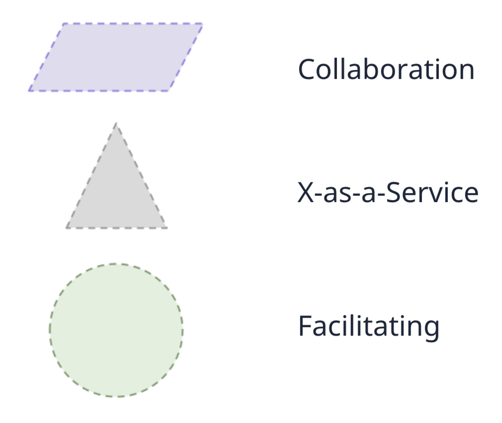

# Table of contents
{: .no_toc .text-delta }

1. TOC
{:toc}

# Introduction

The way the teams interact is between the lines when we define the four fundamental team types in the section about [team types](https://datascienceleadership.com/docs/technical-leadership/team-types). Now, we go deeper into them since clarity on how to interact with different teams is a must for Staff+ since, at this level, one acts a lot like an interface.

<figure>
	
		<figcaption>The three modes of interactions are represented by these shapes.
<a href="https://github.com/TeamTopologies/Team-Shape-Templates">Source.</a></figcaption>
</figure>

# Interaction modes for teams

Even though a team is composed of the same people, how they play can change depending on their needs. A team should adopt a different mode of interaction depending on the other teams it interacts with. Humans work better together when they can predict each other's behavior.

These interactions determine the interfaces between teams, and as a consequence, these interfaces will be reflected in the software, following Conways Law.

<figure>
	
		<figcaption>A generic typical set of interactions between teams.</figcaption>
</figure>

The typical interaction modes for the fundamental team types are:

<table class="styled-table" style="margin-left:auto;margin-right:auto">
    <thead>
        <tr>
            <th style="text-align:center"></th>
            <th style="text-align:center">Collaboration</th>
            <th style="text-align:center">X-as-a-Service</th>
            <th style="text-align:center">Facilitating</th>
        </tr>
    </thead>
    <tbody>
        <tr>
            <td style="text-align:center">Stream-aligned team</td>
            <td style="text-align:center">Typical</td>
            <td style="text-align:center">Typical</td>
            <td style="text-align:center">Occasional</td>
        </tr>
        <tr>
            <td style="text-align:center">Enabling team</td>
            <td style="text-align:center">Occasional</td>
            <td style="text-align:center"></td>
            <td style="text-align:center">Typical</td>
        </tr>
        <tr>
            <td style="text-align:center">Complicated-subsystem team</td>
            <td style="text-align:center">Occasional</td>
            <td style="text-align:center">Typical</td>
            <td style="text-align:center"></td>
        </tr>
        <tr>
            <td style="text-align:center">Platform team</td>
            <td style="text-align:center">Occasional</td>
            <td style="text-align:center">Typical</td>
            <td style="text-align:center"></td>
        </tr>
    </tbody>
</table>

## Collaboration mode 

Collaboration is a loaded term in the workplace. People commonly use it to describe simple interactions, like a 10-minute clarifying conversation. However, here, collaboration has a more strict meaning. It means working closely together with other teams for a reasonable time period (weeks to months). It requires good alignment, a high appetite, and the ability to work together from the two teams.

The teams either work with partial overlap, with agreements on delivering sub-items related to their expertise, or merge and create a single pool of mixed expertise to tackle the problem. In both cases, they still need to consider the resulting team size.

Collaborating will generate overhead, and every team will feel less effective, at least during the initial stage, because of the increased cognitive load. However, the joint discovery flows better. Because of the certainty of the coordination cost, the benefit should be clear and tangible to both: dates, milestones, how teams will share responsibility, how teams will split the ownership of the output, how the outcome will be valuable to both, etc. If the teams can't define those terms, it is better to not collaborate.

A team should use collaboration mode with, at most, one other team at a time since it is a costly and intensive interaction mode.

The typical usages of the mode are on a stream-aligned team working with a complicated subsystem team or a platform team and a complicated subsystem team working with a platform team.

The collaboration mode is a good idea if:
- The teams are looking for a fundamentally different solution; neither has the complete knowledge to deliver it;
- The teams involved have different expertise (not putting two teams together only to have more people working on it). A team must know things the other don't;
- The gains in efficiency on discovery by using each other's expertise outplays the overhead of coordinating with a different team, which is usually the case for innovation.

Since innovation might break the current team boundaries and prevent the current interfaces from proceeding, collaboration can avoid creating a back-and-forth of communication and broken demands between two teams by bringing clarity upfront when they agree to work together. 

A leader can also perceive collaboration as a signal for team design dysfunction. If two teams always have to collaborate, there is a high chance something is wrong, like a bad mix of experts or poor domain boundaries.

## X-as-a-Service

It is consuming or providing something with minimal collaboration. It offers clear responsibilities with predictable delivery but depends on good product management. 

It makes sense when one or more teams must use a code library, component, API, or platform that "just works" when another team can provide a part of the system as a service.

Since this mode depends on predictability, it works better after a Collaboration. A previous collaboration should have already discovered the challenging aspects of a service, and the platform team should offer the most effective solution as a service.

It provides excellent clarity on the boundaries because we can see who's offering and who's consuming. The service provider needs less context about how the consumers use their service, and the consumers need less context about how the service provides its capabilities. Innovation happens more slowly than with collaboration mode. 

If XaaS is in place, there is little need for day-to-day collaboration. The team providing XaaS must understand the needs of their users. The value of ignoring the lower-level details to consume XaaS should be high. The team is highly responsible to the customer and highly cares about the developer experience. It should be easy to use, test, deploy, and debug, with clear and up-to-date documentation.

The team owning the service should offer the same level a company would expect from an external provider. 

Product Management is critical because one can't simply build customer-requested features. At the same time, the offering needs to evolve to consider all customers' interests and needs. Attention to needs requires a close producer-consumer relationship.

A team should expect to simultaneously consume or provide X as a service from many teams.

Teams typically use this mode when stream-aligned and complicated-subsystem teams consume services from a platform team or a component or library as a service from a complicated-subsystem team.

## Facilitating mode

In the facilitation mode, a team clears impediments by helping another team. It Identifies and reduces gaps in the supported team's capabilities.

Teams use facilitation mode when one or more teams need coaching on some aspect of their work. It is the primary interaction mode for Enabling teams. The main goal of the team doing facilitation is to make the other team more effective or help spot gaps.

It has the advantage of bringing the right expertise for a short interaction to support solving a problem that a team couldn't. It will upskill a team. 

Facilitation is an interaction mode provided by teams that typically work for many other teams. The team facilitating does not participate in building the central software system, supporting component, or platform. Having experts who do not make things is a meaningful opportunity cost.

A team facilitating for a couple of stream-aligned teams might identify a problematic step in model deployment and then facilitate its improvement with a Platform team taking care of MLOps. 

A team should expect to establish the facilitating interaction mode with a few teams, regardless of consuming or providing facilitation.

The typical case involves an Enabling team helping a stream-aligned, complicated-subsystem, platform team, or a stream-aligned, complicated-subsystem, or platform team helping a stream-aligned team.

A must in this relationship is the openness to be supported. The team receiving the facilitation should be willing to upskill and not feel strange people are interfering with their team.

# Representing typical interactions in teams with Data Science people

In the image, we represent a possible case. The pricing team split and isolated the pricing model into a complicated subsystem team. As a service, this team provides predictions regarding price elasticity, demand forecast, and others. A "dynamic pricing" team consumes and uses it to maximize profits.

At the same time, the larger team uses services from the MLOps platform, for example, to deploy the models from the Pricing Model team. Another possibility is that there is an ongoing collaboration between the MLOps Platform and Pricing because the Pricing team wants to go from dozens of models to thousands to have one model by product for certain cases.

The Fraud team also consumes the model deployment capabilities from the MLOps Platform. Currently, they interact with the ML Consulting team from the platform because they want to upskill their model monitoring game by creating tricky sub-groups to monitor using the monitoring tools provided by the MLOps Platform.

The MLOps consumes capabilities from the data platform. For example, all the model computations (training and scoring) use their APIs. We can imagine a collaboration between the MLOps Platform and the Data Platform because the former wants to implement a new framework for distributed model training.  

<figure>

		<figcaption>A typical set of interactions between teams involved in Data Science activities.</figcaption>
</figure>

# Interaction evolution

One of the most common patterns of interactions involves a Platform team collaborating with a stream-aligned team to develop a new capability.

The stream-aligned team has the use case. The use case guides the platform's interface and design choices, which would miss what the team needs if it worked only based on vague requirements.

After the teams develop the use case, or while the teams collaborate, the platform folks involved refine the interface for the capability. When the collaboration finishes and the teams split, the stream-aligned team has a use case in production, and they are happy they are solving a business problem using an approach they wouldn't be able to do, or they would take way longer if doing alone, and the platform team as a capability to offer as a service not only to the team from the collaboration, but to all the others in the company.

So it went from a collaboration to a X as a service interaction.

# Team topologies evolution

The domains and resulting teams should change slowly over several months, not days or weeks. 

Here is a list of triggers by Skelton & Pais (2019) [^fn1]:
- **Evolve when software has grown too large for one team**: If documenting gets hard, if no one knows the whole code base at a certain level anymore, if there are parts of the system only certain people know how to change, etc., split it.
- **Change it when delivery becomes slower**: the team feels it takes longer to deliver than it used to; throughput metrics are degrading; Working in progress only increases, and there are many external dependencies.
- **The developer experience degrades as teams start to depend on multiple internal products coming from different teams**: Many platforms will exist in a company, and it can be difficult to integrate them as they become very diverse to the internal customer. One can evolve to build a layer between all of them and standardize or ease monitoring of these diverse services.

Getting the signals of the need for change is an essential skill for leadership. Considering Conway's law, it becomes a remarkable skill for Staff+. Skelton & Pais (2019) [^fn1] provide questions that leaders should constantly answer.

- Have we misunderstood how users need/want to behave?
- Do we need to adjust team interaction modes?
- Should we buy a capability as an external service instead of offering it as a service?
- Is the close collaboration between these two teams healthy?  
- Can we abstract a specific capability as a service?
- Are the teams well served by the current set of services that platform teams provide?  

Metrics and having everybody work on the operations of the system they develop are sources of input to support evolution movements.

# Workshop #3 - Team interactions

[Miro template](https://miro.com/app/board/uXjVKms1KIM=/?share_link_id=752512685457).

## Activity 1: Evaluate your squad's last interactions
{: .no_toc }

List 3-5 interactions you had with other teams. Classify them into collaboration, X-as-a-service, and facilitation.
Identify if there was an opportunity to improve.

Try to pick at least one example from each kind.

## Activity 2: Base and overlapping services
{: .no_toc }

If you are part of a team building internal capabilities (platform or complicated subsystem team), consider other existing capabilities or overlapping internal products: How can you reuse them or use what you do as building blocks for them?

If you are on a stream-aligned team, what capabilities could you rely on in existing systems or future endeavors?

Design a high-level architecture (only shows the interaction between the different services and subsystems). 

# References

[^fn1]: Skelton, M., & Pais, M. (2019). Team topologies: organizing business and technology teams for fast flow. It Revolution.
[^fn2]:  Forsgren, N., Humble, J., & Kim, G. (2018). The science behind devops: accelerate building and scaling high performing technology organizations. IT Revolution ISBN.
[^fn3]: [What I Talk About When I Talk About Platforms](https://martinfowler.com/articles/talk-about-platforms.html), 2018, Evan Bottcher
