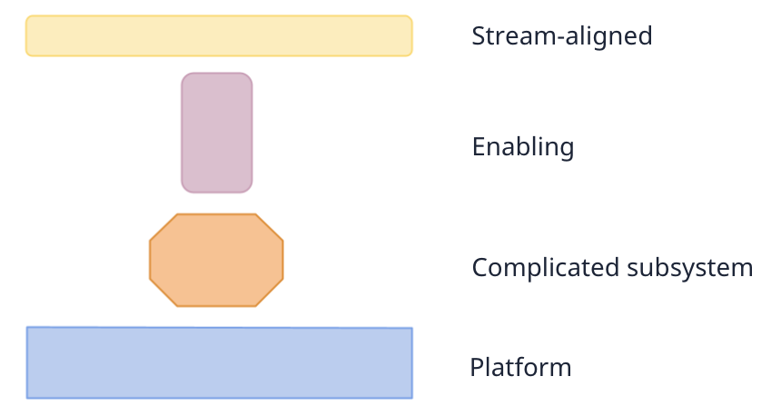

# Table of contents
{: .no_toc .text-delta }

1. TOC
{:toc}

# Introduction

We will review the four fundamental team types described in the Team Topologies and link them to the data scientists and machine learning engineers everyday lives.

<figure>
	
		<figcaption>We can characterize most teams using four team types. The types clarify how to behave as a team and, consequently, to individuals who are part of it. The team type and what others expect from it affect technical decisions.
<a href="https://github.com/TeamTopologies/Team-Shape-Templates">Source.</a></figcaption>
</figure>

# Team types

## Stream-aligned team

A stream is a continuous flow of work towards a business goal represented by a business domain or capability. For example, a team works continuously to improve credit underwriting, which evaluates the risk when lending money to a customer, or a team working on pricing for a marketplace looks to deliver the best price for every item to maximize its business success.

Clarity of purpose is a must since multiple teams can't own the same flow. You don't expect other teams to push changes to the credit underwriting process except the team that owns and delivers on it. At the same time, you need to break your business into many work streams that ultimately cover all its parts while keeping the essence of teams: autonomous and small.

A stream of work can be a single product, service, set of features, user journey, or user persona.

Most of a company's teams are stream-aligned; they move the business. The goal of the other team types is to ease their work and increase the likelihood of their success by supporting them. The Enabling team helps them acquire missing capabilities. The Platform team should reduce the cognitive load by providing easy-to-use services. The complicated-subsystem team isolates part of their system to reduce their stream's complexity and evolve it faster.

Stream-aligned teams cover the whole spectrum of delivery, so they get customer feedback and build, run, and fix their applications. Based on this feedback, they change directions quickly and are usually cross-functional to avoid dependencies. For example, if design work is needed to iterate in a stream-aligned team, a designer should be part of the team.

When Data Scientists and Machine Learning Engineers work in this team type, they will likely pair with business analysts to fit the model into a decision and with Engineers to deploy it. When they become more senior, they interact more with the Product Manager to uncover opportunities.

## Platform team

Evan Bottcher's [^fn3] definition is a great place to start:

> A digital platform is a foundation of self-service APIs, tools, services, knowledge and support which are arranged as a compelling internal product.

This compelling internal product serves the stream-aligned teams. It eases their task of solving business problems and serving the company's final customers.

The essential part is the self-service characteristic. The stream-aligned teams should consume those APIs and tools with autonomy and no person-to-person interaction, which translates into autonomy.

While a stream-aligned team maintains full ownership of building, running, and fixing their application in production, the platform provides internal services to reduce the cognitive load on developing these activities.

Imagine you are a Data Scientist working with creditworthiness in a credit problem. You immerse yourself in the challenge of accurately predicting who will default and dealing with all the dynamism of what you already have in production (model deterioration, concept drifts, issues with data sources, etc.). At the same time, you do everyday things, like model deployment and monitoring. It has little value for you to get into the details of how model deployment or monitoring happens as long as you can successfully deploy and monitor your models. There is so much to dig into with a higher likelihood to support you in solving business problems related to creditworthiness that you just want some tasks from your day-to-day to become services you can rely on.

Finally, the "arranged as a compelling internal product" is where the product side of the challenge comes in: it is common to see people unhappy and not fully using internal tools. Further, the team needs to manage it as a live product since companies and user needs keep evolving.

Here's a set of behaviors from Platform teams coming from Skelton & Pais (2019) [^fn1]:
- Platform knowledge is made available via APIs;
- A platform team value is the value they offer to product teams;
- A platform should offer a small set of services with acceptable quality;
- Everything is built on an underlying platform;
- The users of the platform should drive the interface of a platform;
- A platform team has a strong focus on usability and reliability;
- Manage a Platform as a live product or service;
- Product Management is vital for platforms, it can't depend on feature requests;
- A platform team leads by example by using the services they provide and consuming from others;
- A platform team understands how the adoption of internal services evolves;

## Enabling team

High-performing teams continuously improve their capabilities [^fn2]. However, stream-aligned teams won't have enough time to research, read about, learn, and practice new skills. They are under constant pressure to deliver.

Enabling teams are composed of specialists in a given technical or product domain, and they help to close this gap. They invest in sorting out the best approaches for a domain so they can make informed suggestions to teams. This way, stream-aligned teams can improve without investing the effort, which their leaders usually underestimate and overlook.

Enabling teams are intensely collaborative. They thrive on understanding the problems and shortcomings of Stream-aligned teams to provide practical guidance. Some call them "Technical consulting teams." They provide guidance, not execution. This term can be confusing since "internal consulting teams" usually execute together with other teams, just like an external consulting firm could.

Their goal is to increase the autonomy of the stream-aligned team by growing their capabilities with a focus on their problems, not the solutions. A successful enabling team will finish their job in a few weeks or months; after that, the stream-aligned team doesn't need them anymore since they have developed to operate without their guidance. Considering that interventions that do not address the root cause generate dependency, the Enabling team intervention must strengthen the team's ability to deal with their burden. Beyond teaching, the team wants to establish practices via tooling.

An enabling team focuses on a very specific area, such as building engineering, continuous delivery, deployment, etc. It can support the adoption of new technologies or improve existing ones (faster tests). In Data Science, it is common to have them as specialists consulting on topics (recommendation systems, causality, experimentation) or as part of platform teams.

An enabling team can set up a walking skeleton (the kind of first release I suggest in "[Defining releases](https://datascienceleadership.com/docs/project-management/releases)" under Projects).

## Complicated-subsystem team

A complicated subsystem team is responsible for building and maintaining a part of the system that is heavily dependent on expertise and knowledge. To make changes to the subsystem, most team members need to be specialists in that subject.

The expertise we mention here isn't at the level of "a Data Science specialist", but "a computer vision specialist". It is niche enough that most people from the same broad field will have little knowledge to contribute. Since it is not feasible to have a person with this profile in every team, the complicated subsystem team places them together so it can reduce the cognitive load of one or a couple of stream-aligned teams that use that subsystem to deliver.

This type of team is created after splitting part of the team from a stream-aligned team. We expect collaboration between these two types of teams, mainly when they are in early discovery and development. After that, the interfaces are well defined, and the complicated subsystem team can evolve them internally with fewer interactions with the team they serve.

The examples provided in Skelton & Pais (2019) [^fn1] are:
A video processing codec.
A mathematical model.
A real-time reconciliation algorithm.
A transaction reporting system for financial services.
A face recognition engine.
Since many of them are related to Machine Learning models, I will discuss them more later in this article.

One creates a complicated subsystem team when the subsystem needs specialized knowledge to reduce the cognitive load, not with the ambition to share the component. We expect to have only a few complicated subsystem teams in an organization. When an aspiration is to share the component, it should be a Platform team.

# Typical cases of team types with Data Science

In a 15-person company, you might have only 1-3 DS/MLEs. The same person will model the problem, create the datasets, train the model, create the policy, deploy it, integrate it into the product, monitor everything, and operate it. This is a single stream-aligned team in which business understanding and a generalist approach will work better.

In a medium-sized company, some stream-aligned teams might have DS/MLEs. At some point, they will see a need to evolve their knowledge transfer, going from processes/documentation to tooling, like from a doc for a step-by-step ML model deployment using market tools to a framework that takes into consideration some particularities of the company's tech-stack and wraps some external platforms. Then, one creates a platform team to maintain and evolve this framework. As time passes, the DS/MLEs in the stream-aligned teams will know less and less about how deployment happens. At the same time, they will have to get more immersed in the business problems they are solving if they want to push it forward as they get more complex.

The platform team may perceive many potential internal customers who don't adopt the tools because they lack some basic concepts or training. For example, Software Engineers want to deploy ML models, but they haven't worked with them before. An enabling team can appear in the form of a consulting team. MLEs on these teams usually help others set the environment and deploy the first release of their project. In contrast, data scientists help people frame their business problems as something that predicting the future or counterfactual predictions can help solve.

In some business domains, there are kinds of models that are core. After their first versions, it becomes increasingly complex to keep pushing it. At the same time, it is a component in which one can get good enough feedback without going to the end-to-end, and a complicated subsystem team appears to focus on a core model, like pricing or product recommendation for marketplaces or credit risk for financial products. These teams are usually intensive in MLEs, DSs, and Software Engineers, while business and product people might not be required.

<figure>
	
		<figcaption>A very simplistic depiction of different team types where data scientists and machine learning engineers can be allocated</figcaption>
</figure>

# Where does Research fit?

I don't have experience with Research in the industry. Looking at the Team Topologies framework, it makes sense to fit Research as an enabling team if it is a team where publishing is the final goal, and the research team spreads that knowledge internally about their domain, showing the results and providing guidance to the teams that can use it. If it is a Research & Development team, we can consider it a complicated subsystem team, where they don't only research but implement the subsystem another team will consume internally. As far as I know, it doesn't get to the point of the same team doing Research and the platform that offers it, but the platform part works as a separate team that consumes the Research and puts effort into turning it into an internal product.

# Different teams will demand different skills

To succeed in a platform team, a Staff Data Scientist or Machine Learning Engineer should be minimally interested in internal products. In the same way, working in a stream-aligned team requires a deep understanding of the business domain it owns.

For example, you need to be interested in looking into the details, step-by-step, of how a fraudster behaves if you want to be able to make fundamental changes in how a group solves this problem. Only by following how they evolve and evade companies' defenses and enjoying their dynamic nature will you be able to effectively put your craft in the favor of this business domain. Going beyond getting interested in how the other people contribute with their skills, but pairing with them and having an end-to-end sense.

In a platform, teaming up with the Product Manager effectively and knowing how to leverage each other is critical. The exception is playing the Product Manager role alone, which is now uncommon, or partnering with a DS/MLE manager to play it. Since the value of your work is in your internal customer' hands, understanding their needs deeply and the right abstraction will make the platform effective. Unfortunately, it is expected to build the wrong product, and it is very frustrating for the team. When it happens, it is a missed opportunity by the team's leaders, including Staff+.

In a complicated subsystem team, you better enjoy that subsystem domain a lot and be willing to go deeper and deeper because specializing in it was the reason the team had to split into a separate team. Further, you need to be aware that you might not own the end-to-end, and you need to negotiate with the stream-aligned team that the subsystem fits into.

When on an Enablement team, you need to be in a moment when you can resist the urge to do things yourself and enjoy listening carefully, understanding other teams' problems, and empowering other people to solve their challenges themselves.

It doesn't mean there is just one type of team you should or can work on, but you need to account for your current interests before joining to maximize how much you will enjoy that phase.

# Common team misbehaviors and opportunities for Staff Data Scientists and Machine Learning Engineers

## Early isolation of an ML model as a complicated subsystem
{:.no_toc}

It was far more common in the past, when general leaders instantly identifiedidentify ML as "too complicated or different from what we do", and only a single type of professional would develop it.

However, it is not an extinguished move to place the Data Science folks and their models in a separate team because the leader doesn't get what they do. It is undoubtedly too early to do it if the subsystem hasn't been delivering value yet. It is more likely to be a good idea if:
- You had a couple of production versions, and the metrics and value of new versions are crystal clear;
- The subsystem is intended to serve more than one team (not as an internal product that you want to push adoption, but as a needed component 2-3 teams will necessarily use).

 Staff+ have the chance to abstract this subsystem and enable it to progress at an optimal pace or to see commonalities between two subsystems in their organization and transform them into one. Also, one can act as a force against isolating an ML model as a subsystem if the team still needs quick business feedback to find an effective model.

## Pursuing the monopoly of tooling when in a platform team
{:.no_toc}

Though the clear benefit of having a platform team is that the other people don't have to rework to achieve the same benefit from the standard tool, we can't shut down the creativity and proactiveness of others' building tools. When a stream-aligned team invests in developing a tool, they have at least one real customer: themselves. It is a precious thing because if they are satisfied with their tool, it is likely that other teams will, too.

If it expands, the chances are that the Stream-aligned team won't want to keep that tool and serve other stream-aligned teams as internal customers (they have business problems to solve!), and a migration to a platform can happen.

It is also why it is so essential to build any platform to be just another layer instead of the final tool, which means always having APIs to enable people to build on top, so at least if a new tool appears somewhere in the company, they are likely to adopt the platform's lower level capabilities, so at least part of the quality is ensured.

As a Staff+, there is opportunity to design and enforce choices that enable everything to be a building block for anyone in the company. This includes coordinating tool migration or integration, adopting the platform's stable low-level back-end services, etc.

## Allocating most senior folks to the safe and important initiatives in a Stream-aligned team
{:.no_toc}

As a Staff+, your time is limited. In a Stream-aligned team, pressure is even higher for results. Though we expect Staff behaviors to impact others' work, we also expect a volume of direct work from most senior folks. In that case, it is tempting to allocate them to that safe big lever they can push, e.g., building a new version of a proven important model that comes from a predictable improvement source, like adding a new data source.

While a team should always tackle the low-risk/high-value initiatives, it is better to allocate more junior people to them and use the Staff+ only to ensure success. Funnily, some teams even allocate interns and junior people in moonshots since they don't consider a lack of outcome coming from junior's time will hurt the team. It is terrible for the person still getting confidence in their skills and needs to watch a series of tasks not going anywhere and for the team that will more likely get trapped into their status quo.

Some leaders push more senior people to these opportunities because of speed due to the pressure for results. Junior, mid-level and senior developers can usually develop very fast if they have clarity about what to do and proper pairing in key moments. So instead of accepting working on them, a Staff+ can challenge the allocation and help a more junior person by supporting, breaking tasks, reviewing, etc.

The most effective Staff+ I've worked with and observed were always working on something straightforward to sell in terms of importance - it would clearly impact highly important metrics. At the same time, the root causes of the problem were not trivial, and even unclear to them when they started solving it. In a Stream-aligned team, it should be trivial to accept the importance of solving a particular problem since it needs to necessarily translate into the business domain that the team covers.

In the end, mentoring and ensuring speed and quality on the low-risk/high-value front will also count as the Staff's impact, and the person gets the chance to push boundaries elsewhere, potentially bringing much more value to the team.

# Is there room for Data Scientists and MLEs in an Enabling Team?

From my experience, I've seen "internal consulting data science teams" in the same sense a consulting firm would work. Sometimes, they advise on how to solve a problem using ML; other times, they work together to solve it.

An enabling team is a high investment in a group that depends on the demands of enablement in their domain. Because of that, I see it more often related to base aspects, which make them closer to pure software and data engineering domains (e.g., an enabling team focused on data governance) or to general analytics (e.g., experimentation), or as part of the job of a Platform team.

In the last case, MLOps Platform team members will eventually get closer to a certain team and teach a couple of good practices, such as how to use their tools, support the deployment of a first version of a model, etc. The platform teams can hardly split the work so someone or a group can fully dedicate it.

In the following workshop, we will introduce the "interaction modes" and see that there is a "facilitation" mode, which isn't supposed to happen for Platforms. The fact that I see it happening for ML/AI platforms might be a matter of field maturity.

In general, I believe the team types originate from stream-aligned teams. Then, complicated subsystem teams will be created to "isolate" that different subject. The company makes more stream-aligned teams, and people start to identify the exact infra/tooling needs, creating platform teams. Finally, as the subject becomes common ground for many teams and, simultaneously, the company matures enough to make those subjects nontrivial, the enabling teams start to make sense.

However, "facilitating" is occasionally expected from Stream-aligned teams, and I see it happening often. In my current company, we even have a process called "Design Review," in which we pick 1-2 advisors from other teams who are more seasoned in that kind of problem. They don't execute, but we expect them to transfer knowledge and increase the likelihood of success.

# Workshop #2: Evaluating team behaviors & identifying the layers of platforms

## Activity 1: Evaluate your team behaviors according to its team type
{:.no_toc}

First, identify which type of team you are part of.
Then, use the [Miro board](https://miro.com/app/board/uXjVKms1KIM=/?share_link_id=752512685457) to gather evidence of the presence or lack of the many expected behaviors from that team type. Notice that you can have evidence pointing in both directions (it isn't black and white).

## Activity 2: Evaluating Platform Behaviors
{:.no_toc}

Now, think about the tools you use the most and where they come from. Evaluate the platforms that provide them from an "internal customer" perspective.

## Activity 3: Drawing the layers of platforms under and over yours and classifying the teams involved
{:.no_toc}

Identify the layers of platforms you build on top and what people build on top of your offer.
# References

[^fn1]: Skelton, M., & Pais, M. (2019). Team topologies: organizing business and technology teams for fast flow. It Revolution.
[^fn2]:  Forsgren, N., Humble, J., & Kim, G. (2018). The science behind devops: accelerate building and scaling high performing technology organizations. IT Revolution ISBN.
[^fn3]: [What I Talk About When I Talk About Platforms](https://martinfowler.com/articles/talk-about-platforms.html), 2018, Evan Bottcher
